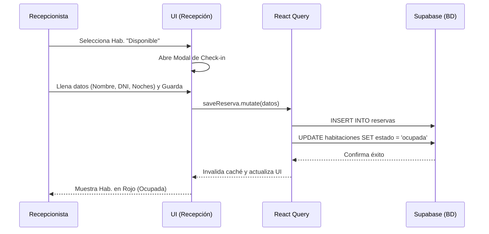
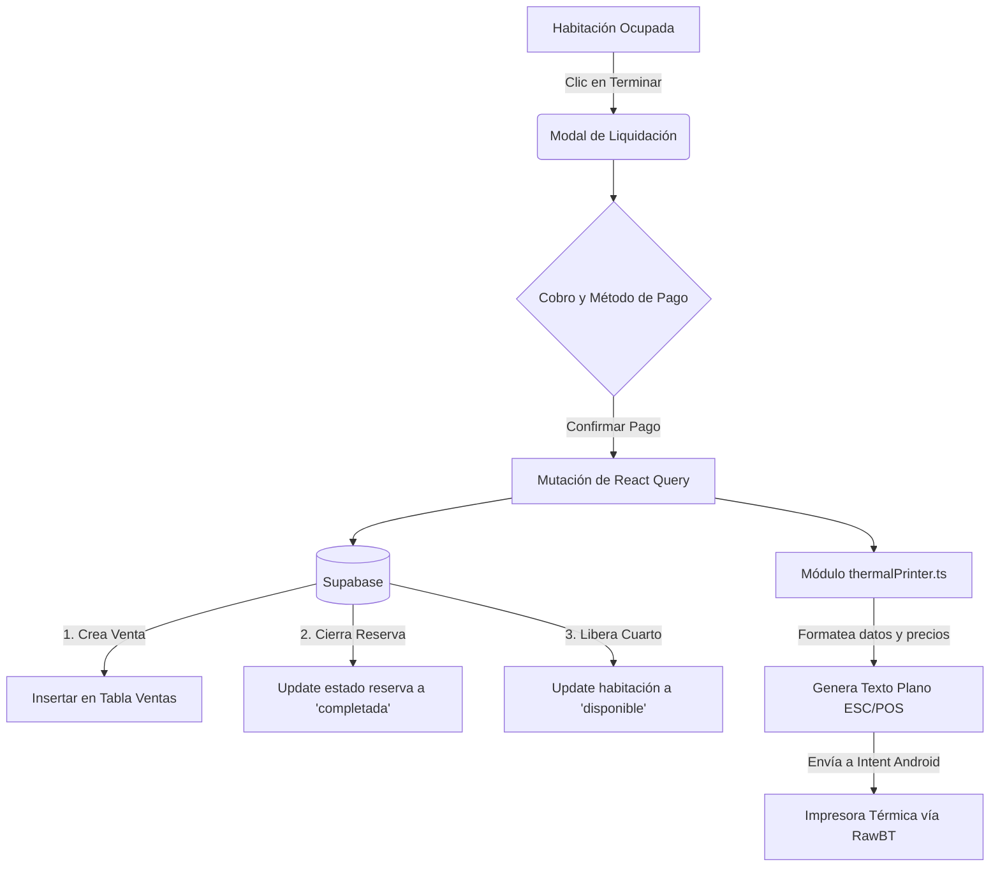
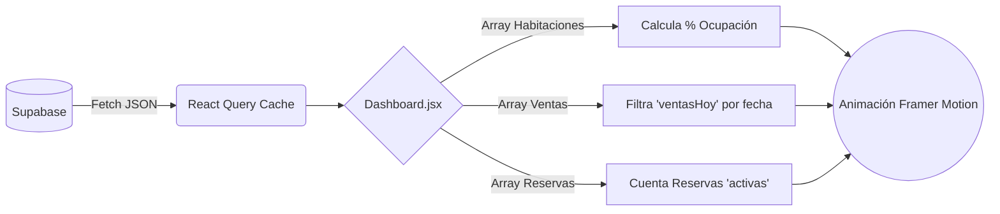

# 📖 Documentación Exhaustiva: Sistema Gestión de Hospedajes

Este documento es la referencia técnica definitiva del sistema. Detalla la arquitectura, el stack tecnológico y los diagramas de flujo completos de las operaciones principales.

---

## 🛠️ 1. Stack Tecnológico (Tech Stack)

El sistema está construido bajo una arquitectura moderna sin servidor (Serverless Backend) enfocada en la velocidad y la experiencia de usuario móvil (PWA).

### Frontend (Capa Visual y Lógica de Cliente)
*   **Core:** `React 18` empaquetado con `Vite`.
*   **Routing:** `react-router-dom` v6 (SPA - Single Page Application sin recargas).
*   **Estilos:** `Tailwind CSS` con un sistema de variables CSS personalizadas (Dark Mode puro `#000000`).
*   **UI Components:** `Shadcn UI` (Componentes base) + `Lucide React` (Iconos).
*   **Animaciones Premium:** `Framer Motion` (Glassmorphism, transiciones fluidas, hover effects, number tickers).

### Backend & Estado (Capa de Datos)
*   **Database & Auth:** `Supabase` (Base de datos PostgreSQL en la nube).
*   **State Management:** `@tanstack/react-query` v5. Controla la caché, las peticiones asíncronas y mantiene sincronizada la interfaz visual sin depender de `useEffect` masivos.
*   **Patrón de Datos:** Hook `useHotelData` (Provee la instancia `hotelDb` que abstrae el CRUD hacia Supabase).

### Hardware & Periféricos
*   **Motor de Impresión:** Generación de texto plano en crudo estructurado (ESC/POS) a través de `thermalPrinter.ts`.
*   **Puente de Impresión:** `RawBT` (App Android que intercepta el buffer de texto y lo envía a la mini-impresora térmica Bluetooth).

---

## 🔄 2. Flujo Completo del Sistema (System Flow)

A continuación se detallan los flujos de usuario (User Flows) y cómo se comunican los componentes por detrás.

### A. Flujo de Recepción (Check-in / Check-out)

El proceso principal ocurre en el módulo de recepción. El sistema reacciona en tiempo real.

### B. Flujo de Facturación e Impresión (Check-out)

Este es el flujo crítico para cuadrar caja y entregar el recibo al cliente.

### C. Flujo de Panel de Control (Dashboard)

El Dashboard lee todas las colecciones para generar métricas. No muta datos, solo observa.

---

## 🏗️ 3. Arquitectura de Archivos y Responsabilidades

*   `/src/pages/Dashboard.jsx`
    *   **Responsabilidad:** Resumen métrico ejecutivo.
    *   **Lógica:** Cruza el array de `ventas` con el día actual (`sv-SE YYYY-MM-DD`).
    *   **UI:** Tarjetas de Glassmorphism, animaciones de conteo.
*   `/src/pages/Habitaciones.jsx`
    *   **Responsabilidad:** Gestión de Inventario.
    *   **Lógica Especial:** Valida que no existan duplicados (ej. no crear dos "101") antes de enviar la mutación. Ordena el array de respuesta numéricamente (`parseInt`).
*   `/src/pages/Recepcion.jsx`
    *   **Responsabilidad:** Operatividad diaria.
    *   **Lógica:** Combina datos de `habitaciones` y `reservas activas` para saber qué cuarto está ocupado por quién.
*   `/src/modules/printer/services/thermalPrinter.ts`
    *   **Responsabilidad:** Traductor de hardware.
    *   **Lógica:** Formatea el Ticket. Alinea columnas usando espacios en blanco fijos (`padEnd`, `padStart`) e inyecta la cabecera del hospedaje (Hotel Angelica Frey).

---

## 🔐 4. Base de Datos (Estructura Lógica)

El esquema de la base de datos se basa en 3 entidades principales altamente relacionales:

1.  **Tabla `habitaciones`**
    *   `id` (UUID)
    *   `numero` (String: "101", "102")
    *   `estado` (Enum: disponible, ocupada, mantenimiento, reservada)
    *   `precio_noche` (Numeric)
2.  **Tabla `reservas`**
    *   `id` (UUID)
    *   `habitacion_id` (Relación -> habitaciones.id)
    *   `huesped_nombre`, `huesped_documento`
    *   `fecha_ingreso`, `fecha_salida`
    *   `estado` (Enum: activa, completada, cancelada)
3.  **Tabla `ventas`**
    *   `id` (UUID)
    *   `reserva_id` (Relación -> reservas.id)
    *   `total`, `metodo_pago` (Efectivo, Yape, Plin)
    *   `estado_comprobante` (Ticket, SUNAT)
