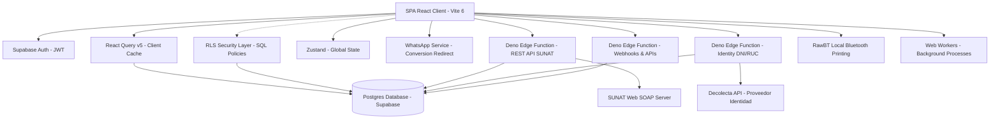
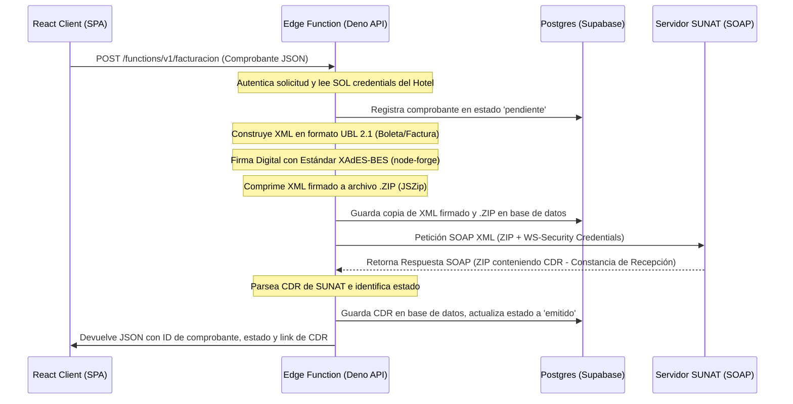
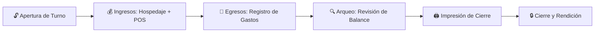

# Documentación Técnica de Arquitectura y Sistema - PMS JCAR LABS

**Autor:** Equipo de Arquitectura Core - JCAR LABS  
**Fecha de Referencia:** Junio 2026  
**Tecnologías Base:** React 18, Vite 6, Supabase (PostgreSQL), React Query v5, Zustand, TailwindCSS, Deno (Edge Functions)

---

## 🗺️ 1. Arquitectura de Software General

**PMS JCAR LABS** es un Property Management System (PMS) de nueva generación diseñado para la gestión integral de hospedajes y hoteles. La solución funciona bajo el patrón de arquitectura **Single Page Application (SPA)** serverless, completamente acoplado a la infraestructura BaaS (Backend as a Service) de **Supabase Cloud**. Esto elimina la necesidad de un servidor de aplicación tradicional (Node.js/Python), delegando la persistencia, la seguridad, el aislamiento de inquilinos (Multi-tenant) y la concurrencia directamente a PostgreSQL a través del motor API de Supabase.

### 1.1 Diagrama de Componentes


### 1.2 Capas de la Aplicación
1. **Frontend Core (SPA):** Desarrollado en React 18 con Vite 6 como bundler ultra rápido. La navegación se realiza a través de `react-router-dom` con lazy-loading habilitado para optimizar el consumo de red en dispositivos móviles.
2. **Capa de Caché Persistente:** Implementada con `React Query v5` e `idb-keyval` (IndexedDB). Actúa como una réplica local persistente del estado del servidor. Los catálogos estáticos (productos, configuraciones) viven en caché por 48 horas sin consumir red, mientras que los dinámicos usan estrategias de revalidación.
3. **Estado Global del Cliente:** Manejado de forma minimalista y reactiva con `Zustand` para el estado de autenticación (`auth.store.ts`), elementos UI globales (`ui.store.ts`) y carrito de ventas del POS (`useCartStore.js`).
4. **Persistencia y Back-end Serverless:** Supabase JS Client interactúa dinámicamente con la base de datos PostgreSQL a través de PostgREST y WebSockets para la suscripción a eventos en tiempo real.
5. **Capa de Negocio Asíncrona (RPCs y Edge Functions):** Cálculos financieros pesados delegados al backend (Postgres RPCs) y llamadas seguras de integración con SUNAT manejadas en Deno Edge Functions. Adicionalmente, el enrutamiento de webhooks y el motor de reservas online se procesan mediante `webhook-gateway`.

---

## 🗄️ 2. Diseño de Base de Datos y Aislamiento Multi-Tenant

El sistema adopta el modelo de base de datos **Shared Database, Shared Schema**. Múltiples hoteles comparten la misma base de datos relacional y las mismas tablas, garantizando el aislamiento lógico de datos de manera estricta mediante políticas de seguridad a nivel de base de datos.

### 2.1 Aislamiento Lógico (Row Level Security - RLS)
Cada tabla crítica de negocio (ej. `habitaciones`, `reservas`, `ventas`, `ventas_pos`, `egresos`, `cierres_caja`) incluye un campo `hotel_id` de tipo UUID. Las políticas de **Row Level Security (RLS)** inyectadas directamente en PostgreSQL garantizan que un usuario autenticado solo pueda consultar, insertar o actualizar filas cuyos registros correspondan a su propio `hotel_id`.

Para evitar bucles infinitos de recursión en políticas SQL complejas, la verificación del tenant se centraliza en la base de datos a través de una función con seguridad definidora (`SECURITY DEFINER`):
```sql
CREATE OR REPLACE FUNCTION get_my_hotel_id()
RETURNS UUID AS $$
BEGIN
  RETURN (SELECT hotel_id FROM public.usuarios WHERE id = auth.uid());
END;
$$ LANGUAGE plpgsql SECURITY DEFINER;
```

A nivel de API Frontend, el archivo de abstracción de base de datos (`db.js`) expone el método `db.forHotel(hotelId)` que intercepta dinámicamente las llamadas del cliente inyectando de forma transparente el filtro `hotel_id` en las operaciones CRUD, protegiendo las mutaciones contra inyecciones maliciosas del cliente.

---

## 💾 3. Esquema Completo de la Base de Datos

A continuación se detallan las tablas que estructuran el sistema en `combined_setup.sql` y `supabase_schema.sql`:

### 3.1 Tabla: `hoteles`
Almacena la entidad principal del tenant y su configuración regional y tributaria.
| Campo | Tipo | Restricción | Descripción |
| :--- | :--- | :--- | :--- |
| `id` | UUID | PRIMARY KEY, Default gen_random_uuid() | Identificador único del hotel. |
| `nombre` | TEXT | NOT NULL | Nombre comercial del hospedaje. |
| `ruc` | TEXT | Opcional | Registro Único de Contribuyente (11 dígitos). |
| `direccion` | TEXT | Opcional | Dirección física del hotel. |
| `ciudad` | TEXT | Opcional | Ciudad de operaciones. |
| `telefono` | TEXT | Opcional | Teléfono / WhatsApp oficial. |
| `email` | TEXT | Opcional | Correo electrónico del establecimiento. |
| `logo_url` | TEXT | Opcional | URL del logo hospedado en Supabase Storage. |
| `aplica_igv` | BOOLEAN | Default `true` | Determina si el hotel añade el 18% de IGV (aplica exención para la Amazonía Peruana). |
| `modo_sunat` | TEXT | Default `'manual'` | Control de facturación: `'manual'`, `'automatico'`, `'desactivado'`. |
| `sunat_usuario_sol` | TEXT | Opcional | Nombre del usuario SOL de SUNAT. |
| `sunat_clave_sol` | TEXT | Opcional | Clave SOL de SUNAT (almacenada para encriptación de Edge Function). |
| `mensaje_ticket` | TEXT | Default `'¡Gracias por su preferencia!'` | Pie de página del ticket térmico impreso. |
| `hora_checkin` | TEXT | Default `'14:00'` | Hora estándar de ingreso. |
| `hora_checkout` | TEXT | Default `'12:00'` | Hora estándar de salida. |
| `numero_yape` | TEXT | Opcional | Número de teléfono para cobros vía billetera digital Yape/Plin. |
| `tipo_cambio` | NUMERIC | Default `3.80` | Tipo de cambio USD a PEN para cobro multi-moneda. |
| `created_date` | TIMESTAMPTZ| Default `now()` | Fecha de creación del registro. |

### 3.2 Tabla: `usuarios`
Perfiles extendidos vinculados a la tabla del motor de autenticación `auth.users`.
| Campo | Tipo | Restricción | Descripción |
| :--- | :--- | :--- | :--- |
| `id` | UUID | PRIMARY KEY, REFERENCES `auth.users(id)` | Identificador sincronizado del usuario auth. |
| `email` | TEXT | UNIQUE, NOT NULL | Correo de inicio de sesión. |
| `full_name` | TEXT | Opcional | Nombre completo del colaborador. |
| `role` | TEXT | Default `'recepcionista'` | Rol del usuario: `'admin'`, `'recepcionista'`, `'limpieza'`, `'developer'`. |
| `hotel_id` | UUID | REFERENCES `hoteles(id)` | Identificador del hotel asignado para aislamiento. |
| `created_date` | TIMESTAMPTZ| Default `now()` | Fecha de registro. |

### 3.3 Tabla: `habitaciones`
Inventario físico de habitaciones asignables en el hotel.
| Campo | Tipo | Restricción | Descripción |
| :--- | :--- | :--- | :--- |
| `id` | UUID | PRIMARY KEY, Default gen_random_uuid() | Identificador de la habitación. |
| `hotel_id` | UUID | REFERENCES `hoteles(id)` ON DELETE CASCADE | Relación con el hotel tenant. |
| `numero` | TEXT | NOT NULL | Número o código visible (ej. "101", "A-2"). |
| `piso` | TEXT | Opcional | Piso en el que se ubica. |
| `tipo` | TEXT | Default `'simple'` | Tipos: `'simple'`, `'doble simple'`, `'matrimonial'`, `'doble matrimonial'`, `'mixta'`, `'queen'`. |
| `estado` | TEXT | Default `'disponible'` | Estado actual: `'disponible'`, `'ocupada'`, `'mantenimiento'`, `'reservada'`. |
| `precio_noche` | NUMERIC | NOT NULL, Default `80.00` | Tarifa base por noche. |
| `capacidad` | INTEGER | Default `1` | Número máximo de personas permitidas. |
| `descripcion` | TEXT | Opcional | Notas específicas sobre la habitación. |
| `created_date` | TIMESTAMPTZ| Default `now()` | Historial de auditoría. |

### 3.4 Tabla: `reservas`
Expedientes de reservas y hospedaje activos del PMS.
| Campo | Tipo | Restricción | Descripción |
| :--- | :--- | :--- | :--- |
| `id` | UUID | PRIMARY KEY | Identificador de reserva. |
| `hotel_id` | UUID | REFERENCES `hoteles(id)` ON DELETE CASCADE | Relación tenant. |
| `habitacion_id` | UUID | REFERENCES `habitaciones(id)` ON DELETE SET NULL | Habitación física asignada. |
| `habitacion_numero`| TEXT | Opcional | Número de habitación de respaldo histórico. |
| `habitacion_tipo` | TEXT | Opcional | Tipo de habitación de respaldo histórico. |
| `huesped_nombre` | TEXT | NOT NULL | Nombre completo del huésped titular. |
| `huesped_dni` | TEXT | Opcional | DNI, Pasaporte o carné de extranjería del huésped. |
| `huesped_telefono` | TEXT | Opcional | Teléfono de contacto. |
| `huesped_procedencia`| TEXT| Opcional | Lugar de donde proviene (DIRCETUR). |
| `nacionalidad` | TEXT | Default `'Peruana'` | Nacionalidad (DIRCETUR). |
| `motivo_viaje` | TEXT | Default `'turismo'` | Motivo: `'turismo'`, `'negocios'`, `'estudios'`, etc. |
| `fecha_entrada` | DATE | NOT NULL | Fecha de ingreso programada. |
| `fecha_salida` | DATE | NOT NULL | Fecha de salida programada. |
| `noches` | NUMERIC | Default `1` | Cantidad total de noches estimadas. |
| `precio_noche` | NUMERIC | Default `0.00` | Precio real cobrado por noche. |
| `total` | NUMERIC | Default `0.00` | Monto bruto total a pagar. |
| `num_adultos` | INTEGER | Default `1` | Cantidad de adultos ingresados. |
| `num_ninos` | INTEGER | Default `0` | Cantidad de niños ingresados. |
| `estado` | TEXT | Default `'activa'` | Estados: `'pendiente'`, `'activa'`, `'finalizada'`, `'cancelada'`. |
| `observaciones` | TEXT | Opcional | Anotaciones de la estadía. |
| `numero_reserva` | TEXT | Opcional | Código numérico correlativo único de reserva. |
| `created_date` | TIMESTAMPTZ| Default `now()` | Fecha de creación del registro. |

### 3.5 Tabla: `ventas`
Ingresos directos por concepto de noches de hospedaje (foliados y liquidados en check-out).
| Campo | Tipo | Restricción | Descripción |
| :--- | :--- | :--- | :--- |
| `id` | UUID | PRIMARY KEY | Identificador de venta. |
| `hotel_id` | UUID | REFERENCES `hoteles(id)` ON DELETE CASCADE | Relación tenant. |
| `habitacion_numero`| TEXT | Opcional | Habitación asociada. |
| `huesped_nombre` | TEXT | NOT NULL | Nombre del cliente facturado. |
| `numero_ticket` | TEXT | Opcional | Número de ticket autogenerado correlativo. |
| `metodo_pago` | TEXT | Default `'efectivo'` | Métodos: `'efectivo'`, `'yape'`, `'plin'`, `'transferencia'`, `'tarjeta'`. |
| `fecha_pago` | TIMESTAMPTZ| Default `now()` | Fecha y hora exacta de cobro. |
| `total` | NUMERIC | NOT NULL | Monto final liquidado. |
| `created_date` | TIMESTAMPTZ| Default `now()` | Auditoría de creación. |

### 3.6 Tabla: `categorias_productos`
Agrupaciones lógicas del inventario del Minimarket/POS.
| Campo | Tipo | Restricción | Descripción |
| :--- | :--- | :--- | :--- |
| `id` | UUID | PRIMARY KEY | Identificador de la categoría. |
| `hotel_id` | UUID | REFERENCES `hoteles(id)` ON DELETE CASCADE | Relación tenant. |
| `nombre` | TEXT | NOT NULL | Nombre de la categoría (ej. "Bebidas", "Snacks"). |
| `created_date` | TIMESTAMPTZ| Default `now()` | Auditoría. |

### 3.7 Tabla: `productos`
Productos para venta secundaria en el Minimarket/POS.
| Campo | Tipo | Restricción | Descripción |
| :--- | :--- | :--- | :--- |
| `id` | UUID | PRIMARY KEY | Identificador del producto. |
| `hotel_id` | UUID | REFERENCES `hoteles(id)` ON DELETE CASCADE | Relación tenant. |
| `categoria_id` | UUID | REFERENCES `categorias_productos(id)` ON DELETE SET NULL | Categoría taxonómica. |
| `nombre` | TEXT | NOT NULL | Nombre del producto. |
| `precio_venta` | NUMERIC | NOT NULL, Default `0.00` | Precio cobrado al público. |
| `stock` | INTEGER | NOT NULL, Default `0` | Unidades físicas en estante. |
| `activo` | BOOLEAN | Default `true` | Habilitación en catálogo de POS. |
| `created_date` | TIMESTAMPTZ| Default `now()` | Auditoría. |

### 3.8 Tabla: `ventas_pos`
Ventas agregadas del minimarket o de consumos de la habitación.
| Campo | Tipo | Restricción | Descripción |
| :--- | :--- | :--- | :--- |
| `id` | UUID | PRIMARY KEY | Identificador de ticket. |
| `hotel_id` | UUID | REFERENCES `hoteles(id)` ON DELETE CASCADE | Relación tenant. |
| `numero_ticket` | TEXT | Opcional | Código correlativo legible (ej. "POS234901"). |
| `tipo` | TEXT | Opcional | Tipo de venta: `'solo_extras'`, `'solo_estadia'`, `'estadia_extras'`. |
| `habitacion_numero`| TEXT | Opcional | Habitación a la que se asocia la venta. |
| `huesped_nombre` | TEXT | Opcional | Nombre del huésped. |
| `huesped_dni` | TEXT | Opcional | Documento del huésped. |
| `reserva_id` | UUID | REFERENCES `reservas(id)` ON DELETE SET NULL | Enlace opcional a reserva activa. |
| `items` | JSONB | Default `'[]'` | Listado de productos vendidos con precio unitario, cantidad y emoji. |
| `subtotal_estadia` | NUMERIC | Default `0.00` | Subtotal del hospedaje en la reserva. |
| `subtotal_extras` | NUMERIC | Default `0.00` | Subtotal de los productos/extras comprados. |
| `descuento` | NUMERIC | Default `0.00` | Descuento aplicado en el POS. |
| `total` | NUMERIC | Default `0.00` | Neto total cobrado en la operación. |
| `metodo_pago` | TEXT | Opcional | Métodos: `'efectivo'`, `'yape'`, `'plin'`, `'transferencia'`, `'tarjeta'`. |
| `tipo_comprobante` | TEXT | Default `'ninguno'` | Tipo de documento tributario: `'ninguno'`, `'boleta'`, `'factura'`. |
| `estado_comprobante`| TEXT | Default `'ticket_interno'` | Estado del envío SUNAT: `'ticket_interno'`, `'sunat_pendiente'`, `'sunat_emitido'`, `'sunat_rechazado'`. |
| `ruc_cliente` | TEXT | Opcional | RUC del cliente (Requerido si es factura). |
| `razon_social` | TEXT | Opcional | Razón Social (Requerido si es factura). |
| `notas` | TEXT | Opcional | Observaciones de venta. |
| `fecha_venta` | TIMESTAMPTZ| Default `now()` | Fecha y hora exacta de la transacción. |
| `created_date` | TIMESTAMPTZ| Default `now()` | Auditoría. |

### 3.9 Tabla: `egresos`
Control de caja chica y egresos operativos del día.
| Campo | Tipo | Restricción | Descripción |
| :--- | :--- | :--- | :--- |
| `id` | UUID | PRIMARY KEY | Identificador de egreso. |
| `hotel_id` | UUID | REFERENCES `hoteles(id)` ON DELETE CASCADE | Relación tenant. |
| `monto` | NUMERIC | NOT NULL | Cantidad de dinero retirada de caja física. |
| `concepto` | TEXT | NOT NULL | Justificación del gasto. |
| `categoria` | TEXT | NOT NULL | Tipo de gasto: `'operativo'`, `'servicios'`, `'insumos'`, `'mantenimiento'`, `'personal'`, `'otros'`. |
| `fecha` | TIMESTAMPTZ| Default `now()` | Registro temporal de salida de efectivo. |
| `usuario_id` | UUID | REFERENCES `usuarios(id)` ON DELETE SET NULL | Colaborador que registra el gasto. |
| `usuario_nombre` | TEXT | Opcional | Nombre del colaborador para el historial directo. |
| `created_date` | TIMESTAMPTZ| Default `now()` | Auditoría. |

### 3.10 Tabla: `cierres_caja`
Cierres de turno realizados por recepcionistas para cuadre financiero.
| Campo | Tipo | Restricción | Descripción |
| :--- | :--- | :--- | :--- |
| `id` | UUID | PRIMARY KEY | Identificador de cierre de caja. |
| `hotel_id` | UUID | REFERENCES `hoteles(id)` ON DELETE CASCADE | Relación tenant. |
| `fecha` | TIMESTAMPTZ| Default `now()` | Fecha y hora del cierre. |
| `total_ventas` | NUMERIC | Default `0.00` | Total de ingresos acumulados en el turno. |
| `total_egresos` | NUMERIC | Default `0.00` | Total de egresos registrados en el turno. |
| `saldo_final` | NUMERIC | Default `0.00` | Saldo neto esperado en caja física (`total_ventas - total_egresos`). |
| `usuario_id` | UUID | REFERENCES `usuarios(id)` ON DELETE SET NULL | Recepcionista que cerró la caja. |
| `usuario_nombre` | TEXT | Opcional | Nombre del recepcionista. |
| `created_date` | TIMESTAMPTZ| Default `now()` | Auditoría. |

### 3.11 Tabla: `tarifas_dinamicas`
Reglas dinámicas de variación de precio por temporadas o feriados estacionales.
| Campo | Tipo | Restricción | Descripción |
| :--- | :--- | :--- | :--- |
| `id` | UUID | PRIMARY KEY | Identificador de la regla. |
| `hotel_id` | UUID | REFERENCES `hoteles(id)` ON DELETE CASCADE | Relación tenant. |
| `nombre` | TEXT | NOT NULL | Nombre descriptivo (ej. "Semana Santa", "Año Nuevo"). |
| `tipo` | TEXT | NOT NULL | Tipo de regla: `'temporada'` (rango de fechas) o `'dia_semana'`. |
| `fecha_inicio` | TEXT | Opcional | Formato `'yyyy-MM-dd'` de inicio de vigencia. |
| `fecha_fin` | TEXT | Opcional | Formato `'yyyy-MM-dd'` de fin de vigencia. |
| `dias_semana` | INTEGER[] | Opcional | Días de la semana afectados (ej. `[5, 6]` para fines de semana). |
| `habitacion_tipo` | TEXT | Default `'todos'` | Afectación: `'simple'`, `'doble'`, `'matrimonial'`, o `'todos'`. |
| `factor_ajuste` | NUMERIC | Default `1.0` | Multiplicador de tarifa (ej. `1.25` para un recargo de +25%). |
| `created_date` | TIMESTAMPTZ| Default `now()` | Auditoría. |

### 3.12 Tablas de Gestión de Insumos (Limpieza e Inventario)
Soportan el control logístico de los insumos internos utilizados en la limpieza y mantenimiento del hospedaje.
* **`categorias_insumos`**: Categorías de almacenamiento de insumos (ej. "Detergentes", "Amenidades").
* **`insumos`**: Registro físico de insumos, incluyendo `nombre`, `stock` actual, y `unidad_medida` (ej. "Litro", "Unidad").
* **`movimientos_insumos`**: Trazabilidad detallada de `tipo_movimiento` (`'entrada'` por compras o `'salida'` por consumo de limpieza), cantidades, costo asociado y motivo.

### 3.13 Tabla de Auditoría Inmutable: `audit_logs`
Registra automáticamente todos los cambios de base de datos (`INSERT`, `UPDATE`, `DELETE`) en tablas críticas (`ventas`, `reservas`, `cierres_caja`) mediante triggers PostgreSQL inmutables, salvaguardando la información financiera contra alteraciones accidentales o fraudulentas.

### 3.14 Tablas de Microservicio de Identidad (`identity_cache` e `identity_logs`)
El sistema cuenta con un caché inteligente administrado por una Edge Function para optimizar consultas de DNI y RUC a la API de Decolecta:
* **`identity_cache`**: Guarda el JSON mapeado de DNIs (con TTL lógico de 30 días) y RUCs (1 día) para evitar peticiones redundantes a la API externa y ahorrar saldo.
* **`identity_logs`**: Tabla de observabilidad para trazar tiempos de respuesta (`response_time_ms`), aciertos/errores y auditar las consultas vinculándolas al `hotel_id` y `usuario_id`.

---

## 💻 4. Funcionalidades del Sistema por Módulos

El frontend expone un conjunto de 14 módulos funcionales (`src/pages`) optimizados para uso móvil y desktop:

### 4.1 Autenticación y Control de Roles (`Login.jsx`)
* **Seguridad Centralizada:** Manejado nativamente mediante Supabase Auth.
* **Roles de Acceso:**
  1. **Administrador (`admin`):** Acceso total al Dashboard, reportes consolidados financieros, configuración del hotel, eliminación de datos históricos y gestión de personal.
  2. **Recepcionista (`recepcionista`):** Acceso al mapa de habitaciones, registro de check-in, check-out, cobro POS, y control de egresos del turno. No puede borrar transacciones ni ver credenciales SOL.
  3. **Limpieza (`limpieza`):** Acceso exclusivo al mapa de habitaciones de limpieza para cambiar estados de habitaciones de "sucia" a "limpia" e ingresar consumos de insumos.
  4. **Desarrollador (`developer`):** Acceso a herramientas de depuración y panel de pruebas (`PanelDesarrollador.jsx`).

### 4.2 Recepción y Mapa de Habitaciones (`Recepcion.jsx`)
* **Grilla Visual Interactiva:** Mapa de calor de habitaciones segmentado por pisos. Colores de estado:
  * 🟢 **Disponible (Verde):** Cuarto limpio listo para check-in.
  * 🔴 **Ocupada (Rojo):** Cuarto asignado con huésped activo.
  * 🟡 **Reservada (Amarillo):** Cuarto pre-asignado a una reserva futura.
  * 🔵 **Mantenimiento/Sucia (Azul/Gris):** Cuarto desocupado pendiente de limpieza.
* **Flujo Check-in Rápido:** Selección de habitación -> Carga de DNI/Nombre (con búsqueda inteligente si ya es cliente recurrente) -> Guardar.
* **Flujo Check-out y Liquidación:** Muestra el subtotal de noches, consumos asociados al cuarto (POS) y calcula el saldo a pagar.

### 4.3 Punto de Venta / POS Minimarket (`PuntoVenta.jsx`)
* **Catálogo por Categorías:** Muestra los productos con badges visuales de stock:
  * 🔴 **Agotado:** Bloquea las interacciones para evitar sobreventa.
  * 🟠 **Bajo Stock (<= 5 unidades):** Alerta visual de reposición.
  * 🟢 **Stock Normal.**
* **Manejo del Carrito:** Registro de items con recalculación automática en caliente (`useCartStore.js`).
* **Modal de Pago Dinámico (`PagoModal.jsx`):** Permite el cobro inmediato asignando un método de pago, o cargar el saldo directo al folio de la habitación del huésped para su liquidación final.

### 4.4 Turnos de Caja y Caja Chica (`Caja.jsx`)
* **Arqueo en Tiempo Real:** Suma automáticamente los ingresos del POS y Hospedaje clasificados por método de pago (Efectivo, Yape/Plin, Tarjeta, Transferencia).
* **Control de Salidas:** Registro detallado de egresos por categorías (insumos, servicios, etc.) con deducción inmediata del saldo neto de caja física.
* **Cierre de Turno:** Almacena el saldo en la tabla `cierres_caja` e imprime el ticket de arqueo por impresora térmica o exporta a PDF/XLSX para auditoría contable.

### 4.5 Booking Engine y Check-in Autogestión
* **Check-in Digital por QR (`CheckinPublico.jsx`):** Los huéspedes escanean un código QR físico en recepción para registrar sus datos personales (nacionalidad, motivo de viaje, etc.), cumpliendo con las normas legales de MINCETUR. Esto genera un registro en la tabla `checkins_publicos` que el recepcionista puede cargar al momento de asignar el cuarto.
* **Motor de Reservas Público (`BookingPublico.jsx`):** Canal directo 0% comisión para clientes. El huésped selecciona fechas, número de noches y tipo de cuarto. El sistema calcula las tarifas en tiempo real (aplicando reglas de feriados) y empaqueta el resumen redirigiéndolo al **WhatsApp Business** del hotel con un formato estructurado para confirmación inmediata.

### 4.6 Módulo de Limpieza y Housekeeping (`Limpieza.jsx`)
* Muestra el listado de habitaciones que requieren limpieza tras el check-out de un huésped.
* Permite al personal de limpieza actualizar el estado de la habitación de `mantenimiento` a `disponible` con un solo toque y registrar el uso de insumos (ej. desinfectante, jabón, papel) descontando stock del inventario interno.

### 4.7 Configuración del Sistema (`Configuracion.jsx`)
* **Ficha de Datos:** Control del switch de IGV (18%), RUC, datos fiscales, tipo de cambio e impresora local.
* **SUNAT Mode:** Cambia las reglas globales de facturación.
* **Gestión de Personal:** Permite al administrador invitar usuarios por correo electrónico, asignar roles y gestionar la tabla de colaboradores de su sede.
* **Tarifas Dinámicas:** Panel para agregar reglas estacionales de cobro especial.
* **Borrado de Datos Seguro:** Permite purgar registros antiguos en rangos específicos (por seguridad o reinicio de pruebas).

---

## 🇵🇪 5. Localización y Cumplimiento Legal en Perú

### 5.1 Microservicio de Identidad Fiscal Peruana (DNI/RUC)
El PMS integra de forma nativa la autocompletación de datos personales y corporativos al ingresar documentos en los modales de Check-in y Facturación. 
La lógica está orquestada por una Edge Function (`identity`) que intercepta la petición, verifica credenciales, consulta una tabla de **Caché Inteligente** en PostgreSQL para ahorrar saldo, y de no existir, hace un puente seguro HTTP a la API de **Decolecta** (Proveedor de datos peruano).

### 5.2 Ficha Oficial DIRCETUR
* El sistema compila y exporta de forma automática en PDF vectorial la **Ficha de Registro de Huéspedes** con los campos obligatorios del Anexo N° 4 del MINCETUR (Procedencia, Destino, Profesión, Sexo, Nacionalidad, Fecha de Nacimiento). (Generado de forma asíncrona mediante Web Workers).

### 5.3 Lógica Tributaria y Exención de IGV
* La base imponible y el cálculo de IGV (18%) se procesan de manera dinámica en cada liquidación de check-out o venta POS.
* La configuración global `aplica_igv` desactiva todo cargo tributario en reportes y tickets, ajustándose a la Ley N° 27037 (Amazonía Peruana).

### 5.4 Facturación Electrónica SUNAT (Edge Function & REST API)
Para formalizar la emisión de Boletas y Facturas, el sistema implementa una arquitectura serverless en una Deno Edge Function segura (`supabase/functions/facturacion/index.ts`).



#### Detalles de la Integración SUNAT:
* **UBL 2.1:** Generación nativa y validación del formato XML-UBL.
* **Firmado XAdES-BES:** Ejecutado en memoria mediante criptografía nativa de `node-forge`. Permite usar certificados reales PFX/P12 configurados por el hotel, o autogenerar uno de pruebas si está en modo Sandbox.
* **Enrutamiento SOAP Inteligente:**
  * Si el RUC o usuario SOL coinciden con credenciales de prueba (`MODODATOS`), el sistema redirige automáticamente las peticiones SOAP a los endpoints Beta de SUNAT (`https://e-beta.sunat.gob.pe/...`).
  * En producción real, enruta al Webservice oficial (`https://e-factura.sunat.gob.pe/...`).
* **Sincronización:** Si ocurre un fallo de red o rechazo de SUNAT, el estado del comprobante queda registrado en la base de datos como `sunat_pendiente` o `sunat_rechazado` para reintento manual posterior desde la vista de ventas (`Ventas.jsx`).
* **Generación de Representación Impresa (PDF A4 con QR):** El hook `useComprobantesPDF.js` utiliza `jsPDF` y `jspdf-autotable` para renderizar el comprobante en tamaño A4 oficial. Genera dinámicamente un código QR en el cliente usando la librería `qrcode` que almacena los datos obligatorios exigidos por la SUNAT.
* **Flujo del Comprobante (`ComprobanteModal` y `ComprobanteBoton`):** El modal permite editar/validar la documentación del adquiriente, previsualizar detalles e imprimir de manera instantánea el ticket térmico o descargar el PDF A4. Está integrado directamente en el historial de ventas (`Ventas.jsx`) y al final de la pasarela de pago (`PagoModal.jsx`).

---

## 🖨️ 6. Integración con Hardware Local (Impresión Térmica)

El sistema soporta la impresión transparente de tickets térmicos de 58mm y 80mm utilizando el estándar **ESC/POS**.

* **Servicio de Impresión y Conmutación de Entorno (`src/services/printer/index.js`):** La SPA React compila los comandos ESC/POS y delega la impresión utilizando la función `printEscPos`, la cual autodetecta el sistema de ejecución:
  * **Dispositivos Móviles (Android):** Emplea el esquema de deep links `intent://rawbt` para comunicarse con la app de impresión RawBT.
  * **Dispositivos de Escritorio (Desktop):** Realiza una petición local HTTP POST (`http://localhost:8080/`) al servidor de impresión local de RawBT.
* **Plantillas y Componentes de Impresión Disponibles:**
  * **`checkIn.js`:** Constancia física de ingreso del huésped.
  * **`checkOut.js`:** Resumen de noches, consumos totales y detalle de la cuenta pagada.
  * **`receipt.js`:** Comprobante simplificado para transacciones POS e ingresos rápidos.
  * **`cashClosure.js`:** Arqueo financiero del turno de caja del recepcionista.
  * **`comprobanteTermico.js`:** Estructura regulatoria SUNAT de 58mm (32 columnas) para Boletas y Facturas electrónicas.
  * **`TicketPOSPDF.jsx`:** Componente reactivo para el ticket de venta (ticket interno).

---

## 📊 7. Flujo Financiero Integral de Turno

El flujo diario para garantizar cero pérdidas y control de liquidez se resume en la siguiente secuencia operativa:



1. **Inicio de Turno:** El recepcionista inicia sesión. El sistema asocia todas las operaciones realizadas al ID de usuario del colaborador.
2. **Ingresos:** Las ventas registradas en Recepción y Punto de Venta actualizan el flujo de caja dinámico según el método de pago seleccionado.
3. **Egresos:** Cualquier compra de insumos de limpieza u otros se declara en la vista de Caja.
4. **Cierre de Caja:** Al terminar el día, se genera un arqueo. El sistema calcula el saldo en caja física esperada:
   $$\text{Saldo Neto Caja} = \text{Ventas en Efectivo} - \text{Egresos Operativos}$$
5. **Auditoría:** El recepcionista contrasta el dinero físico con el valor calculado, escribe comentarios de cuadre en el formulario y confirma el cierre para archivar el registro inmutablemente en la base de datos.

---

## 🚀 8. Optimización, Caché y Rendimiento de Alta Concurrencia

El PMS está diseñado para mantener **60 FPS** fluidos incluso al manejar grandes volúmenes de datos históricos en el cliente (miles de ventas, cierres y reportes), aplicando tres estrategias críticas de optimización arquitectónica:

### 8.1 Base de Datos: Índices Estratégicos (B-Tree y Parciales)
Las consultas en Postgres han sido optimizadas para resolver operaciones en milisegundos mediante la creación explícita de índices en `optimizations_indexes_v2.sql`. Se cubren:
* **Búsqueda Rápida de Claves Foráneas:** Índices en `hotel_id` de todas las tablas para aislamientos ultra-rápidos de Tenant.
* **Queries Temporales y de Auditoría:** Índices concurrentes sobre `created_date` y `fecha_entrada` / `fecha_pago` debido al intenso uso de rangos de fechas en reportes.
* **Índices Parciales:** Por ejemplo, en reservas se incluyó un filtro parcial `WHERE estado IN ('activa', 'pendiente')` agilizando la lectura de la ocupación hotelera activa, ignorando las miles de reservas históricas (`finalizada`).

### 8.2 Client-Side: Caché Persistente con IndexedDB (React Query Persist)
Para minimizar el consumo de ancho de banda y garantizar respuestas instantáneas ("zero-latency load") al abrir la app o recargar una página, `React Query` se ha envuelto con `@tanstack/react-query-persist-client` sincronizado con la base de datos de disco local **IndexedDB** (`idb-keyval`).
* **Data Estática (48 horas de vida):** Información del catálogo de productos, personal, parámetros SUNAT o configuraciones de hotel se hidratan al instante del disco duro y persisten entre sesiones.
* **Data Dinámica Inteligente:** El tablero de estado en tiempo real interactúa con la persistencia, pero es priorizado por suscripciones WebSockets y un recolector de basura (Garbage Collector) configurado a nivel de SPA.

### 8.3 Procesos Asíncronos Complejos (Web Workers y Supabase RPCs)
Evitamos bloquear el Event Loop (hilo principal de Javascript en el navegador) delegando las funciones CPU-intensivas a entornos paralelos:
* **Background PDF Generation (Web Workers):** Los archivos PDF pesados con miles de filas en "Cierres de Caja" y el Anexo 4 de Mincetur son renderizados asíncronamente en el Worker script (`src/workers/pdfWorker.js`). La interfaz permanece totalmente reactiva mientras el documento se genera "entre bastidores" y es despachado como archivo Blob.
* **Server-Side Aggregations (Supabase RPCs):** Cálculos financieros pesados (Sumatorias iterativas y agrupaciones métricas requeridas para dashboards o reportes), que anteriormente se hacían descargando arrays masivos para usar `Array.prototype.reduce()` en la UI, ahora se han delegado a funciones almacenadas nativas de PostgreSQL (`rpcs_optimizacion.sql`), trasladando el estrés de cálculo del navegador al clúster de base de datos.
