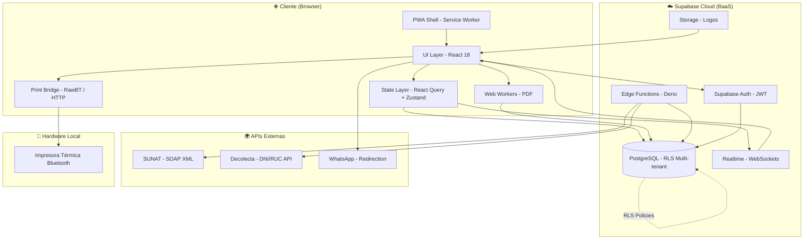
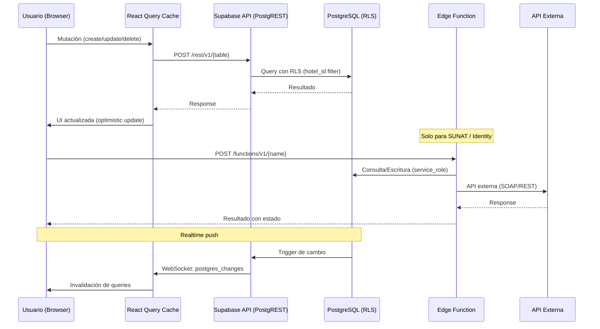
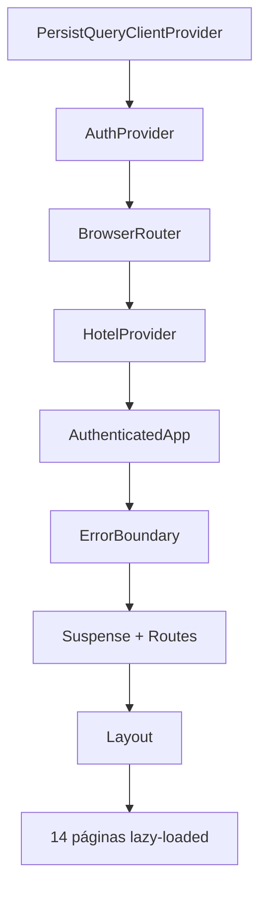
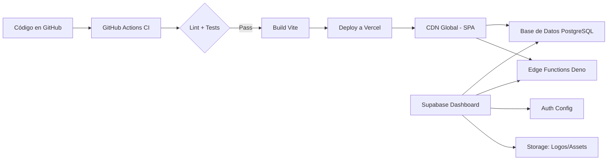
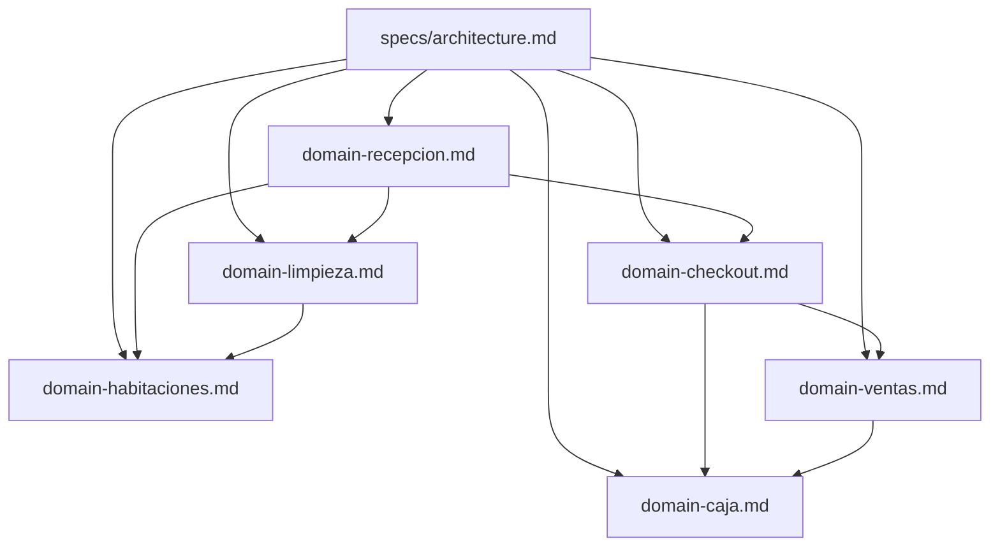

# Spec: Arquitectura General del Sistema

**Dominio:** Arquitectura  \
**Prioridad:** P0  \
**Versión:** 3.0 Enterprise  \
**Última actualización:** Agosto 2026  \
**Dependencias:** Ninguna (documento raíz. Todos los specs de dominio dependen de este.)

---

## 1. Propósito

Definir la arquitectura de software del **PMS JCAR LABS**, un Property Management System (PMS) serverless multi-tenant diseñado para la gestión integral de hospedajes en Perú. Este documento es el mapa arquitectónico raíz del sistema y detalla las capas, patrones, tecnologías y relaciones entre módulos que gobiernan todo el desarrollo.

Los specs de dominio (`domain-checkout.md`, `domain-recepcion.md`, `domain-habitaciones.md`, `domain-limpieza.md`, `domain-ventas.md`, `domain-caja.md`, `domain-fidelidad.md`) se derivan de esta arquitectura y la refinan con reglas de negocio específicas.

---

## 2. Stack Tecnológico

| Capa | Tecnología | Versión | Propósito |
|:---|:---|---:|:---|
| **Frontend Framework** | React | 18 | UI declarativa con componentes reutilizables |
| **Bundler** | Vite | 6 | Build ultrarrápido con HMR nativo |
| **Routing** | react-router-dom | 6 | SPA Navigation con lazy-loading |
| **Estilos** | Tailwind CSS | 3 | Utility-first + custom theme (Ivory & Emerald) |
| **UI Components** | shadcn/ui (Radix) | — | Componentes accesibles y personalizables |
| **Animaciones** | Framer Motion | 11 | Transiciones fluidas, glassmorphism |
| **Data Fetching / Caché** | TanStack React Query | 5 | Caché server-state + persistencia IndexedDB |
| **Estado Global** | Zustand | 5 | Estado minimalista (auth, UI, carrito) |
| **Validación** | Zod | 3 | Schemas de validación runtime + TypeScript |
| **Iconos** | Lucide React | — | Iconos SVG premium |
| **Gráficos** | Recharts | 2 | Dashboard y reportes analíticos |
| **PDF** | jsPDF + jsPDF-AutoTable | 4 | Comprobantes SUNAT A4 y exportación |
| **Excel** | SheetJS (xlsx) | — | Exportación de cierres de caja |
| **QR** | qrcode | — | Códigos QR en comprobantes SUNAT |
| **Notificaciones** | Sonner | 2 | Toasts modernos y accesibles |
| **Backend (BaaS)** | Supabase | 2 | Auth, Database, Realtime, Storage |
| **Base de Datos** | PostgreSQL (Supabase) | 15 | Persistencia principal |
| **Edge Functions** | Deno (Supabase) | — | SUNAT facturación, Identity DNI/RUC |
| **Impresión Térmica** | RawBT | — | ESC/POS Bluetooth bridge (Android) |
| **PWA** | Vite PWA Plugin + Workbox | — | Offline support, installable |
| **Pruebas** | Jest + Testing Library | 30 | Tests unitarios y de integración |
| **E2E** | Playwright | — | Tests end-to-end |
| **Linting** | ESLint + TypeScript (`@ts-check`) | — | Calidad de código y tipado JSDoc estricto (0 Errores IDE) |
| **CI/CD** | GitHub Actions | — | Deploy automático a Vercel |

---

## 3. Diagrama de Arquitectura General

### 3.1 Capas del Sistema



### 3.2 Flujo de Datos Transaccional



---

## 4. Estructura del Proyecto

### 4.1 Mapa de Directorios

```
/
├── .agents/skills/          # Skills para desarrollo asistido por AI
├── database/                # Migraciones SQL de la base de datos
├── specs/                   # Documentación de specs por dominio
├── public/                  # Assets estáticos (logo, manifest)
├── src/
│   ├── api/                 # Capa de acceso a datos (abstracción Supabase)
│   ├── components/          # Componentes UI por dominio y comunes
│   │   ├── ui/              # Componentes base shadcn/ui (Radix)
│   │   ├── admin/           # Gestión de hoteles (multi-tenant)
│   │   ├── caja/            # Arqueo, egresos, cierres
│   │   ├── common/          # Componentes compartidos (ErrorBoundary, etc.)
│   │   ├── comprobantes/    # Modal y botón de comprobantes SUNAT
│   │   ├── configuracion/   # Datos del hotel, SUNAT, personal
│   │   ├── dev/             # Panel de desarrollador (auditoría, stats)
│   │   ├── habitaciones/    # Grid, cards, formulario de habitaciones
│   │   ├── insumos/         # Inventario de insumos de limpieza
│   │   ├── layout/          # Layout principal, sidebar, topbar, bottomnav
│   │   ├── pos/             # Punto de venta (catálogo, carrito, pago)
│   │   ├── recepcion/       # Matriz de habitaciones, check-in modal
│   │   └── ventas/          # Tabla desktop, lista mobile, cards resumen
│   ├── config/              # Configuración (Supabase client, constants)
│   ├── constants/           # Constantes (statusColors, etc.)
│   ├── contexts/            # Contextos React (Auth, Hotel)
│   ├── hooks/               # Custom hooks por dominio
│   ├── lib/                 # Utilidades, helpers, exportadores
│   ├── modules/printer/     # Módulo de impresión térmica ESC/POS
│   ├── pages/               # Páginas de la aplicación (15 páginas)
│   │   ├── Caja/            # Componentes y hooks propios de Caja
│   │   ├── Configuracion/   # Componentes y hooks propios de Config
│   │   └── Dev/             # Panel desarrollador (auditoría, logs, tenant switch)
│   ├── router/              # Enrutamiento con guards de roles
│   ├── schemas/             # Schemas Zod para validación
│   ├── services/            # Servicios de lógica pura por dominio
│   ├── store/               # Stores Zustand (auth, ui)
│   ├── stores/              # Store del carrito Zustand (POS)
│   ├── styles/              # Estilos adicionales (animaciones, PWA)
│   ├── types/               # Tipos TypeScript compartidos
│   ├── utils/               # Utilidades generales
│   └── workers/             # Web Workers (pdfWorker)
├── supabase/functions/      # Edge Functions (facturacion, identity)
└── tests/                   # Tests por dominio
```

### 4.2 Arquitectura de Componentes por Página

Cada página sigue un patrón consistente:

```
src/pages/{Dominio}.jsx
├── Importa hooks específicos (use{Dominio}.js)
├── Importa componentes del dominio (src/components/{dominio}/)
├── Renderiza UI con datos de React Query
└── Delega mutaciones a servicios (src/services/{dominio}.service.ts)
```

| Página | Ruta | Acceso | Servicio | Schema | Hook |
|:---|:---|:---|:---|:---|:---|
| `Login.jsx` | `/login` | — | `auth.service.ts` | — | `useAuth` |
| `Dashboard.jsx` | `/dashboard` | admin, recepcionista | — | — | `useHotelData` |
| `Recepcion.jsx` | `/recepcion` | admin, recepcionista | `recepcion.service.ts` | `recepcion.schema.js` | `useRecepcion.js` |
| `Habitaciones.jsx` | `/habitaciones` | admin | `habitaciones.service.ts` | `habitacion.schema.ts` | `useHabitaciones.ts` |
| `Huespedes.jsx` | `/huespedes` | admin, recepcionista | — | — | — |
| `Ventas.jsx` | `/ventas` | admin, recepcionista | `checkout.service.ts` | `venta.schema.ts` | — |
| `Caja.jsx` | `/caja` | admin, recepcionista | `caja.service.ts` | `caja.schema.ts` | `useCajaStats.js` |
| `PuntoVenta.jsx` | `/pos` | admin, recepcionista | — | — | `useCartStore.js` |
| `Limpieza.jsx` | `/limpieza` | limpieza, admin | `limpieza.service.ts` | `limpieza.schema.ts` | — |
| `InsumosPage.jsx` | `/insumos` | admin, limpieza | — | — | — |
| `Reportes.jsx` | `/reportes` | admin | — | — | — |
| `Configuracion.jsx` | `/configuracion` | admin | `hotel.service.ts` | — | — |
| `PanelDesarrollador.jsx` | `/dev` | developer | — | — | — |

---

## 5. Capa de Datos (Persistencia)

### 5.1 Modelo de Base de Datos

El sistema usa **PostgreSQL 15** en Supabase con 18 tablas principales:

```
hoteles                    → Configuración del tenant
usuarios                   → Perfiles extendidos de auth
habitaciones               → Inventario de cuartos
reservas                   → Estadías activas e históricas
ventas                     → Ingresos por hospedaje
ventas_pos                 → Ingresos por minimarket / POS
categorias_productos       → Categorías del catálogo POS
productos                  → Productos del minimarket
egresos                    → Gastos operativos / caja chica
cierres_caja               → Cierres de turno financiero
tarifas_dinamicas          → Reglas de precios estacionales
categorias_insumos         → Categorías de insumos de limpieza
insumos                    → Inventario de insumos
movimientos_insumos        → Trazabilidad de consumo de insumos
checkins_publicos          → Pre-registro digital QR
audit_logs                 → Auditoría inmutable (triggers)
identity_cache             → Caché de consultas DNI/RUC
identity_logs              → Logs del microservicio de identidad
```

Ver el esquema completo en `database/`, `combined_setup.sql` y `supabase_schema.sql`.

### 5.2 Aislamiento Multi-Tenant (Row Level Security)

```
Tablas con hotel_id: habitaciones, reservas, ventas, ventas_pos,
                    egresos, cierres_caja, productos, categorias_productos,
                    tarifas_dinamicas, insumos, movimientos_insumos,
                    checkins_publicos

Mecanismo:
  1. Cada fila tiene campo hotel_id (UUID → hoteles.id)
  2. RLS Policy: hotel_id = get_my_hotel_id()
  3. get_my_hotel_id() es SECURITY DEFINER → SELECT hotel_id FROM usuarios WHERE id = auth.uid()
  4. Frontend: db.forHotel(hotelId) inyecta hotel_id automáticamente
  5. Rol 'developer' puede saltar el aislamiento para debug
  6. Rol 'admin' puede ver solo su hotel (excepción: PanelDesarrollador)
```

### 5.3 Capa de Acceso a Datos (`src/api/db.js`)

```typescript
// Abstracción unificada de CRUD sobre Supabase
db.entities.{EntityName}
  .list(orderBy?, limit?, columns?)    → SELECT con ordenamiento
  .create(record)                      → INSERT con UUID auto
  .update(id, updates)                 → UPDATE by ID (protege created_date)
  .delete(id)                          → DELETE by ID
  .filter(filters, columns?, orderBy?) → SELECT con condiciones

db.forHotel(hotelId)  → Proxy que inyecta hotel_id en todas las operaciones
db.auth.logout()       → Cierra sesión + limpia localStorage
db.users.inviteUser()  → Invita usuario por email
```

### 5.4 Índices Estratégicos

```sql
-- Ver database/optimizations_indexes_v2.sql
-- Índices compuestos en hoteles más consultados:
habitaciones(hotel_id, estado)
reservas(hotel_id, estado, fecha_entrada, fecha_salida)
ventas(hotel_id, fecha_pago)
ventas_pos(hotel_id, fecha_venta)
-- Índices parciales para consultas activas:
reservas WHERE estado IN ('activa', 'pendiente')
```

### 5.5 Auditoría Inmutable (Triggers PostgreSQL)

```sql
-- Triggers automáticos en ventas, reservas, cierres_caja
-- Log en audit_logs con: hotel_id, usuario_id, accion, tabla, registro_id, detalles (JSON)
-- Políticas RLS: solo INSERT (nadie puede UPDATE/DELETE audit_logs)
```

---

## 6. Capa Frontend (SPA React)

### 6.1 Árbol de Proveedores (`src/App.jsx`)



**Orden de carga crítica:**
1. `PersistQueryClientProvider` — Hidrata caché desde IndexedDB
2. `AuthProvider` — Verifica sesión Supabase + carga perfil de `usuarios`
3. `HotelProvider` — Carga datos del hotel asignado
4. `AuthenticatedApp` — Maneja loading, errores y renderizado condicional

### 6.2 Gestión de Estado

| Estado | Herramienta | Persistencia | Ámbito |
|:---|:---|:---|:---|
| Server State | React Query v5 | IndexedDB (48h estático, dinámico según staleTime) | Global |
| Auth | Zustand (`auth.store.ts`) | Sesión Supabase + localStorage | Global |
| UI Global | Zustand (`ui.store.ts`) | No persistente | Global |
| Carrito POS | Zustand (`useCartStore.js`) | No persistente | Sesión |
| Tema (dark/light) | next-themes | localStorage | Global |

**React Query Config:**
```typescript
const queryClient = new QueryClient({
  defaultOptions: {
    queries: {
      staleTime: 1000 * 60 * 2,       // 2 min
      gcTime: 1000 * 60 * 15,          // 15 min
      refetchOnWindowFocus: false,
      refetchOnReconnect: true,
      retry: 1,
    },
  },
});
```

### 6.3 Suscripciones en Tiempo Real (`useRealtimeSync.js`)

```typescript
// Canal Supabase Realtime por hotel
const channel = supabase.channel(`hotel_${hotelId}`);
  .on('postgres_changes', { table: 'reservas', filter: `hotel_id=eq.${hotelId}` }, ...)
  .on('postgres_changes', { table: 'habitaciones', filter: `hotel_id=eq.${hotelId}` }, ...)
  .on('postgres_changes', { table: 'ventas', filter: `hotel_id=eq.${hotelId}` }, ...)
```

Cuando ocurre un cambio, se invalida la query key correspondiente y React Query refresca la UI automáticamente.

### 6.4 Enrutamiento con Guards de Roles

```typescript
// src/router/guards.tsx
const roleAccess = {
  '/recepcion':    ['admin', 'recepcionista'],
  '/limpieza':     ['limpieza'],
  '/caja':         ['admin', 'recepcionista'],
  '/ventas':       ['admin', 'recepcionista'],
  '/configuracion': ['admin'],
  '/dev':          ['developer'],
  // ...
};

// RoleGuard: verifica rol del usuario contra la ruta
// AuthGuard: verifica sesión activa
// Redirección automática a /login si no autenticado
```

---

## 7. Capa de Servicios (Lógica de Negocio Pura)

### 7.1 Patrón de Servicios

Cada dominio tiene un **servicio de lógica pura** (funciones sin efectos secundarios ni imports de Supabase) y un **schema Zod** para validación:

```
src/services/{dominio}.service.ts
├── Funciones puras (sin side effects)
├── Tipos TypeScript (inputs/outputs)
├── Constantes del dominio
└── 100% testable sin mocks de base de datos

src/schemas/{dominio}.schema.ts
├── Schema Zod con validaciones
├── Tipos inferidos (z.infer)
└── Mensajes de error en español
```

### 7.2 Servicios Implementados

| Servicio | Archivo | Funciones | Tests |
|:---|:---|---:|:---|
| Recepción | `recepcion.service.ts` | 15+ | ✅ 64 tests |
| Checkout | `checkout.service.ts` | 10+ | ✅ 54 tests |
| Habitaciones | `habitaciones.service.ts` | 8+ | ✅ 46 tests |
| Limpieza | `limpieza.service.ts` | 10+ | ✅ 47 tests |
| Ventas | — | — | ✅ 72 tests (helpers) |
| Caja | `caja.service.ts` | 10+ | ✅ 33 tests |
| Auth | `auth.service.ts` | — | — |
| Hotel | `hotel.service.ts` | — | — |
| Reservas | `reservas.service.ts` | — | — |
| WhatsApp | `whatsapp.service.js` | — | — |

**Total: 395 tests** ✅

### 7.3 Hooks de Integración

Los hooks conectan los servicios con React Query y la UI:

| Hook | Servicio que usa | Query Keys |
|:---|:---|:---|
| `useRecepcion.js` | recepcion.service | `['reservas', hotelId]` |
| `useCheckout.ts` | checkout.service | `['reservas', 'ventas', hotelId]` |
| `useHabitaciones.ts` | habitaciones.service | `['habitaciones', hotelId]` |
| `useCajaStats.js` | caja.service | `['ventas', 'ventas_pos', 'egresos', hotelId]` |
| `useHotelData.ts` | hotel.service | `['hotel', 'config', hotelId]` |
| `useRealtimeSync.js` | — (solo suscripción) | Invalida queries por cambio |
| `useTarifador.js` | recepcion.service | — |
| `useIdentity.ts` | — (Edge Function) | `['identity']` |

---

## 8. Capa de Integración (Edge Functions y APIs)

### 8.1 Facturación Electrónica SUNAT

```
Edge Function: supabase/functions/facturacion/index.ts (Deno)
Endpoint:     POST /functions/v1/facturacion
Protocolo:    SOAP XML (UBL 2.1 + XAdES-BES)
Sandbox:      https://e-beta.sunat.gob.pe/
Producción:   https://e-factura.sunat.gob.pe/

Flujo:
  1. Frontend envía JSON con datos del comprobante
  2. Edge Function construye XML UBL 2.1
  3. Firma digital con XAdES-BES (node-forge)
  4. Comprime a ZIP (JSZip)
  5. Envía SOAP a SUNAT
  6. Recibe CDR y actualiza estado en BD
  7. Devuelve resultado al frontend

Estados del comprobante:
  ticket_interno → sunat_pendiente → sunat_emitido | sunat_rechazado
```

### 8.2 Microservicio de Identidad (DNI/RUC)

```
Edge Function: supabase/functions/identity/index.ts (Deno)
Endpoint:     POST /functions/v1/identity
Proveedor:    Decolecta API

Flujo:
  1. Frontend envía tipo_documento + numero
  2. Edge Function consulta identity_cache (TTL: 30 días DNI, 1 día RUC)
  3. Si no hay caché, consulta API Decolecta
  4. Almacena resultado en cache
  5. Devuelve JSON con datos del ciudadano/empresa
```

### 8.3 Impresión Térmica (ESC/POS)

```
Motor:      thermalPrinter.ts (generación de comandos ESC/POS)
Bridge:     RawBT (Android) / HTTP localhost:8080 (Desktop)
Template:   checkIn.js, checkOut.js, receipt.js, cashClosure.js, comprobanteTermico.js

Modos de impresión:
  - Android: deep link intent://rawbt#Intent...
  - Desktop: POST http://localhost:8080/ con datos del ticket
  - Fallback: Generación de PDF (jsPDF)

Servicio unificado: src/modules/printer/services/printer.service.js
  → printCheckInTicket(), printCheckOutTicket(), printReceipt()
```

### 8.4 WhatsApp Business

```
Servicio: src/services/whatsapp.service.js
Flujo:    Redirección a enlace de WhatsApp con mensaje pre-llenado
Uso:      Confirmación de reservas online (BookingPublico.jsx)
```

---

## 9. Concerns Transversales

### 9.1 PWA (Offline First)

```typescript
// vite.config.js → VitePWA plugin
// Service Worker con Workbox:
//   - CacheFirst para assets estáticos
//   - NetworkFirst para API Supabase
//   - runtimeCaching para /rest/v1/*

// main.jsx → registerSW({ immediate: true })
// ConnectionBanner en App.jsx → muestra "sin conexión"
```

### 9.2 Temas (Light / Dark OLED)

```css
/* src/index.css */
:root {
  --background: 0 0% 98%;           /* Ivory #FAFAFA */
  --primary: 158 95% 26%;           /* Deep Emerald */
  --secondary: 42 78% 60%;          /* Golden Harvest */
}

.dark {
  --background: 0 0% 0%;            /* Pure Black OLED */
  --primary: 158 95% 36%;
  --secondary: 42 78% 50%;
}

/* States */
--state-disponible-bg: 158 95% 97%;  /* Verde claro */
--state-ocupada-bg: 224 71% 97%;     /* Azul oscuro */
--state-reservada-bg: 262 83% 97%;   /* Púrpura claro */
--state-mantenimiento-bg: 42 78% 97%;/* Ámbar claro */
--state-limpieza-bg: 199 89% 97%;    /* Celeste claro */
```

### 9.3 Auditoría y Trazabilidad

```
Mecanismo: Triggers PostgreSQL + tabla audit_logs
Tablas auditadas: ventas, reservas, cierres_caja
Campos: hotel_id, usuario_id, accion, descripcion, modulo, created_date
Inmutabilidad: RLS solo permite INSERT (no UPDATE/DELETE)
Fallback: localStorage si Supabase no está disponible (auditLogger.js)
```

---

## 10. Arquitectura de Despliegue



### 10.1 Variables de Entorno Requeridas

```env
# Obligatorias
VITE_SUPABASE_URL=https://<proyecto>.supabase.co
VITE_SUPABASE_ANON_KEY=eyJhbGciOiJIU...

# Opcionales (para Edge Functions)
DECOLECTA_API_KEY=...
DECOLECTA_API_URL=...
```

### 10.2 Chunking de Build (Vite)

```javascript
manualChunks: {
  'vendor-core': ['react', 'react-dom', 'react-router-dom'],
  'vendor-data': ['@tanstack/react-query', '@supabase/supabase-js', 'zustand'],
  'vendor-ui': ['framer-motion', 'lucide-react', 'sonner'],
  'vendor-charts': ['recharts', 'date-fns', 'jspdf', 'xlsx'],
}
```

---

## 11. Arquitectura de Pruebas

### 11.1 Pirámide de Tests

```
         ╱╲
        ╱ E2E ╲           Playwright (pocos, rutas críticas)
       ╱────────╲
      ╱ Integración ╲     Testing Library + Jest (componentes + flujos)
     ╱────────────────╲
    ╱   Unit / Contrato  ╲  Jest (servicios puros + schemas)
   ╱────────────────────────╲
```

### 11.2 Distribución de Tests

| Tipo | Archivos | Tests | Dominios |
|:---|:---:|:---:|:---|
| Unit / Contrato | `tests/{dominio}/**` | 300+ | checkout, recepcion, habitaciones, limpieza, ventas, caja |
| Schema validation | `tests/schemas/**` | 20+ | caja, limpieza |
| Integración React | `tests/**/*.test.tsx` | 70+ | habitaciones, reportes, ventas, recepcion |

**Total: 395 tests** ✅

### 11.3 Patrón de Test de Contrato

Cada test de contrato sigue el formato:

```typescript
describe('DOM-XXX: Nombre del contrato', () => {
  it('debe cumplir la regla de negocio', () => {
    // Arrange: datos mock realistas
    // Act: función pura del service
    // Assert: resultado esperado
  });
});
```

Los tests NO dependen de Supabase — usan funciones puras de `src/services/`.

---

## 12. Mapa de Dependencias entre Specs



---

## 13. Glosario Arquitectónico

| Término | Definición |
|:---|---|
| **Tenant** | Hotel individual. Cada hotel es un tenant aislado por RLS. |
| **BaaS** | Backend as a Service. Supabase provee Auth, DB, Realtime, Storage. |
| **RLS** | Row Level Security. Políticas PostgreSQL que filtran filas por `hotel_id`. |
| **Multi-tenant** | Múltiples hoteles comparten la misma base de datos con aislamiento lógico. |
| **SPA** | Single Page Application. Toda la UI se sirve como un solo HTML+JS. |
| **PWA** | Progressive Web App. Instalable, offline, push notifications. |
| **Edge Function** | Función serverless en Deno ejecutada en el edge de Supabase. |
| **Realtime** | WebSockets de Supabase para actualizaciones en vivo. |
| **ESC/POS** | Protocolo de impresión térmica para tickets. |
| **CDR** | Constancia de Recepción. Comprobante de SUNAT que confirma la aceptación. |
| **UBL 2.1** | Estándar XML para facturación electrónica peruana. |
| **XAdES-BES** | Formato de firma digital XML para comprobantes SUNAT. |
| **DIRCETUR** | Dirección Regional de Comercio Exterior y Turismo. Ficha de registro obligatoria. |
| **MINCETUR** | Ministerio de Comercio Exterior y Turismo del Perú. |

---

## 14. Historial de Cambios

| Versión | Fecha | Cambio | Autor |
|:---|:---|:---|:---|
| 1.0 | Julio 2026 | Versión inicial del spec | Buffy (Freebuff) |
