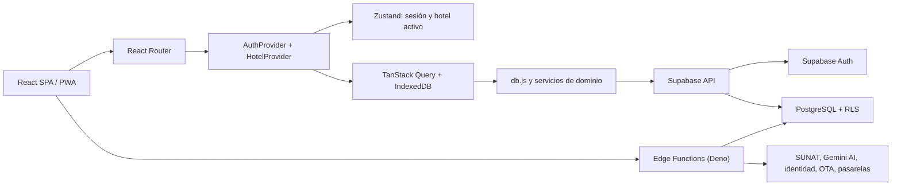
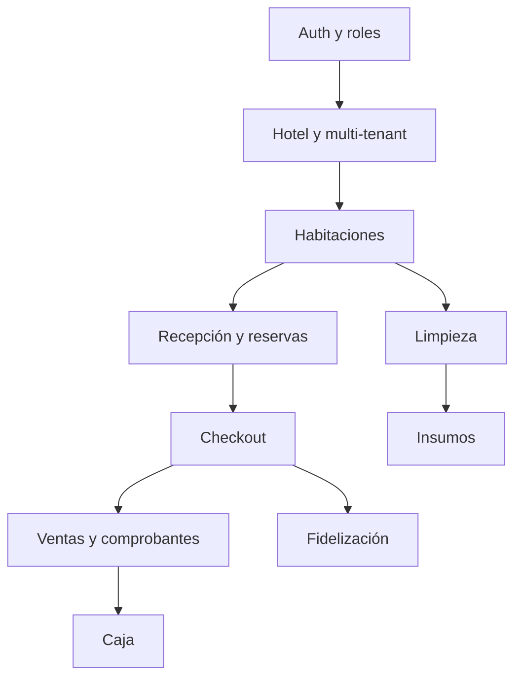

# Arquitectura del PMS JCAR LABS

**Versión:** 2.0.0
**Última revisión:** 22 de agosto de 2026

## Objetivo

El sistema es una SPA/PWA multi-tenant para operación hotelera. El frontend organiza la experiencia y limita rutas por rol, pero la autorización efectiva se aplica en PostgreSQL RLS y en las Edge Functions.

## Vista general

## Frontend

| Ruta o directorio | Responsabilidad |
| --- | --- |
| `src/App.jsx` | Providers, lazy loading y rutas |
| `src/components/Layout.jsx` | Shell, sidebar, navegación móvil y sesión |
| `src/router/ProtectedRoute.jsx` | Autenticación y control de acceso por ruta |
| `src/constants/permissions.ts` | Matriz compartida de permisos |
| `src/constants/roomStatus.ts` | Estados y transiciones de habitación |
| `src/contexts/AuthContext.tsx` | Sesión, perfil, conectividad y logout seguro |
| `src/contexts/HotelContext.tsx` | Propiedad activa y selector multi-hotel |
| `src/store/auth.store.ts` | Estado de sesión y `hotelId` |
| `src/lib/query-client.js` | Caché React Query persistida |
| `src/api/db.js` | Entidades y proxy con ámbito de hotel |
| `src/services/` | Lógica de negocio reutilizable |
| `src/pages/` | Módulos de la aplicación |

Las páginas privadas se cargan mediante `React.lazy`. `ErrorBoundary`, los skeletons y el toaster se montan a nivel de aplicación.

## Rutas y permisos

### Rutas públicas

| Ruta | Propósito |
| --- | --- |
| `/login` | Inicio de sesión por email y contraseña |
| `/booking/:hotelId` | Motor público de reservas |
| `/public-checkin/:token` | Pre-check-in mediante token |
| `/portal/:token` | Portal del huésped |

### Rutas privadas

| Ruta | Roles |
| --- | --- |
| `/` | admin, developer |
| `/dev` | developer |
| `/configuracion` | admin, developer |
| `/revenue`, `/insumos` | admin, developer |
| `/caja`, `/reportes`, `/ventas` | admin, developer, recepcionista |
| `/recepcion`, `/huespedes`, `/pos` | admin, developer, recepcionista |
| `/habitaciones`, `/limpieza` | admin, developer, recepcionista, limpieza |

`ProtectedRoute` redirige a limpieza hacia `/limpieza` y a recepción hacia `/recepcion`. Esta matriz debe mantenerse sincronizada con `src/constants/permissions.ts`.

## Contexto multi-tenant

1. Supabase Auth recupera o crea la sesión.
2. `AuthContext` carga el perfil desde `usuarios` y valida `activo` y `role`.
3. `useHotelData` obtiene las propiedades autorizadas.
4. `auth.store` conserva el `hotelId` activo y lo refleja en `localStorage`.
5. `db.forHotel(hotelId)` añade el ámbito esperado a las operaciones del cliente.
6. RLS vuelve a validar identidad, rol y hotel en el servidor.

El filtro del cliente no es un control de seguridad. Una operación sigue siendo inválida si RLS no la autoriza.

## Datos y sincronización

- TanStack Query administra consultas, mutaciones e invalidaciones.
- La caché seleccionada persiste en IndexedDB.
- Realtime invalida información operativa al recibir cambios de Supabase.
- Las mutaciones PMS requieren conexión y un contrato idempotente del servidor; la compatibilidad `sync-queue.js` falla cerrada y no persiste/reproduce operaciones.
- `OfflineSyncManager` solo informa conectividad; no ejecuta mutaciones almacenadas.
- El logout no depende de colas del navegador y purga la caché allowlist de esa identidad.
- El Service Worker no almacena respuestas autenticadas de Supabase.

## Backend

`supabase/migrations/` es la única fuente versionada del esquema, funciones SQL y políticas RLS.

Las Edge Functions cubren:

- configuración de secretos por hotel;
- **facturación electrónica (SUNAT)** y firmado XML (`facturacion`, `xmlGenerator`, `xmlSigner`);
- **inteligencia artificial (Gemini 2.0)** y tool calling (`ai-gateway`);
- **conectividad OTA** bidireccional (`ota-sync-inventory`, `ota-sync-rates`);
- **pasarelas de pago** y webhooks (`generate-payment`, `validate-gateway`, `webhook-gateway`);
- booking, check-in y portal públicos;
- invitación de usuarios e identidad;
- expiración de puntos.

Las funciones están escritas para el runtime de Deno 2.x. Se utiliza el archivo `deno.json` para configurar módulos nativos (`npm:` specifiers) como `xml-crypto` y deshabilitar advertencias intrusivas de linter, asegurando que el servidor de lenguaje no colisione con el proyecto React raíz.

Las funciones autenticadas reutilizan `supabase/functions/_shared/auth-middleware.ts`. Las integraciones sin proveedor real deben devolver un error explícito y permanecer deshabilitadas.

## Seguridad

1. Cada entidad operativa incluye `hotel_id`.
2. Los perfiles y hoteles inactivos no pueden operar.
3. La clave `service_role` nunca se entrega al navegador.
4. Los secretos fiscales y de pago se escriben mediante una Edge Function y se almacenan fuera de columnas públicas.
5. Las rutas públicas reciben datos mínimos mediante contratos controlados.
6. Las invitaciones validan rol, hotel y autoridad del solicitante.
7. Las acciones destructivas se confirman en la UI y siguen protegidas por RLS.
8. Una migración aplicada nunca se reescribe.

## PWA y rendimiento

- Vite divide los proveedores principales en chunks.
- Las páginas usan lazy loading.
- Procesamiento pesado delegado a Web Workers (ej. generación asíncrona de reportes y PDFs) para evitar bloquear el hilo de la UI.
- Limpieza automática de animaciones (garbage collection) a través de los contextos nativos de `@gsap/react`.
- Workbox precachea activos estáticos y aplica actualización automática.
- No existe runtime caching de respuestas Supabase.
- `ANALYZE=true pnpm build` genera un reporte local del bundle.

## Quality gate

`.github/workflows/deploy.yml` ejecuta:

1. `pnpm install --frozen-lockfile`;
2. `pnpm lint`;
3. `pnpm typecheck`;
4. `pnpm audit --audit-level=high`;
5. `pnpm build`;
6. publicación del artefacto `dist`.

Los escenarios contractuales de cada spec funcionan como matriz de aceptación. El repositorio productivo no incluye las suites de pruebas históricas eliminadas durante la limpieza.

## Dependencias de dominio

Los contratos detallados se encuentran en `specs/domain-*.md`.

## Reglas de evolución

- Actualizar código y documentación en el mismo cambio.
- Crear migraciones aditivas y reversibles cuando sea posible.
- Centralizar permisos y estados; no duplicar strings de dominio.
- Reutilizar componentes visuales y contratos de datos.
- Ejecutar el quality gate y el smoke check antes de promover a producción.
