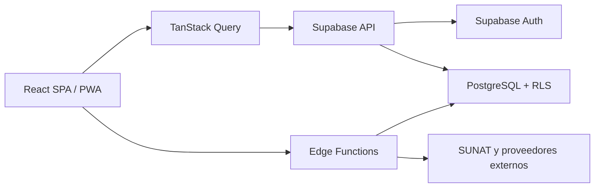

# Arquitectura del PMS JCAR LABS

## Objetivo

El sistema es una SPA multi-tenant para operación hotelera. El frontend nunca sustituye la autorización del backend: Supabase Auth identifica al usuario y PostgreSQL RLS limita cada operación al hotel autorizado.

## Componentes

## Frontend

- `src/App.jsx`: rutas públicas y protegidas.
- `src/components/Layout.jsx`: navegación y shell operativo.
- `src/pages/`: módulos cargados de forma diferida.
- `src/api/db.js`: acceso CRUD y ámbito del hotel.
- `src/contexts/`: autenticación y selección del hotel.
- `src/services/`: lógica de negocio compartida que participa en producción.
- `src/modules/printer/`: impresión térmica y plantillas.

Las rutas privadas son:

| Ruta | Módulo |
| --- | --- |
| `/` | Dashboard |
| `/habitaciones` | Habitaciones |
| `/recepcion` | Recepción |
| `/huespedes` | Huéspedes |
| `/ventas` | Ventas |
| `/caja` | Caja |
| `/reportes` | Reportes |
| `/revenue` | Revenue |
| `/configuracion` | Configuración |
| `/pos` | Punto de venta |
| `/limpieza` | Housekeeping |
| `/insumos` | Inventario |
| `/dev` | Administración multi-tenant |

Las rutas `/booking/:hotelId`, `/public-checkin/:token` y `/portal/:token` son públicas, pero sus datos se entregan mediante contratos restringidos y tokens.

## Persistencia y sincronización

- React Query administra caché, revalidación e invalidaciones.
- La caché persistente usa IndexedDB.
- Realtime invalida datos operativos cuando cambian en Supabase.
- La cola offline almacena mutaciones pendientes y las reintenta con el contexto del hotel.
- El Service Worker no almacena respuestas autenticadas de Supabase.

## Backend

`supabase/migrations/` es la fuente de verdad del esquema y RLS. Las Edge Functions aíslan credenciales y operaciones privilegiadas:

- facturación SUNAT e identidad;
- reservas, check-in y portal públicos;
- invitaciones;
- configuración segura por hotel;
- webhooks, pagos y OTA.

Las integraciones sin adaptador real deben fallar de forma explícita; no deben simular éxito.

## Seguridad multi-tenant

1. Cada entidad operativa incluye `hotel_id`.
2. RLS valida usuario activo, rol y hotel.
3. El cliente añade ámbito de hotel para ergonomía, pero RLS es la defensa efectiva.
4. Las credenciales sensibles viven en esquemas privados o secretos de Edge Functions.
5. La clave `service_role` nunca llega al navegador.
6. Los endpoints públicos aplican tokens, expiración, rate limiting y selección mínima de columnas.

## Dependencias de dominio

Los contratos funcionales se mantienen en:

- `domain-auth.md`
- `domain-hotel.md`
- `domain-habitaciones.md`
- `domain-recepcion.md`
- `domain-checkout.md`
- `domain-ventas.md`
- `domain-caja.md`
- `domain-limpieza.md`
- `domain-insumos.md`
- `domain-fidelidad.md`

## Reglas de evolución

- Crear migraciones aditivas y reversibles cuando sea posible.
- No editar migraciones ya aplicadas.
- Mantener los estados de habitación y reserva centralizados.
- Reutilizar componentes compartidos para confirmaciones, estados y acciones.
- Todo cambio debe superar lint, typecheck y build antes del despliegue.
