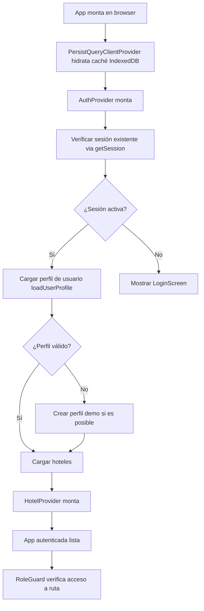
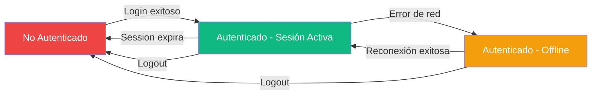
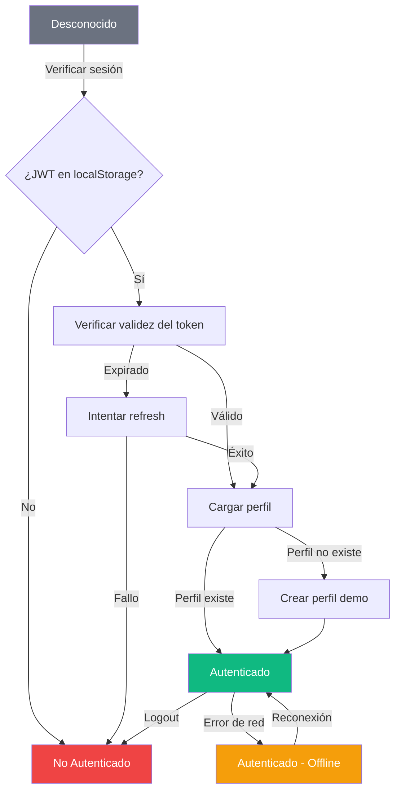

# Spec: Autenticación y Autorización — Auth, Roles y Sesiones

**Dominio:** Autenticación / Auth  
**Prioridad:** P0  
**Versión:** 3.0 Enterprise  
**Última actualización:** Agosto 2026  
**Dependencias:** `specs/architecture.md`, `specs/domain-hotel.md`

---

## 1. Propósito

Gestiona el ciclo de vida completo de autenticación y autorización del sistema: inicio de sesión (login), cierre de sesión (logout), persistencia de sesión, carga del perfil de usuario, asignación de roles y control de acceso a rutas y funcionalidades. El módulo de Auth es la puerta de entrada al sistema y define qué puede hacer cada usuario dentro del PMS.

El sistema utiliza **Supabase Auth** como proveedor de identidad, complementado con una tabla `usuarios` que extiende el perfil con datos de negocio: hotel asignado, rol y nombre completo.

---

## 2. Flujo Canónico

### 2.1 Inicio de Sesión (Login)

```mermaid
graph TD
    A[Usuario accede a /login] --> B[Ingresar email + contraseña]
    B --> C[Validar formato de email]
    C -->|Inválido| D[Mostrar error: "Email inválido"]
    C -->|Válido| E[Llamar a supabase.auth.signInWithPassword]
    E --> F{¿Credenciales correctas?}
    F -->|No| G[Mostrar error: "Credenciales inválidas"]
    F -->|Sí| H[Recibir sesión JWT]
    H --> I[Cargar perfil desde tabla 'usuarios']
    I --> J{¿Existe perfil?}
    J -->|Sí| K[Cargar datos del hotel asignado]
    J -->|No| L[Crear perfil demo automático]
    L --> K
    K --> M[Redirigir a página de inicio según rol]
    M --> N[Mostrar toast de bienvenida]
```

### 2.2 Carga de Aplicación (App Initializer)



### 2.3 Cierre de Sesión (Logout)

```mermaid
graph TD
    A[Usuario hace clic en Cerrar Sesión] --> B[Confirmar acción]
    B --> C[Llamar a supabase.auth.signOut]
    C --> D[Limpiar Zustand store (auth.store)]
    D --> E[Limpiar localStorage: claves sb-*]
    E --> F[Limpiar sessionStorage]
    F --> G[Redirigir a /login]
    G --> H[Recargar aplicación]
```

---

## 3. Reglas de Negocio

### RN-AUTH-001: Roles del Sistema

El sistema define exactamente 4 roles, cada uno con un conjunto específico de permisos:

```typescript
type UserRole = 'admin' | 'recepcionista' | 'limpieza' | 'developer';
```

| Rol | Acceso | Descripción |
|:---|:---|:---|
| `admin` | Todas las rutas excepto `/dev` | Gestión completa del hotel: configuración, personal, reportes, datos financieros |
| `recepcionista` | `/recepcion`, `/pos`, `/ventas`, `/caja`, `/huespedes`, `/habitaciones` | Operaciones diarias: check-in, check-out, cobros, POS, caja chica |
| `limpieza` | `/limpieza`, `/habitaciones` | Housekeeping: ver habitaciones sucias, marcar limpieza completada, registrar insumos |
| `developer` | Todas las rutas incluido `/dev` | Depuración, tests, auditoría, herramientas de sistema |

**Reglas de jerarquía:**
- `developer` tiene acceso total (diagnóstico y reparación).
- `admin` ve todo excepto herramientas de desarrollo.
- `recepcionista` no puede borrar transacciones ni ver credenciales SOL de SUNAT.
- `limpieza` solo ve su módulo específico.

### RN-AUTH-002: Estados de Autenticación



- **No Autenticado:** Usuario no ha iniciado sesión o sesión expiró. Solo ve `/login`.
- **Autenticado - Sesión Activa:** Usuario con JWT válido y perfil cargado. Acceso completo según rol.
- **Autenticado - Offline:** Sesión JWT aún vigente pero sin conexión a Supabase. La UI funciona con datos cacheados.

### RN-AUTH-003: Persistencia de Sesión

```
La sesión JWT se almacena en localStorage por Supabase Auth.
Tiene un TTL configurable (default: 1 hora de acceso, 7 días de refresh).
Al recargar la página:
  1. supabase.auth.getSession() recupera la sesión desde localStorage
  2. Si el token expiró, supabase.auth.refreshSession() intenta renovarlo
  3. Si falla el refresh → sesión inválida → mostrar LoginScreen
```

- El refresh token se maneja automáticamente por Supabase Auth.
- No se requiere lógica manual de refresh.

### RN-AUTH-004: Carga de Perfil (loadUserProfile)

```typescript
async function loadUserProfile(userId: string): Promise<UserProfile> {
  1. SELECT * FROM usuarios WHERE id = userId
  2. SI no existe (PGRST116) → createDemoProfile(userId)
  3. SI existe → retornar perfil con role normalizado
  4. SI role = 'administrador' → normalizar a 'admin'
  5. SI email = 'almanacenromeroj@gmail.com' → forzar role = 'developer'
}
```

- El perfil se carga **antes** de que cualquier componente intente acceder a datos.
- La tabla `usuarios` es una extensión de `auth.users` (FK por defecto).
- El mapeo `auth.users.id → usuarios.id` es responsabilidad de la app al registrarse.

### RN-AUTH-005: Creación de Perfil Demo (createDemoProfile)

```
CUANDO el usuario autenticado NO tiene registro en 'usuarios':
  1. Obtener datos de auth.getUser()
  2. SI user.email = developer → role = 'developer'
     SINO → role = 'admin'
  3. INSERT en usuarios:
     id, email, full_name, role, hotel_id (default UUID)
  4. Retornar perfil creado
```

- Este mecanismo **solo opera en entorno demo** (no hay registro formal).
- Para producción, un admin debe invitar al usuario manualmente desde la Configuración.

  > **Nota de implementación:** `db.users.inviteUser()` es una función planeada para invitar
  > usuarios por email con asignación automática de rol y hotel. Actualmente no está implementada.
  > La invitación se realiza insertando directamente en la tabla `usuarios`.

### RN-AUTH-006: Control de Acceso por Ruta (Guards)

```typescript
const ROUTE_ROLE_MAP = {
  '/':              ['admin', 'developer'],
  '/dev':          ['developer'],
  '/configuracion': ['admin', 'developer'],
  '/caja':          ['admin', 'developer', 'caja'],
  '/reportes':      ['admin', 'developer', 'caja'],
  '/ventas':        ['admin', 'developer', 'recepcionista', 'caja'],
  '/recepcion':     ['admin', 'developer', 'recepcionista'],
  '/huespedes':     ['admin', 'developer', 'recepcionista'],
  '/pos':           ['admin', 'developer', 'recepcionista', 'caja'],
  '/habitaciones':  ['admin', 'developer', 'recepcionista', 'limpieza'],
  '/limpieza':      ['admin', 'developer', 'recepcionista', 'limpieza'],
};
```

**Reglas de redirección:**
- Si el usuario no autenticado → redirigir a `/login` (guardar ruta original en `state.from`).
- Si el usuario autenticado no tiene rol para la ruta → redirigir a su página de inicio según rol:
  - `limpieza` → `/limpieza`
  - `recepcionista` → `/recepcion`
  - `caja` → `/caja`
  - otros → `/`
- Si el usuario autenticado visita `/` → redirigir según rol a su página predeterminada.

### RN-AUTH-007: Registro de Auditoría (Audit Logs)

```typescript
interface AuditLogPayload {
  hotel_id: string;          // UUID del hotel
  usuario_id: string;        // UUID del usuario que realizó la acción
  usuario_nombre: string;    // Nombre del usuario (redundancia para histórico)
  usuario_role: string;      // Rol del usuario
  accion: string;            // Acción en mayúsculas (ej. "CHECK-IN", "CHECK-OUT")
  descripcion: string;       // Descripción legible de la acción
  modulo: ModuloSistema;     // Módulo: recepcion, ventas, caja, pos, limpieza, configuracion, dev
}
```

**Mecanismo de registro:**
1. Intentar INSERT en `audit_logs` via Supabase.
2. SI falla Supabase → almacenar en `localStorage['audit_logs_fallback']` (máximo 100 registros).
3. La acción se convierte automáticamente a mayúsculas.
4. Los audit_logs son **inmutables** (RLS solo permite INSERT, no UPDATE/DELETE).

### RN-AUTH-008: Seguridad de Sesión

```
- JWT almacenado en localStorage con prefijo 'sb-'
- Al hacer logout:
  1. supabase.auth.signOut()
  2. Limpiar store Zustand (auth.store)
  3. Eliminar todas las claves localStorage que empiecen con 'sb-'
  4. sessionStorage.clear()
  5. window.location.reload() → reinicia app limpia
  
- No se borran configuraciones de tema, PWA ni preferencias de usuario.
- El logout es total: no hay sesión persistente entre recargas.
```

### RN-AUTH-009: Manejo de Errores de Autenticación

| Error | Causa | Mensaje | Acción |
|:---|---|:---|---|
| `Invalid login credentials` | Email o contraseña incorrectos | "Credenciales inválidas. Verifica tu email y contraseña." | Mostrar en UI del formulario |
| `Email not confirmed` | Email no verificado | "Debes confirmar tu email antes de iniciar sesión." | Reenviar confirmación |
| `User not found` | Usuario eliminado o no existe | "Usuario no encontrado." | Redirigir a login |
| `PGRST116` (profile no existe) | Usuario autenticado sin perfil | Auto-crear perfil demo | Flujo automático |
| Network error | Sin conexión a Supabase | "Error de conexión. Verifica tu internet." | Toast + reintento automático |

---

## 4. Schemas de Datos

### 4.1 UserProfile (Perfil de Usuario)

```typescript
interface UserProfile {
  id: string;                    // UUID, PK, REFERENCES auth.users(id)
  email?: string;                // Correo electrónico (único)
  full_name: string;             // Nombre completo del colaborador
  role: 'admin' | 'recepcionista' | 'limpieza' | 'developer';  // Rol del sistema
  hotel_id?: string;             // UUID, FK → hoteles(id) — hotel asignado
  created_date?: string;         // Fecha de creación del perfil (TIMESTAMPTZ)
}
```

### 4.2 AuthState (Estado de Autenticación — Zustand Store)

```typescript
interface AuthState {
  // Estado
  user: UserProfile | null;       // Perfil del usuario autenticado
  session: Session | null;        // Sesión JWT de Supabase
  hotelId: string | null;         // ID del hotel activo
  isAuthenticated: boolean;       // Flag de autenticación

  // Acciones
  setSession: (session: Session | null) => void;
  setUser: (user: UserProfile | null) => void;
  setHotelId: (hotelId: string | null) => void;
  clearAuth: () => void;
}
```

### 4.3 AuditLogPayload (Payload de Auditoría)

```typescript
interface AuditLogPayload {
  hotel_id: string;              // UUID del hotel
  usuario_id: string;            // UUID del usuario
  usuario_nombre: string;        // Nombre del colaborador
  usuario_role: string;          // Rol del colaborador
  accion: string;                // Acción (se almacena en mayúsculas)
  descripcion: string;           // Descripción legible
  modulo: 'recepcion' | 'ventas' | 'caja' | 'pos' | 'limpieza' | 'configuracion' | 'dev';
}
```

### 4.4 Tabla `usuarios` — Estructura Completa

| Campo | Tipo | Restricción | Descripción |
|:---|:---|:---|:---|
| `id` | UUID | PK, REFERENCES auth.users(id) ON DELETE CASCADE | ID sincronizado con Supabase Auth |
| `email` | TEXT | UNIQUE, NOT NULL | Correo de inicio de sesión |
| `full_name` | TEXT | NOT NULL | Nombre completo |
| `role` | TEXT | NOT NULL, DEFAULT 'recepcionista' | admin, recepcionista, limpieza, developer |
| `hotel_id` | UUID | REFERENCES hoteles(id) ON DELETE SET NULL | Hotel asignado (tenant isolation) |
| `created_date` | TIMESTAMPTZ | DEFAULT now() | Fecha de creación |

**Política RLS:**
```sql
-- Los usuarios pueden ver solo su propio perfil
CREATE POLICY "ver_propio_perfil" ON usuarios
  FOR SELECT TO authenticated
  USING (id = auth.uid());

-- El admin del hotel puede ver todos los usuarios de su hotel
CREATE POLICY "admin_ver_usuarios_hotel" ON usuarios
  FOR SELECT TO authenticated
  USING (
    hotel_id = get_my_hotel_id()
    AND EXISTS (SELECT 1 FROM usuarios WHERE id = auth.uid() AND role IN ('admin', 'developer'))
  );
```

### 4.5 Tabla `audit_logs` — Estructura

| Campo | Tipo | Descripción |
|:---|:---|:---|
| `id` | UUID | PK |
| `hotel_id` | UUID | FK → hoteles |
| `usuario_id` | UUID | FK → usuarios |
| `usuario_nombre` | TEXT | Nombre del usuario |
| `usuario_role` | TEXT | Rol del usuario |
| `accion` | TEXT | Acción registrada |
| `descripcion` | TEXT | Descripción legible |
| `modulo` | TEXT | Módulo del sistema |
| `created_date` | TIMESTAMPTZ | Fecha de creación |

---

## 5. Diagrama de Estado de Sesión



---

## 6. Integraciones

### 6.1 Hotel Provider

```
El AuthProvider debe montarse ANTES que el HotelProvider:
1. AuthProvider verifica sesión y carga perfil
2. HotelProvider usa user.hotel_id para cargar datos del hotel asignado

Flujo de dependencia:
  AuthProvider → HotelProvider → Páginas
```

### 6.2 API db.js (Capa de Datos)

```
El objeto db.auth.logout() es el método unificado de cierre de sesión:
  - Llama a supabase.auth.signOut()
  - Dispara clearAuth() del store
  - Limpia localStorage/sessionStorage
  - Recarga la aplicación
```

### 6.3 Guards de Ruta (Route Guards)

```
Los guards de ruta se implementan en dos capas:

AuthGuard: Verifica que el usuario tenga sesión activa.
  - Si no autenticado → redirigir a /login
  - Guarda la ruta original en location.state para redirección post-login

RoleGuard: Verifica que el rol del usuario tenga acceso a la ruta.
  - Consulta ROUTE_ROLE_MAP con la ruta actual
  - Si no tiene permiso → redirigir a página de inicio del rol
```

### 6.4 ErrorBoundary

```
El ErrorBoundary global captura errores de autenticación no manejados.
Si el error es de autenticación (código 401/403):
  - Forzar logout
  - Mostrar pantalla de error con opción "Reintentar"
```

---

## 7. Tests de Contrato

- [ ] `AUTH-001`: Obtener sesión activa con usuario autenticado → retorna sesión JWT
- [ ] `AUTH-002`: Obtener sesión sin usuario autenticado → retorna null
- [ ] `AUTH-003`: Cargar perfil de usuario existente → retorna UserProfile completo
- [ ] `AUTH-004`: Cargar perfil de usuario inexistente → crea perfil demo automáticamente
- [ ] `AUTH-005`: Crear perfil demo para email de developer → role = 'developer'
- [ ] `AUTH-006`: Crear perfil demo para email normal → role = 'admin'
- [ ] `AUTH-007`: Normalizar role 'administrador' a 'admin'
- [ ] `AUTH-008`: Forzar role 'developer' para email del dueño
- [ ] `AUTH-009`: Registrar audit log exitosamente en Supabase
- [ ] `AUTH-010`: Registrar audit log con fallback a localStorage cuando Supabase falla
- [ ] `AUTH-011`: Audit log convierte accion a mayúsculas
- [ ] `AUTH-012`: AuthGuard redirige a /login si no hay sesión
- [ ] `AUTH-013`: RoleGuard permite acceso a ruta permitida
- [ ] `AUTH-014`: RoleGuard redirige a página por defecto según rol si no tiene permiso
- [ ] `AUTH-015`: RoleGuard redirige a página específica al visitar `/` según rol
- [ ] `AUTH-016`: Logout limpia correctamente sessionStorage y localStorage
- [ ] `AUTH-017`: clearAuth resetea el store Zustand a estado inicial

---

## 8. Criterios de Aceptación

1. ✅ Un usuario con credenciales válidas puede iniciar sesión y es redirigido a su página según rol
2. ✅ Un usuario sin credenciales ve la pantalla de login
3. ✅ El perfil de usuario se carga automáticamente con los datos de la tabla `usuarios`
4. ✅ Los roles se aplican correctamente en todas las rutas protegidas
5. ✅ Cada acción crítica genera un audit_log inmutable
6. ✅ Si Supabase no está disponible, los audit_logs se almacenan en localStorage como fallback
7. ✅ El logout limpia completamente la sesión sin afectar configuraciones de tema/PWA
8. ✅ La sesión persiste al recargar la página (JWT en localStorage)
9. ✅ El refresh de token es automático y transparente para el usuario
10. ✅ El ErrorBoundary captura errores de autenticación y ofrece opción de reintento

---

## 9. Historial de Cambios

| Versión | Fecha | Cambio | Autor |
|:---|:---|:---|:---|
| 1.0 | Julio 2026 | Versión inicial del spec | Buffy (Freebuff) |
