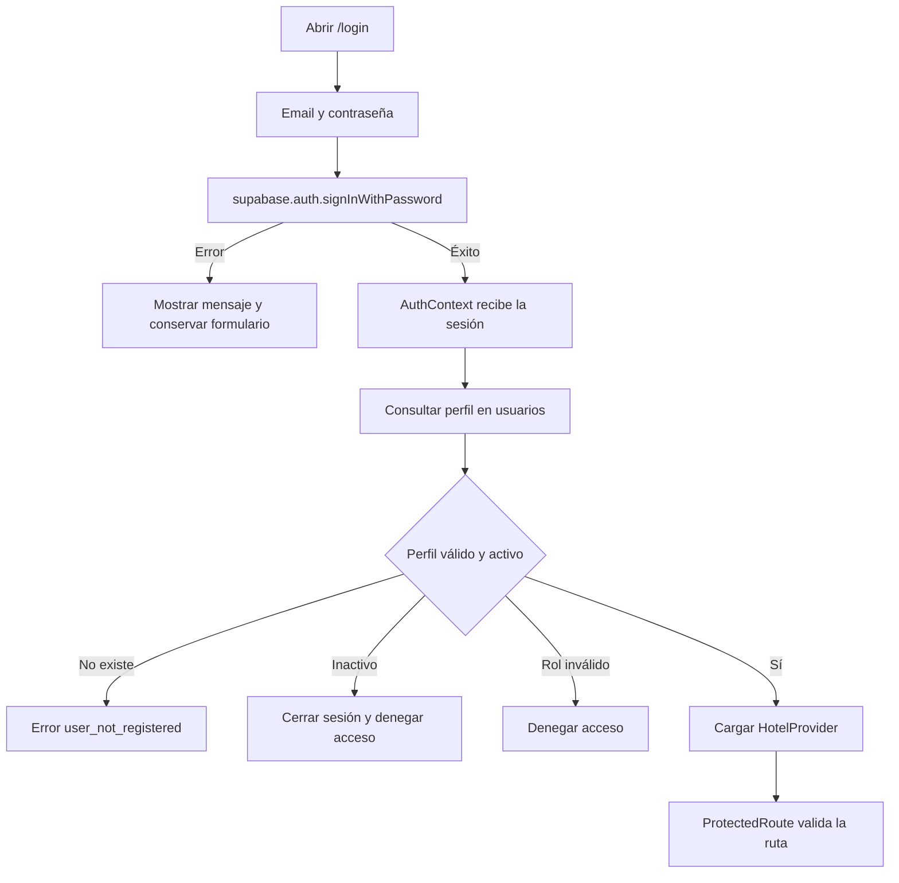
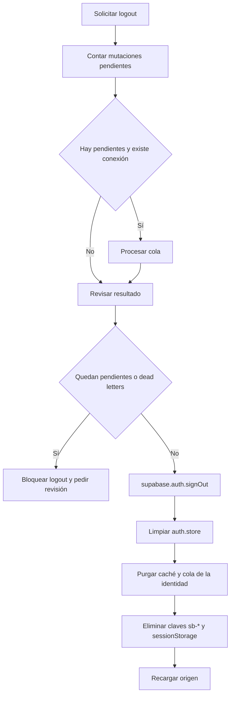

# Spec: autenticación y autorización

**Dominio:** identidad, sesión y permisos
**Prioridad:** P0
**Versión:** 4.0
**Última actualización:** 16 de agosto de 2026

## 1. Propósito

Supabase Auth identifica al usuario. La tabla `usuarios` extiende esa identidad con nombre, rol, hotel y estado activo. El frontend restringe rutas para orientar la experiencia; RLS y las Edge Functions aplican la autorización definitiva.

Fuentes ejecutables:

- `src/pages/Login.jsx`;
- `src/contexts/AuthContext.tsx`;
- `src/store/auth.store.ts`;
- `src/router/ProtectedRoute.jsx`;
- `src/constants/permissions.ts`;
- `supabase/functions/invite-user/index.ts`.

## 2. Inicio de sesión



Reglas:

- El login acepta email válido y contraseña de al menos seis caracteres en la interfaz.
- No se crea un perfil demo automáticamente.
- Un usuario autenticado sin registro en `usuarios` recibe `user_not_registered`.
- Solamente se aceptan los roles `admin`, `developer`, `recepcionista` y `limpieza`.
- `usuarios.activo = false` fuerza el cierre de sesión.

## 3. Persistencia y carga

1. Supabase conserva y renueva la sesión.
2. `PersistQueryClientProvider` hidrata la caché permitida.
3. `AuthContext` recupera la sesión y carga el perfil.
4. `auth.store` refleja usuario, sesión, conectividad y hotel activo.
5. `HotelProvider` carga las propiedades autorizadas.
6. La aplicación privada se renderiza cuando identidad y hotel terminaron de validarse.

El estado `isAuthenticated` requiere simultáneamente sesión y perfil.

## 4. Roles y rutas

| Ruta | developer | admin | recepcionista | limpieza |
| --- | :---: | :---: | :---: | :---: |
| `/` | Sí | Sí | Redirige | Redirige |
| `/dev` | Sí | No | No | No |
| `/configuracion` | Sí | Sí | No | No |
| `/revenue`, `/insumos` | Sí | Sí | No | No |
| `/caja`, `/reportes`, `/ventas` | Sí | Sí | Sí | No |
| `/recepcion`, `/huespedes`, `/pos` | Sí | Sí | Sí | No |
| `/habitaciones`, `/limpieza` | Sí | Sí | Sí | Sí |

Redirecciones:

- usuario sin perfil válido: `/login`;
- recepcionista que abre `/`: `/recepcion`;
- limpieza que abre `/`: `/limpieza`;
- ruta no permitida: pantalla de acceso restringido con retorno al inicio del rol.

La matriz debe cambiarse en `src/constants/permissions.ts`, no duplicarse dentro de componentes.

## 5. Hotel activo

- `hotelId` forma parte del store de autenticación.
- `localStorage['hotel_activo_id']` permite recuperar la última propiedad autorizada.
- Si el valor persistido no pertenece a la lista actual, se selecciona la primera propiedad válida.
- Cambiar de hotel actualiza el store y obliga a las consultas a usar el nuevo contexto.
- RLS vuelve a comprobar que el usuario pueda operar sobre ese hotel.

## 6. Invitación de usuarios

`db.users.inviteUser(email, role, hotelId)` invoca la Edge Function `invite-user`.

La función:

1. autentica al solicitante;
2. exige rol admin o developer;
3. valida email, UUID y rol de destino;
4. impide que un admin invite usuarios a otro hotel;
5. usa `INVITE_REDIRECT_URL`;
6. envía la invitación con Supabase Admin;
7. crea o actualiza el perfil `usuarios` con `activo = true`;
8. elimina la identidad recién creada si falla el perfil.

Roles invitables: `admin`, `recepcionista` y `limpieza`. La creación de developers no se permite desde este contrato.

## 7. Logout seguro



El logout no elimina preferencias independientes como el tema. No se permite cerrar sesión silenciosamente si eso dejaría cambios operativos sin revisar.

## 8. Conectividad

- Los eventos `online` y `offline` actualizan Context y store.
- La interfaz muestra un banner sin conexión.
- Una sesión almacenada no sustituye la validación del perfil.
- Al reconectar, el gestor offline intenta procesar la cola.
- Cada entrada de la cola se particiona por usuario y hotel.

## 9. Datos mínimos

```typescript
interface UserProfile {
  id: string;
  email?: string;
  full_name: string;
  role: 'admin' | 'developer' | 'recepcionista' | 'limpieza';
  hotel_id?: string;
  activo?: boolean;
}

interface AuthState {
  user: UserProfile | null;
  session: unknown | null;
  hotelId: string | null;
  isAuthenticated: boolean;
  isOffline: boolean;
}
```

## 10. Matriz de validación funcional

Estos escenarios son contratos de aceptación; no afirman la existencia de una suite automatizada en el repositorio productivo.

- [ ] Credenciales válidas cargan sesión y perfil.
- [ ] Credenciales inválidas muestran error sin autenticar.
- [ ] Perfil inexistente produce `user_not_registered`.
- [ ] Perfil inactivo cierra la sesión.
- [ ] Rol desconocido no obtiene acceso.
- [ ] Cada rol ve únicamente las rutas permitidas.
- [ ] Admin no puede invitar personal a otro hotel.
- [ ] Invitación fallida no deja un perfil huérfano.
- [ ] Cambio de hotel no conserva datos operativos del tenant anterior.
- [ ] Logout limpia sesión, caché persistida y cola de la identidad.
- [ ] Logout se bloquea si existen pendientes o dead letters.
- [ ] Reconexión procesa la cola correspondiente al usuario y hotel.

## 11. Criterios de aceptación

1. La aplicación privada nunca se monta con perfil inválido.
2. Las rutas y la navegación comparten una única matriz de permisos.
3. El frontend no contiene credenciales administrativas.
4. Las invitaciones se realizan exclusivamente mediante la Edge Function.
5. El aislamiento entre hoteles se mantiene aunque se manipule el cliente.
6. El cambio de identidad purga datos persistidos de la sesión anterior.
