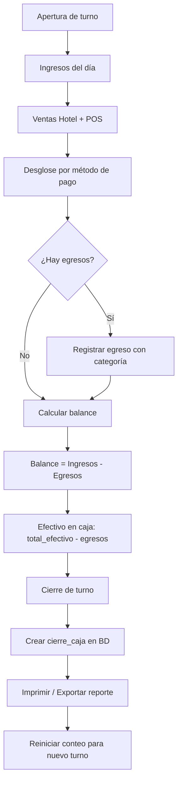

# Spec: Caja — Arqueo, Egresos y Cierre de Turno

**Dominio:** Caja  
**Prioridad:** P1  
**Versión:** 3.0 Enterprise  
**Última actualización:** Agosto 2026  
**Dependencias:** `specs/domain-ventas.md`, `specs/domain-limpieza.md`

---

## 1. Propósito

Gestiona el control financiero diario del hotel: arqueo de caja en tiempo real, registro de egresos operativos y cierre de turno. El módulo de Caja consolida los ingresos del hospedaje y del minimarket, los desglosa por método de pago y genera reportes para la contabilidad del establecimiento.

Sirve como herramienta de cuadre para el recepcionista al final de su turno, asegurando que el efectivo físico en caja coincida con el registro digital.

---

## 2. Flujo Canónico

### 2.1 Flujo de Caja Diario



### 2.2 Flujo de Registro de Egreso

```mermaid
graph TD
    A[Recepcionista necesita retirar efectivo] --> B[Abrir modal de egreso]
    B --> C[Ingresar monto]
    C --> D[Ingresar concepto (mín. 3 caracteres)]
    D --> E[Seleccionar categoría]
    E --> F{Categoría = insumos?}
    F -->|Sí| G[Seleccionar insumo + cantidad]
    F -->|No| H[Validar egreso]
    G --> H
    H --> I{¿Válido?}
    I -->|Sí| J[Crear egreso + descontar de caja]
    I -->|No| K[Mostrar errores de validación]
    J --> L[Actualizar stats de caja]
```

---

## 3. Reglas de Negocio

### RN-CAJA-001: Estadísticas de Caja

```typescript
function calcularCajaStats(
  ventasHotel: VentaRegistro[],
  ventasPOS: VentaRegistro[],
  egresos: EgresoRegistro[]
): CajaStats {
  ingresos    = sum(ventasHotel) + sum(ventasPOS)
  hotel       = sum(ventasHotel)
  pos         = sum(ventasPOS)
  egresos     = sum(egresos)
  balance     = ingresos - egresos
  metodos     = desglosePorMetodoPago(todasVentas)
  balanceEfectivo = metodos.efectivo - egresos
}
```

- El balance considera TODOS los ingresos (hotel + POS).
- El balance de efectivo considera solo pagos en efectivo menos egresos (son físicos).

### RN-CAJA-002: Desglose por Método de Pago

```typescript
function calcularDesgloseMetodosPago(ventas): Record<MetodoPago, number> {
  // efectivo, yape, plin, transferencia, tarjeta
  // Case-insensitive para metodo_pago
}
```

- Cada venta se clasifica según su `metodo_pago`.
- Si el método no está en la lista, se asigna a `efectivo` como fallback.

### RN-CAJA-003: Balance de Efectivo Físico

```
balanceEfectivo = SUM(ventas.metodo_pago = 'efectivo') - SUM(egresos.monto)
```

- Solo considera transacciones en efectivo para el arqueo físico.
- Los egresos se descuentan del efectivo disponible.

### RN-CAJA-004: Desglose SUNAT

```
Clasifica ventas por estado_comprobante:
  - sunat_emitido → declaradas (count + total)
  - sunat_pendiente → pendientes (count + total)
  - sunat_rechazado → rechazadas (count + total)
  - ticket_interno → no cuenta (no reportable)
```

### RN-CAJA-005: Filtrado por Período

```typescript
type PeriodoFiltro = 'hoy' | 'semana' | 'todo';
```

- `hoy`: Solo registros con fecha igual a hoy (por campos: `fecha_pago`, `fecha_venta`, `created_date`, `fecha` en orden de prioridad).
- `semana`: Registros de los últimos 7 días.
- `todo`: Todos los registros sin filtro.

### RN-CAJA-006: Registro de Egreso

```
REQUISITOS:
  - Monto > 0
  - Concepto ≥ 3 caracteres
  - Categoría válida (enumerate)
  
VALIDACIÓN CONDICIONAL:
  SI categoria = 'insumos':
    - insumo_id obligatorio
    - cantidad_insumo > 0 obligatorio
```

### RN-CAJA-007: Cierre de Caja

```typescript
function prepararCierreCaja(stats, notas) {
  return {
    total_ventas: round(ingresos, 2),
    total_egresos: round(egresos, 2),
    saldo_final: round(ingresos - egresos, 2),
    notas: notas.trim() || '',
  };
}
```

El cierre de caja es el registro inmutable del balance financiero al finalizar un turno. Una vez creado, no se puede modificar.

### RN-CAJA-008: Validación de Cierre

```
saldoEsperado = total_ventas - total_egresos
SI |saldo_final - saldoEsperado| > 0.01 → Error: inconsistencia
SI total_ventas < 0 → Error
SI total_egresos < 0 → Error
```

### RN-CAJA-009: Categorías de Egreso

```typescript
const CATEGORIAS_EGRESO = [
  'operativo',     // Gastos operativos del día
  'servicios',     // Pago de servicios (luz, agua, internet)
  'insumos',       // Compra de insumos (requiere insumo_id + cantidad)
  'mantenimiento', // Reparaciones y mantenimiento
  'personal',      // Gastos de personal
  'otros',         // Otros gastos no clasificados
];
```

### RN-CAJA-010: Exportación de Reportes

```
Formatos soportados:
  - PDF: jsPDF + autoTable (formato estructurado con encabezado, tabla, firmas)
  - Excel: XLSX (SheetJS) con columnas: Fecha, Ticket, Cliente, Tipo, Pago, Total
  
Contenido del reporte:
  - Resumen de ingresos (Hotel + POS)
  - Desglose por método de pago
  - Detalle de egresos con categorías
  - Balance final
  - Estados SUNAT (declaradas, pendientes, rechazadas)
```

---

## 4. Schemas de Datos

### 4.1 Tabla `ventas` (Ingresos Hotel)

Ver `specs/domain-ventas.md` — Sección 4.1. Para fines de caja, se usan los campos:
- `total` / `monto_pagado`
- `metodo_pago`
- `estado_comprobante` (para desglose SUNAT)
- `fecha_pago` / `created_date` (para filtrado)

### 4.2 Tabla `ventas_pos` (Ingresos Minimarket)

Ver `specs/domain-ventas.md` — Sección 4.2. Para fines de caja, se usan los campos:
- `total`
- `metodo_pago`
- `estado_comprobante` (para desglose SUNAT)
- `fecha_venta` (para filtrado)

### 4.3 Tabla `egresos`

| Campo | Tipo | Descripción |
|:---|:---|:---|
| `id` | UUID | PK |
| `hotel_id` | UUID | FK → hoteles |
| `monto` | NUMERIC | Cantidad de dinero retirada |
| `concepto` | TEXT | Justificación del gasto |
| `categoria` | TEXT | operativo, servicios, insumos, mantenimiento, personal, otros |
| `fecha` | TIMESTAMPTZ | Fecha del egreso |
| `usuario_id` | UUID | FK → usuarios |
| `usuario_nombre` | TEXT | Nombre del colaborador |
| `insumo_id` | UUID | FK → insumos (opcional, solo si categoría = insumos) |
| `cantidad_insumo` | INTEGER | Cantidad de insumo (opcional) |
| `created_date` | TIMESTAMPTZ | Auditoría |

### 4.4 Tabla `cierres_caja`

| Campo | Tipo | Descripción |
|:---|:---|:---|
| `id` | UUID | PK |
| `hotel_id` | UUID | FK → hoteles |
| `fecha` | TIMESTAMPTZ | Fecha y hora del cierre |
| `total_ventas` | NUMERIC | Total de ingresos acumulados |
| `total_egresos` | NUMERIC | Total de egresos registrados |
| `saldo_final` | NUMERIC | Saldo neto (`total_ventas - total_egresos`) |
| `usuario_id` | UUID | FK → usuarios |
| `usuario_nombre` | TEXT | Nombre del recepcionista |
| `notas` | TEXT | Novedades o diferencias |
| `created_date` | TIMESTAMPTZ | Auditoría |

---

## 5. Estados de Caja


No existe un estado "abierto/cerrado" en BD — el estado se infiere por la existencia de un `cierre_caja` para el día actual en curso.

---

## 6. Integraciones

### 6.1 Ventas (Ingresos)
```
El módulo de Caja consume datos de:
  - `ventas` (hospedaje)
  - `ventas_pos` (minimarket)
Ambos se pasan al hook useCajaData para calcular estadísticas diarias.
```

### 6.2 Limpieza (Insumos)
```
Al registrar un egreso con categoría 'insumos':
  - Se desglosa automáticamente en el movimiento de inventario
  - Se registra el egreso en caja por el monto de la compra
```

### 6.3 Dashboard
```
El Dashboard muestra:
  - Balance del día (ingresos - egresos)
  - Alertas de stock bajo (vinculado a egresos de insumos)
  - Último cierre de caja
```

### 6.4 Impresión Térmica
```
- Template: cashClosure.js (ESC/POS 32 cols)
- Muestra: detalle de ingresos, egresos, métodos de pago, saldo final
- Se imprime al hacer clic en "Cerrar Caja"
```

---

## 7. Tests de Contrato

- [ ] `CAJ-001`: Calcular estadísticas de caja (ingresos, egresos, balance)
- [ ] `CAJ-002`: Desglose por método de pago (5 métodos)
- [ ] `CAJ-003`: Balance de efectivo (efectivo - egresos)
- [ ] `CAJ-004`: Desglose SUNAT (declaradas, pendientes, rechazadas)
- [ ] `CAJ-005`: Filtrado por período (hoy, semana, todo)
- [ ] `CAJ-006`: Aceptar egreso operativo válido
- [ ] `CAJ-007`: Rechazar egreso con monto inválido (≤ 0)
- [ ] `CAJ-008`: Rechazar egreso con concepto inválido (< 3 chars)
- [ ] `CAJ-009`: Validar egreso de insumos (insumo_id + cantidad obligatorios)
- [ ] `CAJ-010`: Preparar y validar cierre de caja

---

## 8. Criterios de Aceptación

1. ✅ Las estadísticas de caja se calculan correctamente con datos reales
2. ✅ Los 5 métodos de pago aparecen desglosados en la UI con sus montos
3. ✅ El balance de efectivo físico refleja solo pagos en efectivo menos egresos
4. ✅ Los estados SUNAT se muestran correctamente (declaradas, pendientes, rechazadas)
5. ✅ Los egresos se validan: monto > 0, concepto ≥ 3 chars, categoría válida
6. ✅ Los egresos de insumos requieren insumo_id y cantidad_insumo
7. ✅ El cierre de caja es inmutable una vez creado
8. ✅ Se puede exportar el reporte a PDF y Excel
9. ✅ El cierre se puede imprimir en ticket térmico (ESC/POS)

---

## 9. Historial de Cambios

| Versión | Fecha | Cambio | Autor |
|:---|:---|:---|:---|
| 1.0 | Julio 2026 | Versión inicial del spec | Buffy (Freebuff) |
