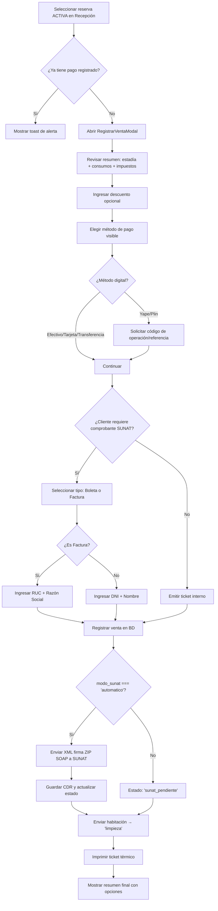
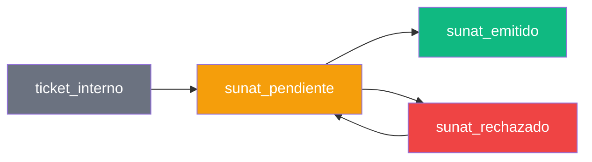

# Spec: Check-out / Liquidación de Estadía

**Dominio:** Recepción  
**Prioridad:** P1  
**Versión:** 3.0 Enterprise  
**Última actualización:** Agosto 2026  
**Dependencias:** `specs/architecture.md`, `specs/domain-checkin.md`

---

## 1. Propósito

Liquidar la estadía completa de un huésped, procesar el pago final (considerando consumos de habitación y descuentos), liberar la habitación para el ciclo de limpieza, y opcionalmente emitir un comprobante electrónico SUNAT.

---

## 2. Flujo Canónico



---

## 3. Reglas de Negocio

### RN-CHECKOUT-001: Cálculo del Total a Cobrar

```
total_estadia     = precio_noche × noches
total_consumos    = SUM(items_venta_pos.precio × items_venta_pos.cantidad) DONDE reserva_id coincida
total_bruto       = total_estadia + total_consumos
total_a_cobrar    = total_bruto - descuento
```

- `descuento` es opcional, default `0`, no puede ser negativo.
- Si no hay ventas POS asociadas, `total_consumos = 0`.

### RN-CHECKOUT-002: IGV Condicional

```
SI hotel.aplica_igv = true →
    base_imponible  = total_a_cobrar / 1.18
    igv             = total_a_cobrar - base_imponible
    total_final     = total_a_cobrar
SINO →
    base_imponible  = total_a_cobrar
    igv             = 0
    total_final     = total_a_cobrar
```

- El IGV es siempre 18% (tasa fija peruana).
- La exención de IGV aplica solo si `hotel.aplica_igv = false` (Ley N° 27037 Amazonía Peruana).

### RN-CHECKOUT-003: Liberación de Habitación

```
SI pago registrado exitosamente →
    reserva.estado       = 'finalizada'
    habitacion.estado    = 'limpieza'
    SI modo_sunat = 'automatico' Y requiere_comprobante →
        estado_comprobante = 'sunat_emitido'
    SINO →
        estado_comprobante = 'ticket_interno' | 'sunat_pendiente'
```

- La habitación pasa a `'limpieza'`; solo Housekeeping puede devolverla a `'disponible'` tras el aseo e inspección.
- El cambio de estado es atómico: si falla la actualización de la habitación, la venta no se confirma.

### RN-CHECKOUT-004: Método de Pago Obligatorio

```
SI metodo_pago está vacío o no es uno de los valores permitidos →
    RECHAZAR transacción
    → "Debe seleccionar un método de pago"

Valores permitidos: ['efectivo', 'yape', 'plin', 'transferencia', 'tarjeta']
```

- Para Yape/Plin: se requiere código de operación/referencia como validación adicional.

### RN-CHECKOUT-005: Comprobante SUNAT — Validación de Datos

```
SI requiere_comprobante = true →
    CASO tipo_comprobante:
        'boleta' →
            dni_cliente: obligatorio, formato: 8 dígitos (DNI) o CE/Pasaporte
            nombre_cliente: obligatorio, min 3 caracteres
        
        'factura' →
            ruc_cliente:   obligatorio, regex: /^\d{11}$/
            razon_social:  obligatorio, min 3 caracteres

SI requiere_comprobante = false →
    tipo_comprobante = 'ninguno'
    No se requiere documentación del cliente
```

### RN-CHECKOUT-006: Integridad Transaccional

```
1. Crear registro en tabla `ventas`
2. SI modo_sunat = 'automatico':
     a. Llamar a Edge Function `/functions/v1/facturacion`
     b. Si falla → venta queda como 'sunat_pendiente', no se bloquea
3. Actualizar reserva → estado = 'finalizada'
4. Actualizar habitación → estado = 'limpieza'
5. Registrar en audit_logs con acción = 'CHECK-OUT'
```

- Si el paso 2b falla, los pasos 3-5 aún deben ejecutarse.
- El comprobante SUNAT se puede reenviar desde la vista de Ventas posteriormente.

---

## 4. Schemas de Datos

### 4.1 CheckoutRequest

```typescript
interface CheckoutRequest {
  // Datos de la reserva
  reserva_id: string;

  // Financiero
  metodo_pago: 'efectivo' | 'yape' | 'plin' | 'transferencia' | 'tarjeta';
  descuento?: number;             // default 0
  codigo_referencia?: string;     // obligatorio para yape/plin

  // Comprobante SUNAT
  requiere_comprobante: boolean;
  tipo_comprobante?: 'boleta' | 'factura' | 'ninguno';  // default 'ninguno'

  // Cliente (para comprobante)
  dni_cliente?: string;           // obligatorio si boleta
  nombre_cliente?: string;        // obligatorio si boleta
  ruc_cliente?: string;           // obligatorio si factura, regex /^\d{11}$/
  razon_social?: string;          // obligatorio si factura
}
```

### 4.2 CheckoutResponse

```typescript
interface CheckoutResponse {
  success: boolean;
  venta: {
    id: string;
    numero_ticket: string;
    total: number;
    base_imponible: number;
    igv: number;
    metodo_pago: string;
    estado_comprobante: 'ticket_interno' | 'sunat_pendiente' | 'sunat_emitido' | 'sunat_rechazado';
    tipo_comprobante: string;
  };
  sunat?: {
    estado: 'emitido' | 'pendiente' | 'rechazado';
    cdr_url?: string;
    error?: string;
  };
  errors?: string[];
}
```

### 4.3 Tabla `ventas` — Campos Relevantes

| Campo | Tipo | Descripción |
|:---|:---|:---|
| `id` | UUID | PK |
| `hotel_id` | UUID | FK → hoteles |
| `reserva_id` | UUID | FK → reservas |
| `numero_ticket` | TEXT | Correlativo autogenerado |
| `huesped_nombre` | TEXT | Nombre del cliente |
| `huesped_dni` | TEXT | Documento del cliente |
| `subtotal` | NUMERIC | total_bruto antes de IGV |
| `descuento` | NUMERIC | Descuento aplicado |
| `igv` | NUMERIC | Monto de IGV calculado |
| `total` | NUMERIC | Monto final cobrado |
| `metodo_pago` | TEXT | Método de pago |
| `tipo_comprobante` | TEXT | 'ninguno', 'boleta', 'factura' |
| `estado_comprobante` | TEXT | 'ticket_interno', 'sunat_pendiente', 'sunat_emitido', 'sunat_rechazado' |
| `ruc_cliente` | TEXT | RUC para factura |
| `razon_social` | TEXT | Razón social para factura |
| `notas` | TEXT | Código de referencia Yape/Plin |
| `fecha_pago` | DATE | Fecha del cobro |
| `created_date` | TIMESTAMPTZ | Auditoría |

---

## 5. Estados del Comprobante SUNAT



- **ticket_interno:** No se requiere comprobante SUNAT, solo ticket interno
- **sunat_pendiente:** Cliente solicitó comprobante pero no se envió (modo manual) o falló envío automático
- **sunat_emitido:** CDR recibido y aceptado por SUNAT
- **sunat_rechazado:** SUNAT rechazó el comprobante (error en datos), se puede reintentar

---

## 6. Integraciones

### 6.1 Facturación SUNAT (Edge Function)

```
POST /functions/v1/facturacion
Body: {
  hotel_id, tipo, serie, numero,
  cliente_tipo, cliente_documento, cliente_nombre,
  subtotal, igv, total
}

Response: {
  id, estado, cdr_url, error?
}
```

Ver spec completo en `specs/domain-sunat.md`.

### 6.2 Impresión Térmica (RawBT/ESC/POS)

```
Servicio: src/modules/printer/services/printer.service.js → printCheckOutTicket()
Template:  src/modules/printer/templates/checkOut.js → buildCheckOutTemplate(data)

Datos requeridos:
- hotelName, ruc, address, phone
- guestName, documentId
- roomNumber, checkInDate, checkOutDate, totalNights
- totalRoomCost, totalConsumptions, totalPaid, balance
- ticketNumber, receptionist
```

### 6.3 Auditoría Inmutable

```
Tabla: audit_logs
acción: 'CHECK-OUT'
descripcion: `Check-out: Hab. {numero} - {nombre} - S/ {total}`
```

---

## 7. Tests de Contrato

- [ ] `CHECKOUT-001`: Calcular total correctamente con precio_noche × noches + consumos - descuento
- [ ] `CHECKOUT-002`: Calcular IGV (18%) correctamente cuando hotel.aplica_igv = true
- [ ] `CHECKOUT-003`: No aplicar IGV cuando hotel.aplica_igv = false
- [x] `CHECKOUT-004`: Enviar habitación a limpieza solo si el pago fue exitoso
- [ ] `CHECKOUT-005`: Rechazar checkout si no hay método de pago
- [ ] `CHECKOUT-006`: Validar RUC 11 dígitos si tipo_comprobante = 'factura'
- [ ] `CHECKOUT-007`: Validar DNI 8 dígitos si tipo_comprobante = 'boleta'
- [ ] `CHECKOUT-008`: Código de referencia obligatorio para Yape/Plin
- [ ] `CHECKOUT-009`: Envío a SUNAT automático si modo_sunat = 'automatico'
- [ ] `CHECKOUT-010`: Fallback a sunat_pendiente si servicio SUNAT no responde
- [ ] `CHECKOUT-011`: El descuento no puede ser negativo
- [ ] `CHECKOUT-012`: Registrar en audit_logs después de checkout exitoso

---

## 8. Criterios de Aceptación

1. ✅ Un recepcionista puede hacer checkout de una reserva activa en ≤3 clics
2. ✅ El total refleja noches, consumos extras y descuento
3. ✅ Si el hotel aplica IGV, el impuesto aparece desglosado en el ticket
4. ✅ Si no aplica IGV, no aparece ningún cargo tributario
5. ✅ La habitación pasa inmediatamente a limpieza después del pago exitoso
6. ✅ Yape/Plin requieren código de operación obligatorio
7. ✅ Factura requiere RUC 11 dígitos y razón social
8. ✅ Boleta requiere DNI 8 dígitos y nombre
9. ✅ Si modo SUNAT es automático, el comprobante se envía sin intervención manual
10. ✅ Si modo SUNAT es manual, el comprobante queda pendiente para emisión posterior
11. ✅ El checkout conserva visibles el total, el método seleccionado y la acción de confirmación durante el desplazamiento
12. ✅ Los métodos de pago se presentan como opciones directas, con un área táctil mínima de 44 px
13. ✅ La interfaz explica por qué no se puede confirmar un cobro antes de enviar la operación
14. ✅ La confirmación final comunica ticket, monto y envío de la habitación a limpieza

---

## 9. Historial de Cambios

| Versión | Fecha | Cambio | Autor |
|:---|:---|:---|:---|
| 1.0 | Julio 2026 | Versión inicial del spec | Buffy (Freebuff) |
