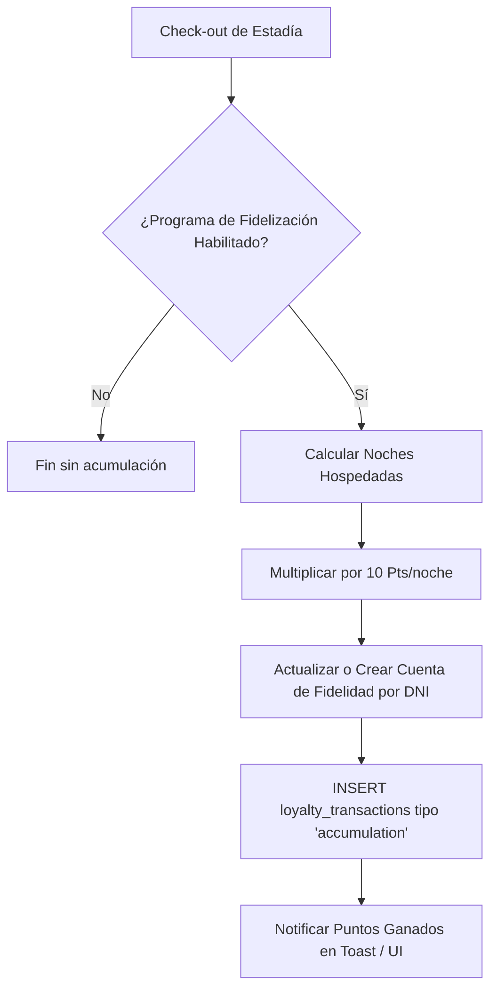
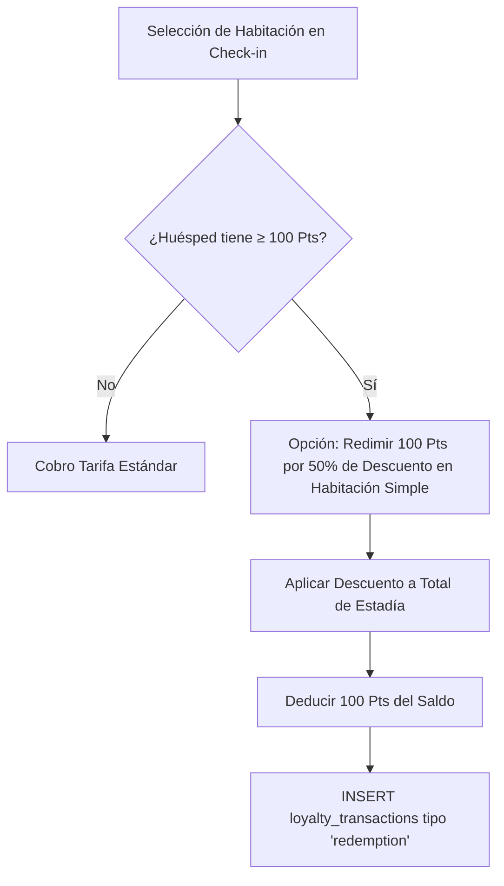

# Spec: Fidelización por Puntos — Programa de Lealtad de Huéspedes

**Dominio:** Fidelización / Lealtad
**Prioridad:** P1
**Versión:** 3.0 Enterprise
**Última actualización:** Agosto 2026
**Dependencias:** `specs/domain-recepcion.md`, `specs/domain-checkout.md`, `specs/architecture.md`

---

## 1. Propósito

El módulo de **Fidelización por Puntos** incentiva el retorno de huéspedes recurrentes asignando puntos acumulables por cada noche alojada y permitiendo la redención de descuentos en estadías futuras. El programa es totalmente multi-tenant (configurable por hotel) y garantiza trazabilidad mediante historial de transacciones.

---

## 2. Flujo Canónico

### 2.1 Acumulación de Puntos al Check-out



### 2.2 Redención de Puntos en Check-in / Venta



---

## 3. Reglas de Negocio

### RN-FID-001: Habilitación Multi-Tenant
- Cada hotel puede activar o desactivar el programa de fidelización desde `Configuración → Fidelidad`.
- La columna `hoteles.loyalty_program_enabled` (BOOLEAN, default `TRUE`) determina si el hotel participa en el sistema.

### RN-FID-002: Tasa de Acumulación
- Todo huésped alojado gana exactamente **10 puntos por cada noche hospedada**.
- La acumulación se procesa automáticamente durante el Check-out de reservas en estado `activa` finalizadas con pago.

### RN-FID-003: Regla de Redención
- **100 Puntos = 50% de descuento** sobre el valor de 1 noche en **Habitación Simple**.
- La redención requiere un saldo mínimo de **100 puntos**.
- No se permiten saldos negativos (`points_balance >= 0` mediante Postgres Check Constraint).

### RN-FID-004: Reversión en Anulación / Cancelación
- Si una estadía o venta asociada a puntos es anulada o cancelada, se ejecuta una transacción compensatoria (`type = 'cancellation_reversal'`) que restaura o deduce los puntos otorgados originalmente.

### RN-FID-005: Expiración de Puntos (12 Meses)
- Los puntos acumulados vencen tras **12 meses consecutivos de inactividad** del huésped.
- Una Edge Function en Deno (`expire-loyalty-points`) se ejecuta periódicamente para vencer puntos e insertar transacciones de tipo `expiration`.

---

## 4. Estructura de Datos (Tablas Postgres)

### `loyalty_accounts`
```sql
CREATE TABLE loyalty_accounts (
    id UUID PRIMARY KEY DEFAULT gen_random_uuid(),
    hotel_id UUID NOT NULL REFERENCES hoteles(id),
    huesped_dni VARCHAR(20) NOT NULL,
    huesped_nombre VARCHAR(255) NOT NULL,
    points_balance INT NOT NULL DEFAULT 0 CHECK (points_balance >= 0),
    total_earned INT NOT NULL DEFAULT 0,
    total_redeemed INT NOT NULL DEFAULT 0,
    created_at TIMESTAMPTZ DEFAULT NOW(),
    updated_at TIMESTAMPTZ DEFAULT NOW(),
    UNIQUE (hotel_id, huesped_dni)
);
```

### `loyalty_transactions`
```sql
CREATE TABLE loyalty_transactions (
    id UUID PRIMARY KEY DEFAULT gen_random_uuid(),
    account_id UUID NOT NULL REFERENCES loyalty_accounts(id),
    hotel_id UUID NOT NULL REFERENCES hoteles(id),
    reserva_id UUID REFERENCES reservas(id),
    type VARCHAR(50) NOT NULL CHECK (type IN ('accumulation', 'redemption', 'expiration', 'cancellation_reversal')),
    points INT NOT NULL,
    description TEXT,
    created_at TIMESTAMPTZ DEFAULT NOW()
);
```

---

## 5. Matriz de validación funcional

Estos escenarios son contratos de aceptación. El repositorio productivo no
incluye la suite histórica de pruebas.

- [ ] Acumular puntos al completar un checkout elegible.
- [ ] No acumular puntos si el programa está deshabilitado para el hotel.
- [ ] Rechazar una redención superior al saldo disponible.
- [ ] Revertir los movimientos asociados a una operación anulada.
- [ ] Expirar únicamente puntos vencidos y conservar trazabilidad.
- [ ] Impedir acceso cruzado a cuentas de fidelización de otro hotel.

La integración de interfaz se implementa mediante `src/hooks/useLoyalty.ts`;
las reglas reutilizables viven en `src/services/loyalty.service.ts`.
