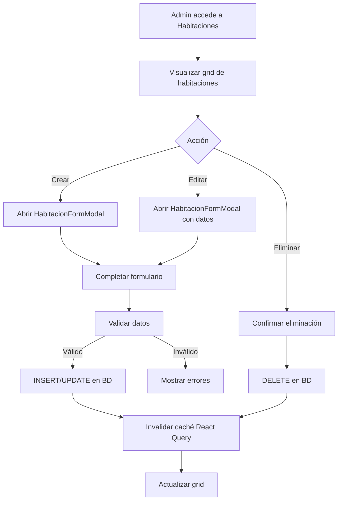
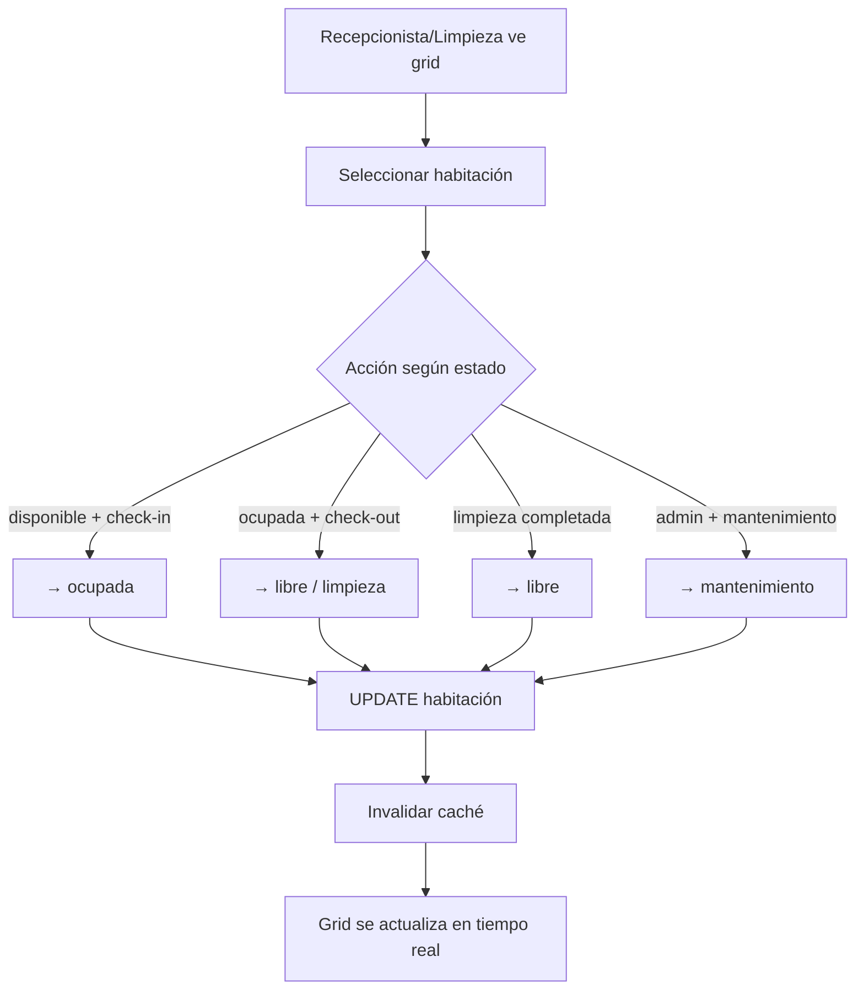
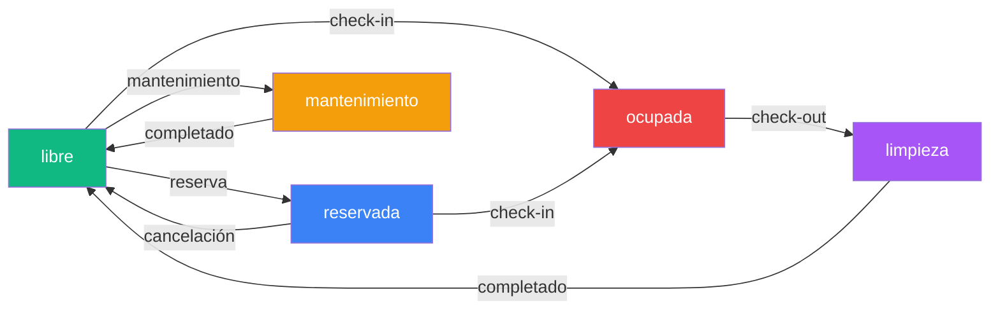

# Spec: Habitaciones — CRUD, Estados y Grid

**Dominio:** Habitaciones
**Prioridad:** P1
**Versión:** 3.0 Enterprise
**Última actualización:** Agosto 2026
**Dependencias:** `specs/domain-recepcion.md`

---

## 1. Propósito

Gestionar el inventario físico de habitaciones del hotel: creación, edición, eliminación, visualización en grid interactivo y control de estados operativos. El módulo de habitaciones es la base de datos maestra que alimenta los módulos de Recepción y Limpieza.

---

## 2. Flujo Canónico

### 2.1 CRUD de Habitaciones



### 2.2 Cambio de Estado



---

## 3. Reglas de Negocio

### RN-HAB-001: Estados de Habitación

```
Estados válidos: 'libre', 'ocupada', 'reservada', 'mantenimiento', 'limpieza'

Transiciones permitidas (RN-REC-001):
  libre        → ocupada        (check-in)
  libre        → reservada      (reserva futura)
  libre        → mantenimiento  (por admin)
  ocupada      → libre          (check-out)
  ocupada      → limpieza       (check-out + limpieza)
  reservada    → ocupada        (check-in de reserva)
  reservada    → libre          (cancelación)
  limpieza     → libre          (limpieza completada)
  mantenimiento → libre         (mantenimiento completado)
```

- Cada transición debe ser atómica.
- El grid muestra colores según `statusColors.ts`.

### RN-HAB-002: Campos Obligatorios

```
Al crear/editar habitación:
  numero:     string, obligatorio, único por hotel
  tipo:       string, default 'simple'
  precio_noche: number, min 0
  capacidad:  integer, min 1
  estado:     string, default 'disponible'
```

- `numero` debe ser único dentro del mismo hotel.
- `precio_noche` es la tarifa base antes de tarifas dinámicas.

### RN-HAB-003: Tipos de Habitación

```
Tipos válidos: 'simple', 'doble simple', 'matrimonial', 'doble matrimonial', 'mixta', 'queen'

Cada tipo tiene un precio base diferente.
Las tarifas dinámicas pueden aplicar factores por tipo.
```

### RN-HAB-004: Grid de Visualización

```
El grid agrupa habitaciones por piso.
Cada tarjeta muestra:
  - Número de habitación
  - Tipo
  - Estado (con color)
  - Precio por noche
  - Capacidad
  - Amenities (si existen)
```

- Filtrado por estado: libre, ocupada, limpieza, mantenimiento, todos.
- Ordenamiento por número de habitación.

### RN-HAB-005: Eliminación de Habitación

```
SI la habitación tiene reservas activas →
  RECHAZAR eliminación
  → "No se puede eliminar: tiene reservas activas"

SI no tiene reservas activas →
  DELETE habitación (ON DELETE CASCADE elimina tarifas)
```

- La eliminación es permanente (no hay soft delete).

### RN-HAB-006: Sincronización en Tiempo Real

```
Cambios en la tabla habitaciones se propagan via Supabase Realtime.
useRealtimeSync.js invalida la caché automáticamente.
```

- No requiere recarga manual del grid.

---

## 4. Schemas de Datos

### 4.1 HabitacionRequest

```typescript
interface HabitacionRequest {
  hotel_id: string;           // UUID, FK → hoteles
  numero: string;             // Obligatorio, único por hotel
  tipo: string;               // 'simple' | 'doble simple' | 'matrimonial' | 'doble matrimonial' | 'mixta' | 'queen'
  estado: string;             // 'disponible' | 'ocupada' | 'reservada' | 'mantenimiento' | 'limpieza'
  precio_noche: number;       // Tarifa base, min 0
  precio?: number;            // Alias alternativo del precio base
  capacidad: number;          // Número máximo de personas, min 1
  descripcion?: string;       // Notas sobre la habitación
  amenities?: string[];       // Array de servicios incluidos
  piso?: string;              // Piso en el que se ubica
}
```

### 4.2 Tabla `habitaciones`

| Campo | Tipo | Descripción |
|:---|:---|:---|
| `id` | UUID | PK |
| `hotel_id` | UUID | FK → hoteles, ON DELETE CASCADE |
| `numero` | TEXT | Número visible (ej. "101") |
| `piso` | TEXT | Piso en el que se ubica |
| `tipo` | TEXT | Tipo de habitación |
| `estado` | TEXT | Estado actual |
| `precio_noche` | NUMERIC | Tarifa base por noche |
| `precio` | NUMERIC | Alias alternativo del precio |
| `capacidad` | INTEGER | Número máximo de personas |
| `descripcion` | TEXT | Notas sobre la habitación |
| `amenities` | TEXT[] | Array de servicios incluidos |
| `created_date` | TIMESTAMPTZ | Fecha de creación |

---

## 5. Estados del Grid



---

## 6. Integraciones

### 6.1 Recepción (Check-in/Check-out)

```
Cuando se crea una reserva → habitación cambia a 'ocupada' o 'reservada'.
Cuando se completa check-out → habitación cambia a 'libre' o 'limpieza'.
La reserva almacena habitacion_numero y habitacion_tipo como respaldo histórico.
```

### 6.2 Limpieza (Housekeeping)

```
Personal de limpieza ve solo habitaciones en estado 'limpieza'.
Al completar limpieza → cambia a 'libre'.
Puede registrar consumo de insumos (descontando stock).
```

### 6.3 Dashboard

```
El Dashboard muestra:
  - Total de habitaciones
  - Habitaciones ocupadas (conteo)
  - Habitaciones en limpieza (conteo)
  - Porcentaje de ocupación
```

### 6.4 Sidebar

```
El sidebar muestra un indicador de ocupación:
  - {ocupadas + limpieza} / {total} habitaciones
  - Color según porcentaje de ocupación
```

---

## 7. Matriz de validación funcional

Los escenarios siguientes son contratos de aceptación; no implican que el
repositorio productivo incluya una suite automatizada.

- [ ] `HAB-001`: Crear habitación con todos los campos obligatorios → habitación creada con estado 'libre'
- [ ] `HAB-002`: Rechazar habitación sin número
- [ ] `HAB-003`: Rechazar habitación con precio negativo
- [ ] `HAB-004`: Rechazar habitación con capacidad < 1
- [ ] `HAB-005`: Editar precio de una habitación existente
- [ ] `HAB-006`: Cambiar estado de 'libre' a 'ocupada' → transición válida
- [ ] `HAB-007`: Cambiar estado de 'ocupada' a 'limpieza' → transición válida
- [ ] `HAB-008`: Intentar cambiar de 'libre' a 'mantenimiento' sin ser admin → verificar permisos
- [ ] `HAB-009`: Eliminar habitación sin reservas activas → eliminación exitosa
- [ ] `HAB-010`: Eliminar habitación con reservas activas → rechazada
- [ ] `HAB-011`: Grid muestra habitaciones agrupadas por piso
- [ ] `HAB-012`: Filtrar habitaciones por estado funciona correctamente
- [ ] `HAB-013`: Sincronización en tiempo real actualiza el grid

---

## 8. Criterios de Aceptación

1. ✅ El admin puede crear, editar y eliminar habitaciones desde la UI
2. ✅ El grid muestra habitaciones agrupadas por piso con colores de estado
3. ✅ Los colores del grid coinciden con `statusColors.ts`
4. ✅ El filtrado por estado funciona en tiempo real
5. ✅ No se puede eliminar una habitación con reservas activas
6. ✅ Los cambios se propagan via Realtime sin recarga manual
7. ✅ El formulario valida todos los campos obligatorios
8. ✅ El sidebar muestra el indicador de ocupación actualizado

---

## 9. Historial de Cambios

| Versión | Fecha | Cambio | Autor |
|:---|:---|:---|:---|
| 1.0 | Julio 2026 | Versión inicial del spec | Buffy (Freebuff) |
