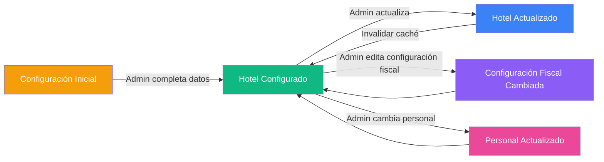

# Spec: Hotel — Configuración, Multi-Tenant y Datos del Establecimiento

**Dominio:** Hotel  
**Prioridad:** P0  
**Versión:** 3.0 Enterprise  
**Última actualización:** Agosto 2026  
**Dependencias:** `specs/architecture.md`, `specs/domain-auth.md`

---

## 1. Propósito

Gestionar la configuración global del establecimiento hotelero: datos fiscales, parámetros operativos, preferencias de facturación SUNAT, tipo de cambio, enlaces públicos y control de personal. El módulo de Hotel es la entidad raíz del modelo multi-tenant y contiene la configuración que afecta a todos los demás módulos del sistema.

Cada hotel es un **tenant** independiente con aislamiento lógico total mediante Row Level Security (RLS) en PostgreSQL. Todas las tablas de negocio (`habitaciones`, `reservas`, `ventas`, `ventas_pos`, `egresos`, `cierres_caja`, `productos`, `insumos`, etc.) están vinculadas a un `hotel_id` que garantiza que un usuario solo vea y modifique datos de su propio hotel.

---

## 2. Flujo Canónico

### 2.1 Carga del Hotel Activo

```mermaid
graph TD
    A[Usuario autenticado] --> B[AuthProvider carga user.hotel_id]
    B --> C[HotelProvider monta con hotelId]
    C --> D[useHotelData inicia]
    D --> E[Query: listHoteles() → todos los hoteles asignados]
    E --> F{¿hotelId coincide con algún hotel?}
    F -->|Sí| G[hotelActual = hotel encontrado]
    F -->|No| H[Fallback: localStorage 'hotel_activo_id' o primer hotel]
    H --> I[Sincronizar hotelId en Zustand store]
    I --> G
    G --> J[Crear db.forHotel(hotelId) → proxy con hotel_id inyectado]
    J --> K[Páginas usan db para CRUD con filtro automático]
```

### 2.2 Cambio de Hotel (Multi-Hotel)

```mermaid
graph TD
    A[Admin cambia de hotel en SelectorHotel] --> B[setHotelId(nuevoId)]
    B --> C[Zustand auth.store actualiza hotelId]
    C --> D[localStorage 'hotel_activo_id' actualizado]
    D --> E[React Query invalida todas las queries del hotel anterior]
    E --> F[UI se recarga con datos del nuevo hotel]
    F --> G[db.forHotel(nuevoHotelId) → nuevo proxy]
```

### 2.3 Configuración del Hotel

```mermaid
graph TD
    A[Admin accede a Configuración] --> B[Cargar datos actuales del hotel]
    B --> C[Formulario con secciones]
    C --> D[Sección 1: Datos del hotel (nombre, RUC, dirección)]
    C --> E[Sección 2: Configuración fiscal (IGV, SUNAT)]
    C --> F[Sección 3: Tipo de cambio (USD/PEN)]
    C --> G[Sección 4: Horarios (check-in, check-out)]
    C --> H[Sección 5: Personal (invitar/editar usuarios)]
    C --> I[Sección 6: Enlaces públicos (QR booking, check-in)]
    
    D --> J[Actualizar vía HotelService.updateConfiguracion]
    E --> J
    F --> J
    G --> J
    H --> K[Invitar usuario por email]
    I --> L[Generar QR / enlaces públicos]
    
    J --> M[Invalidar caché de hotel]
    M --> N[Mostrar toast de éxito]
```

---

## 3. Reglas de Negocio

### RN-HOTEL-001: Aislamiento Multi-Tenant (RLS)

```sql
-- Cada tabla de negocio tiene campo hotel_id REFERENCES hoteles(id)
-- Política RLS estándar para todas las tablas:
CREATE POLICY "aislamiento_tenant" ON {tabla}
  FOR ALL TO authenticated
  USING (hotel_id = get_my_hotel_id())
  WITH CHECK (hotel_id = get_my_hotel_id());

-- Función helper optimizada (SECURITY DEFINER para evitar recursión):
CREATE OR REPLACE FUNCTION get_my_hotel_id()
RETURNS UUID AS $
BEGIN
  RETURN (SELECT hotel_id FROM public.usuarios WHERE id = auth.uid());
END;
$ LANGUAGE plpgsql SECURITY DEFINER STABLE;
```

**Tablas con aislamiento multi-tenant:**
- `habitaciones`, `reservas`, `ventas`, `ventas_pos`
- `egresos`, `cierres_caja`, `productos`, `categorias_productos`
- `tarifas_dinamicas`, `insumos`, `movimientos_insumos`
- `checkins_publicos`, `comprobantes`, `identity_logs`

**Excepciones al aislamiento:**
- `hoteles`: El usuario solo ve su propio hotel (`id = get_my_hotel_id()`).
- `usuarios`: El admin ve los usuarios de su hotel (`hotel_id = get_my_hotel_id()`).
- El rol `developer` puede saltar el aislamiento para diagnóstico (política especial).

### RN-HOTEL-002: Estructura de la Tabla `hoteles`

```typescript
interface Hotel {
  id: string;                    // UUID, PK
  nombre: string;                // Nombre comercial del hospedaje
  ruc?: string;                  // RUC 11 dígitos
  direccion?: string;            // Dirección física
  ciudad?: string;               // Ciudad de operaciones
  telefono?: string;             // Teléfono de contacto
  email?: string;                // Correo del establecimiento
  logo_url?: string;             // URL del logo en Supabase Storage
  mensaje_ticket?: string;       // Pie de página del ticket (default "¡Gracias por su preferencia!")
  
  // Configuración fiscal
  aplica_igv: boolean;           // true → IGV 18%, false → exención (Amazonía Ley 27037)
  modo_sunat: string;            // 'manual' | 'automatico' | 'desactivado'
  sunat_usuario_sol?: string;    // Usuario SOL SUNAT
  sunat_clave_sol?: string;      // Clave SOL SUNAT (encriptada)
  
  // Configuración operativa
  hora_checkin: string;          // Default "14:00"
  hora_checkout: string;         // Default "12:00"
  numero_yape?: string;          // Número Yape/Plin para cobros digitales
  tipo_cambio: number;           // Default 3.80 (USD → PEN)
  
  // Auditoría
  created_date?: string;         // Fecha de creación
}
```

### RN-HOTEL-003: Control de IGV (Impuesto General a las Ventas)

```
SI hotel.aplica_igv = true:
  - IGV = 18% sobre la base imponible
  - El IGV aparece desglosado en tickets y comprobantes
  - Aplica para hoteles fuera de la Amazonía Peruana

SI hotel.aplica_igv = false:
  - No se calcula IGV
  - Precio mostrado = precio final
  - Aplica para hoteles en zonas exoneradas (Ley N° 27037)
  - Marca "EXONERADO - Ley 27037" en facturación
```

### RN-HOTEL-004: Modos de Facturación SUNAT

```typescript
type ModoSunat = 'manual' | 'automatico' | 'desactivado';
```

| Modo | Descripción | Flujo |
|:---|---|:---|
| `manual` | El recepcionista elige cuándo enviar comprobantes a SUNAT | Venta se crea como `sunat_pendiente`, se envía manualmente desde Ventas |
| `automatico` | Cada venta con comprobante se envía automáticamente a SUNAT | Venta + envío a Edge Function en un solo flujo |
| `desactivado` | No se emiten comprobantes SUNAT (solo tickets internos) | Todas las ventas quedan como `ticket_interno` |

### RN-HOTEL-005: Tipo de Cambio

```
El tipo de cambio se usa para:
  - Conversión USD → PEN en reservas y ventas
  - Mostrar montos en ambas monedas cuando aplica
  
Default: 3.80 soles por dólar
Actualizable por el admin en Configuración → Datos del Hotel
```

### RN-HOTEL-006: Horarios Operativos

```
hora_checkin:  Default "14:00" (2:00 PM)
hora_checkout: Default "12:00" (12:00 PM)

Estos valores se muestran en:
  - Tickets de check-in y check-out
  - Páginas públicas de booking y pre-check-in
  - Reportes y fichas DIRCETUR
```

### RN-HOTEL-007: Gestión de Personal (Usuarios del Hotel)

```
El admin del hotel puede:
  1. Invitar un nuevo usuario por email → db.users.inviteUser(email, role, hotelId)
  2. Cambiar el rol de un usuario existente
  3. Desactivar un usuario (no eliminarlo)

Roles disponibles dentro del hotel:
  - admin: Gestión completa del hotel
  - recepcionista: Operaciones diarias
  - limpieza: Housekeeping
  - developer: Diagnóstico (solo usuarios especiales)

Restricciones:
  - Un admin no puede cambiar su propio rol a uno inferior
  - Solo un developer puede crear/eliminar otros developers
  - No se puede eliminar el último admin del hotel
  
  > **Nota de implementación:** La funcionalidad de "desactivar" un usuario (soft-delete)
  > es una meta planeada. Actualmente los usuarios se gestionan insertando o actualizando
  > registros directamente en la tabla `usuarios`. No existe columna `activo`/`inactivo` en la BD.
```

### RN-HOTEL-008: Enlaces Públicos

```
El hotel puede generar:
  1. QR / URL de pre-check-in (checkin.publico): 
     /public-checkin/{hotelId}
  2. QR / URL de booking online:
     /booking/{hotelId}

Los enlaces se generan dinámicamente basados en hotelId.
Se muestran en Configuración → Enlaces Públicos con QR imprimible.
```

### RN-HOTEL-009: Caché de Configuración (React Query)

```
Query key: ['hotel', 'config', hotelId]
Stale time: 1 hora (1000 * 60 * 60)
Invalida al actualizar configuración del hotel.

Query key: ['hoteles']
Stale time: 1 hora
Lista de todos los hoteles disponibles para el usuario.
Se usa en SelectorHotel y para determinar hotelActual.
```

### RN-HOTEL-010: Abstracción de Base de Datos (db.forHotel)

```typescript
// El proxy db.forHotel(hotelId) inyecta hotel_id automáticamente en:
//   - create(record)  → record.hotel_id = hotelId
//   - list()          → .eq('hotel_id', hotelId)
//   - update(id, data) → verifica hotel_id
//   - delete(id)       → verifica hotel_id

// hotelDb.habitaciones.list() → SELECT * FROM habitaciones WHERE hotel_id = hotelId
// hotelDb.productos.create(p) → INSERT INTO productos (hotel_id, ...) VALUES (hotelId, ...)
```

### RN-HOTEL-011: Panel de Desarrollador (Global Admin)

```
Acceso: Solo para usuarios con rol `developer`.
Ruta: /dev

Funciones principales:
  1. Tenant Switcher Inmersivo: Permite a un developer cambiar de hotel instantáneamente 
     (inyectando un nuevo `hotelId` en Zustand) sin recargar la app para diagnósticos.
  2. Live Stats: Muestra estadísticas de performance de React Query, tiempos de carga y 
     tamaño de caché.
  3. Feature Flags & Logs: Permite activar forzadamente errores o ver logs extendidos 
     de las Edge Functions de SUNAT/DIRCETUR.
```
```

---

## 4. Schemas de Datos

### 4.1 HotelRequest (Datos del Hotel para Creación/Actualización)

```typescript
interface HotelRequest {
  nombre: string;                 // Obligatorio, nombre comercial
  ruc?: string;                   // Opcional, 11 dígitos
  direccion?: string;             // Opcional
  ciudad?: string;                // Opcional
  telefono?: string;              // Opcional
  email?: string;                 // Opcional
  logo_url?: string;              // Opcional
  mensaje_ticket?: string;        // Opcional, default "¡Gracias por su preferencia!"
  
  // Fiscal
  aplica_igv: boolean;            // Default true
  modo_sunat: string;             // Default 'manual'
  sunat_usuario_sol?: string;     // Opcional
  sunat_clave_sol?: string;       // Opcional (se encripta)
  
  // Operativo
  hora_checkin?: string;          // Default "14:00"
  hora_checkout?: string;         // Default "12:00"
  numero_yape?: string;           // Opcional
  tipo_cambio?: number;           // Default 3.80
}
```

### 4.2 Tabla `hoteles` — Esquema Completo

| Campo | Tipo | Default | Descripción |
|:---|:---|:---|:---|
| `id` | UUID | gen_random_uuid() | PK |
| `nombre` | TEXT | — | Nombre comercial del hotel |
| `ruc` | TEXT | — | RUC 11 dígitos |
| `direccion` | TEXT | — | Dirección fiscal |
| `ciudad` | TEXT | — | Ciudad |
| `telefono` | TEXT | — | Teléfono de contacto |
| `email` | TEXT | — | Correo electrónico |
| `logo_url` | TEXT | — | URL del logo |
| `aplica_igv` | BOOLEAN | true | Aplica IGV 18% |
| `modo_sunat` | TEXT | 'manual' | manual, automatico, desactivado |
| `sunat_usuario_sol` | TEXT | — | Usuario SOL SUNAT |
| `sunat_clave_sol` | TEXT | — | Clave SOL (encriptada) |
| `mensaje_ticket` | TEXT | '¡Gracias por su preferencia!' | Pie de ticket |
| `hora_checkin` | TEXT | '14:00' | Hora de check-in |
| `hora_checkout` | TEXT | '12:00' | Hora de check-out |
| `numero_yape` | TEXT | — | Número Yape/Plin |
| `tipo_cambio` | NUMERIC | 3.80 | Tipo de cambio USD->PEN |
| `created_date` | TIMESTAMPTZ | now() | Auditoría |

**Políticas RLS:**
```sql
-- El usuario solo ve su hotel asignado
CREATE POLICY "ver_propio_hotel" ON hoteles
  FOR SELECT TO authenticated
  USING (id = get_my_hotel_id());

-- Solo admin/developer pueden actualizar la configuración
CREATE POLICY "admin_actualizar_hotel" ON hoteles
  FOR UPDATE TO authenticated
  USING (id = get_my_hotel_id() AND EXISTS (
    SELECT 1 FROM usuarios WHERE id = auth.uid() AND role IN ('admin', 'developer')
  ))
  WITH CHECK (id = get_my_hotel_id());
```

---

## 5. Diagrama de Estado de Configuración



---

## 6. Integraciones

### 6.1 Todos los Módulos del Sistema

```
El módulo Hotel provee el contexto base para TODOS los demás módulos:

  useHotelData() retorna:
    - db: Proxy con hotel_id inyectado (para CRUD)
    - hotelId: ID del hotel activo
    - hotelActual: Datos completos del hotel (incluye config)
    - hoteles: Lista de hoteles disponibles
    - isLoading: Estado de carga
    - cambiarHotel: Función para cambiar de hotel
```

### 6.2 Facturación SUNAT (Edge Function)

```
La Edge Function de facturación requiere:
  - hotel.modo_sunat → modo de envío automático/manual
  - hotel.aplica_igv → incluir/excluir IGV en XML
  - hotel.ruc → RUC del emisor en comprobante
  - hotel.sunat_usuario_sol + hotel.sunat_clave_sol → Credenciales SOL
```

### 6.3 Impresión Térmica

```
Los tickets usan:
  - hotel.nombre → Encabezado del ticket
  - hotel.ruc → RUC en ticket
  - hotel.direccion → Dirección en ticket
  - hotel.telefono → Teléfono en ticket
  - hotel.mensaje_ticket → Pie de página del ticket
```

### 6.4 Páginas Públicas (Booking / Pre-check-in)

```
Las URLs públicas se generan con hotelId:
  - /public-checkin/{hotelId}
  - /booking/{hotelId}

El BookingPublico usa:
  - hotel.aplica_igv → mostrar precios con/sin IGV
  - hotel.tipo_cambio → convertir precios a USD
  - hotel.hora_checkin / hotel.hora_checkout → en resumen de reserva
  - hotel.telefono → enlace WhatsApp
```

### 6.5 Dashboard

```
El Dashboard del admin muestra:
  - Nombre del hotel activo
  - RUC del hotel
  - Estado de configuración SUNAT
  - Alertas de configuración incompleta (RUC faltante, credenciales SOL)
```

### 6.6 Sidebar / Layout

```
El Layout usa hotelActual para:
  - Mostrar nombre del hotel en el header
  - Mostrar logo del hotel si existe
  - Indicador de ocupación del hotel (sidebar)
```

---

## 7. Tests de Contrato

- [ ] `HOTEL-001`: Listar hoteles del tenant actual ordenados por nombre
- [ ] `HOTEL-002`: Obtener hotel por ID existente → retorna datos completos
- [ ] `HOTEL-003`: Obtener hotel por ID inexistente → lanza error
- [ ] `HOTEL-004`: Actualizar nombre del hotel → retorna datos actualizados
- [ ] `HOTEL-005`: Actualizar campos parciales (solo teléfono y email) → otros campos no cambian
- [ ] `HOTEL-006`: Actualizar configuración fiscal (aplica_igv, modo_sunat)
- [ ] `HOTEL-007`: useHotelData retorna hotelActual correcto basado en hotelId
- [ ] `HOTEL-008`: useHotelData hace fallback a localStorage si hotelId no coincide
- [ ] `HOTEL-009`: useHotelData selecciona primer hotel si no hay hotelId
- [ ] `HOTEL-010`: db.forHotel inyecta hotel_id en operaciones CRUD
- [ ] `HOTEL-011`: Cambiar de hotel invalida la caché de queries anteriores
- [ ] `HOTEL-012`: SelectorHotel muestra la lista de hoteles disponibles
- [ ] `HOTEL-013`: SelectorHotel cambia correctamente el hotel activo
- [ ] `HOTEL-014`: RLS policy filtra hoteles por get_my_hotel_id()
- [ ] `HOTEL-015`: Solo admin/developer pueden actualizar configuración del hotel

---

## 8. Criterios de Aceptación

1. ✅ Un admin puede ver y editar la configuración completa de su hotel
2. ✅ Los datos fiscales (RUC, IGV, SUNAT) se aplican correctamente en todos los módulos
3. ✅ El tipo de cambio se usa en las conversiones de moneda
4. ✅ Los horarios de check-in/check-out aparecen en tickets y páginas públicas
5. ✅ El admin puede gestionar el personal (invitar, cambiar rol, desactivar)
6. ✅ Los enlaces públicos (QR) se generan correctamente con el hotelId
7. ✅ Al cambiar de hotel, toda la UI se actualiza con los datos del nuevo hotel
8. ✅ La caché de configuración se invalida al actualizar datos del hotel
9. ✅ El aislamiento multi-tenant impide que un usuario vea datos de otro hotel
10. ✅ El pie de página del ticket se personaliza por hotel

---

## 9. Historial de Cambios

| Versión | Fecha | Cambio | Autor |
|:---|:---|:---|:---|
| 1.0 | Julio 2026 | Versión inicial del spec | Buffy (Freebuff) |
