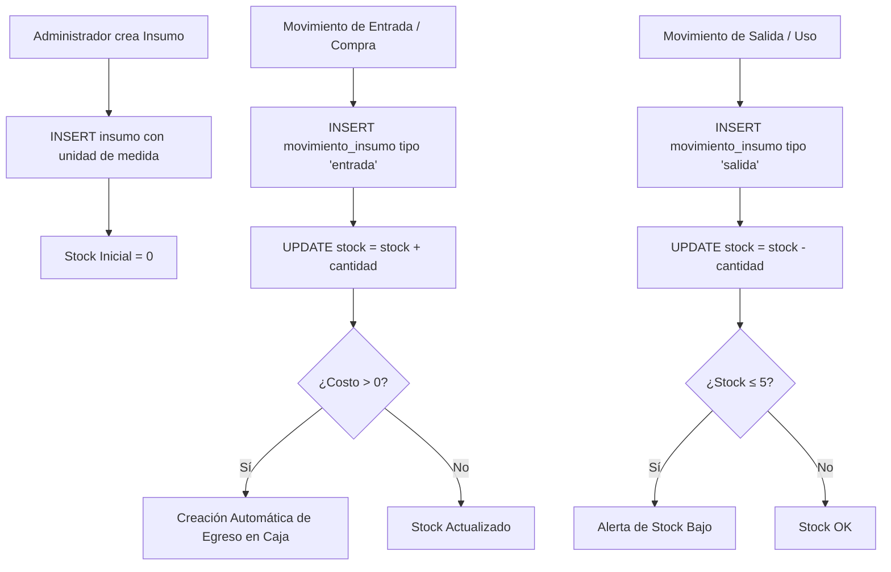

# Spec: Insumos y Suministros — Inventario Interno y Trazabilidad

**Dominio:** Insumos y Suministros  
**Prioridad:** P1  
**Versión:** 3.0 Enterprise  
**Última actualización:** Agosto 2026  
**Dependencias:** `specs/architecture.md`, `specs/domain-limpieza.md`, `specs/domain-caja.md`

---

## 1. Propósito

El módulo de **Insumos y Suministros** (`/insumos`) gestiona de forma independiente el inventario interno del hotel (artículos de aseo, amenidades de baño, blancos, productos de limpieza y mantenimiento). Proporciona control de stock en tiempo real, alertas de stock bajo y registros automáticos de egresos en Caja al ingresar compras con costo.

---

## 2. Flujo Canónico de Insumos

---

## 3. Componentes de la Interfaz (SaaS Premium v2.0)

### 3.1 Header Estandarizado
- **Badge de Icono:** `
` con `<Package className="w-5 h-5 text-primary" />`.
- **Título de Módulo:** `Insumos y Suministros` (`text-2xl sm:text-3xl font-bold tracking-tight text-foreground`).
- **Botón Principal:** `<Button>` `+ Nuevo Insumo` (`h-9 rounded-xl font-bold text-xs sm:text-sm px-4 shadow-xs`).

### 3.2 Matriz de KPIs (4 Tarjetas Compactas)
1. **📦 Ítems Registrados:** Total de categorías/insumos activos en base de datos.
2. **⚠️ Stock Bajo (<5):** Cantidad de insumos cuyo stock está en nivel crítico.
3. **➡️ Ingresos Hoy:** Cantidad de movimientos de entrada registrados el día de hoy.
4. **⬅️ Salidas Hoy:** Cantidad de movimientos de salida (consumo) del día de hoy.

### 3.3 Tarjetas de Inventario Actual
- **Layout:** Rejilla responsiva `grid-cols-1 sm:grid-cols-2 gap-3.5`.
- **Estilo:** `bg-card/60 backdrop-blur-xl border border-border/50 p-4 rounded-2xl shadow-xs`.
- **Valores:** `text-2xl sm:text-3xl font-extrabold tabular-nums tracking-tight`.
- **Acciones Directas:** Botones `Ingreso` (verde) y `Salida` (ámbar/rojo) de altura `h-8 text-xs font-bold`.

---

## 4. Reglas de Negocio

### RN-INS-001: Creación de Egresos Automáticos
- Al registrar un movimiento de tipo `entrada` con un `costo_total > 0`, el sistema crea automáticamente un registro en la tabla `egresos` asignado a la categoría `insumos` para su consolidación en la Caja del día.

### RN-INS-002: Control de Umbral Crítico
- Cuando el stock de un insumo es `≤ 5` unidades, la cifra de stock se resalta en rojo (`text-red-500`) y se contabiliza en la tarjeta de alerta de la vista principal.

### RN-INS-003: Categorización Dinámica
- Permite seleccionar o crear nuevas categorías de insumos en tiempo real durante el registro.
