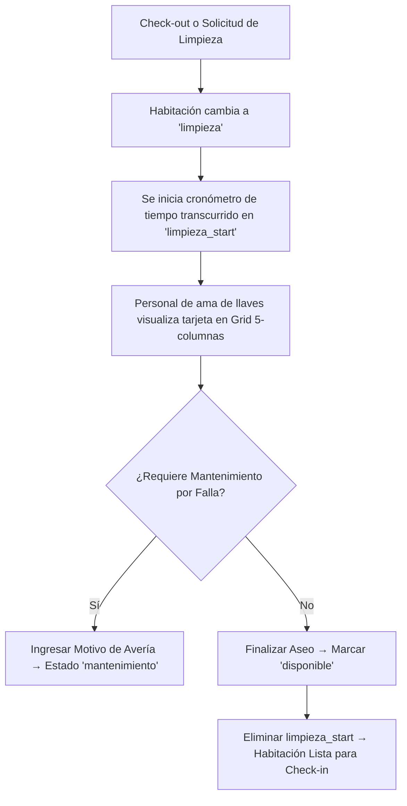

# Spec: Limpieza — Housekeeping y Control de Aseo

**Dominio:** Limpieza / Housekeeping  
**Prioridad:** P1  
**Versión:** 3.2 Enterprise  
**Última actualización:** 7 de Septiembre de 2026  
**Dependencias:** `specs/domain-habitaciones.md`, `specs/domain-recepcion.md`, `specs/architecture.md`, `specs/domain-insumos.md`

---

## 1. Propósito

Gestiona el ciclo operacional completo de limpieza de habitaciones post-check-out, el monitoreo visual en tiempo real mediante tarjetas de alta densidad y la alerta de averías de mantenimiento. El módulo de limpieza es el eslabón entre el check-out de un huésped y la disponibilidad de la habitación para el siguiente check-in.

*(El control de inventario de suministros se gestiona independientemente en `specs/domain-insumos.md`).*

---

## 2. Flujo Canónico

### 2.1 Flujo Operacional de Housekeeping

---

## 3. Componentes de la Interfaz (UX/UI Enterprise v2.0)

### 3.1 Encabezado e Identidad Visual
- **Vector Icon Badge:** Escoba personalizada con partículas SVG `<BroomIcon />` en contenedor `w-10 h-10 rounded-xl bg-primary/15 border border-primary/20`.
- **Título de Módulo:** `Limpieza` (`text-2xl sm:text-3xl font-bold tracking-tight text-foreground`).

### 3.2 Barra Superior de KPIs de Housekeeping
El módulo incluye 4 mini-tarjetas de métricas calculadas en tiempo real en contenedores `bg-card/60 backdrop-blur-xl border border-border/50 rounded-2xl shadow-xs`:
1. 🧼 **Por Limpiar (Sucias):** Cantidad de habitaciones en estado `limpieza`.
2. 🛠️ **En Mantenimiento:** Cantidad bloqueada por reparaciones en estado `mantenimiento`.
3. ✨ **Listas / Disponibles:** Cantidad limpia lista para Check-in (`disponible`).
4. 👥 **Ocupadas:** Cantidad alojando huéspedes actualmente (`ocupada`).

*(En viewports móviles `< sm`, la barra se compacta automáticamente a una fila horizontal única de 4 columnas condensadas, garantizando visualización completa sin requerir scroll vertical).*

### 3.3 Rejilla Responsiva de Alta Densidad (`w-full`)
- Layout extendido a **ancho completo de pantalla (`w-full`)**.
- Grid adaptable de alta densidad: `grid-cols-1 sm:grid-cols-2 md:grid-cols-3 lg:grid-cols-4 xl:grid-cols-5 gap-4`.

### 3.4 Tarjetas de Habitación e Indicadores
- **Status Badge Unificado:** `<StatusBadge status={hab.estado} />`.
- **Cronómetro de Tiempo Transcurrido:** Muestra la duración exacta del proceso de aseo (`⏱️ En proceso: 25m`).
- **Alerta de Mantenimiento:** Muestra el motivo redactado de la falla reportada.
- **Acciones Táctiles Ergonómicas (mín. 50px de altura para uso en campo):**
  - `✨ Marcar Lista`: `<Button variant="emerald">` (cambia a `disponible`).
  - `🧼 Marcar Sucia`: `<Button variant="outline">` (cambia a `limpieza`).
  - `🛠️ Reportar Falla`: Abre modal para especificar motivo y cambiar a `mantenimiento`.

---

## 4. Reglas de Negocio

### RN-LIM-001: Inicio de Cronómetro de Limpieza
- Al cambiar a estado `limpieza`, la aplicación registra la marca de tiempo `limpieza_start` en el objeto JSON de la columna `habitaciones.descripcion`.

### RN-LIM-002: Liberación de Habitación
- Al cambiar a estado `disponible`, se eliminan las llaves `limpieza_start` y `motivo_mantenimiento` del JSON de la habitación, dejándola 100% limpia.

### RN-LIM-003: Bloqueo por Mantenimiento
- Para pasar una habitación a `mantenimiento`, se requiere ingresar un motivo obligatorio en el modal de fallas.

### RN-LIM-004: UI Optimista y Deshacer Inmediato (v3.2.0)
- El cambio de estado operativo (ej. de `limpieza` a `disponible`) se aplica inmediatamente en el estado local de React sin esperar respuesta de red.
- Se dispara un Toast con temporizador de 4 segundos que incluye la acción interactiva **"Deshacer"**.
- Si el usuario pulsa "Deshacer" dentro de la ventana de 4 segundos, el cambio se cancela en cliente sin persistir la mutación remota.
- Si transcurren los 4 segundos sin revocación, la mutación se envía al servidor Supabase. Si ocurre un fallo de red o autorización, se revierte automáticamente el estado y se notifica al usuario.
