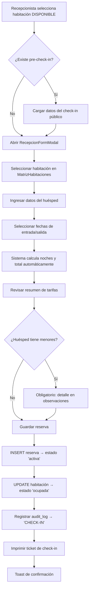
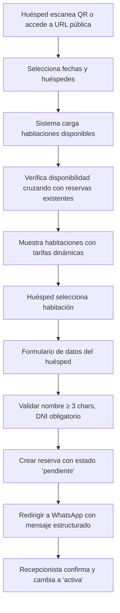
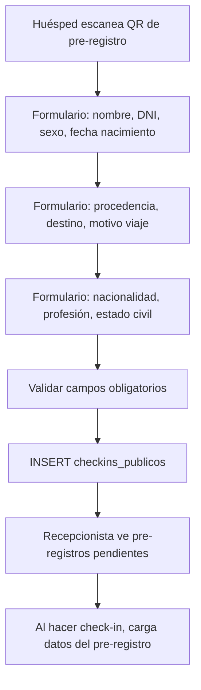
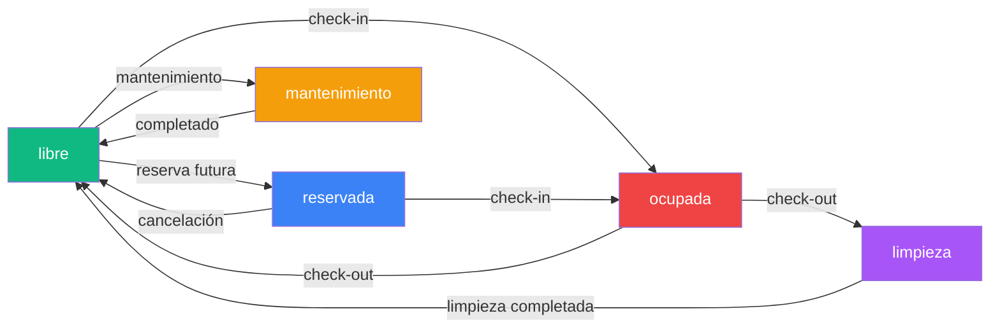

# Spec: Recepción — Check-in, Mapa de Habitaciones y Reservas

**Dominio:** Recepción
**Prioridad:** P0
**Versión:** 3.2 Enterprise
**Última actualización:** 7 de Septiembre de 2026
**Dependencias:** `specs/domain-checkout.md`

---

## 1. Propósito

Gestionar el ciclo de vida completo de una reserva hotelera: desde la solicitud de reserva (online o en recepción), pasando por el check-in del huésped, hasta la asignación y liberación de habitaciones. El módulo de recepción es el corazón operativo del PMS.

---

## 2. Flujo Canónico

### 2.1 Check-in (Recepción)



### 2.2 Check-out (Véase `specs/domain-checkout.md`)

El check-out está documentado en el spec dedicado. El flujo inicia desde Recepción al seleccionar una reserva activa.

### 2.3 Reserva Online (Booking Engine)



### 2.4 Check-in Digital (Pre-registro)



---

## 3. Reglas de Negocio

### RN-REC-001: Estados de Habitación

```
Estados válidos: 'disponible', 'ocupada', 'reservada', 'mantenimiento', 'limpieza'

> Nota: El estado de habitación disponible se representa con el valor `'disponible'` en todos los niveles (BD, service, schema, UI). La label visual es "Disponible".

Transiciones permitidas:
  disponible    → ocupada        (check-in exitoso)
  disponible    → reservada      (reserva futura asignada)
  disponible    → mantenimiento  (por admin)
  ocupada       → limpieza       (check-out o anulación de estancia activa)
  reservada   → ocupada        (check-in de reserva futura)
  reservada   → disponible     (cancelación de reserva pendiente)
  limpieza    → disponible     (limpieza completada)
  mantenimiento → disponible   (mantenimiento completado)
```

- Cada transición debe ser atómica: si falla la actualización de la reserva, la habitación NO cambia de estado.
- La habitación se muestra en el mapa de recepción con colores según `statusColors`.

### RN-REC-002: Estados de Reserva

```
Estados válidos: 'pendiente', 'confirmada', 'activa', 'finalizada', 'cancelada'

> Nota: El tipo TypeScript en types/index.ts usa 'checkin'/'checkout' pero el
> esquema Zod y la BD usan 'activa'/'finalizada'. El canonical es 'activa'/'finalizada'.

Transiciones permitidas:
  pendiente   → activa         (check-in confirmado)
  pendiente   → cancelada      (cancelación)
  activa      → finalizada     (check-out completado)
  activa      → cancelada      (cancelación excepcional)
```

- Reservas online llegan como `pendiente` hasta que recepcionista confirme.
- El cambio de estado es atómico con la actualización de la habitación.

### RN-REC-003: Validación de Datos del Huésped

```
Obligatorios:
  huesped_nombre:  string, min 3 caracteres
  huesped_dni:     string, obligatorio
  fecha_entrada:   date string (yyyy-MM-dd)
  fecha_salida:    date string (yyyy-MM-dd)
  habitacion_id:   UUID, obligatorio

Documento según tipo:
  DNI:       /^\d{8}$/     (exactamente 8 dígitos)
  RUC:       /^\d{11}$/    (exactamente 11 dígitos)
  Pasaporte: 6-15 caracteres alfanuméricos
  CE:        mínimo 4 caracteres

Opcionales pero recomendados (DIRCETUR):
  huesped_fecha_nacimiento, huesped_sexo, nacionalidad,
  motivo_viaje, huesped_procedencia, huesped_destino,
  huesped_profesion, huesped_estado_civil
```

### RN-REC-004: Cálculo de Noches

```
noches = fecha_salida - fecha_entrada (en días)
SI noches ≤ 0 → forzar noches = 1
```

- Las fechas se parsean con hora fija 12:00:00 para evitar bugs de timezone.
- La fecha de salida debe ser estrictamente posterior a la de entrada.

### RN-REC-005: Tarifas Dinámicas

```
Para CADA día de la estadía:
  1. Buscar reglas de tipo 'temporada' donde fecha_inicio ≤ día ≤ fecha_fin
  2. Si no hay temporada, buscar regla de tipo 'dia_semana' para el día de la semana
  3. Aplicar factor_ajuste al precio_base de la habitación
  4. Acumular total

total_estadia = SUM(precio_base × factor_ajuste) para cada día
```

- Prioridad: Temporada > Día de la semana > Tarifa base.
- El `factor_ajuste` es un multiplicador (ej. `1.25` = +25%, `0.80` = -20%).
- Si `hotel.aplica_igv = true`, el IGV se incluye en el total mostrado.

### RN-REC-006: Pre-check-in Digital

```
Campos obligatorios del formulario público:
  huesped_nombre (min 3), huesped_dni, tipo_documento,
  huesped_sexo, huesped_fecha_nacimiento,
  huesped_telefono, huesped_procedencia, huesped_destino,
  motivo_viaje, nacionalidad

Campos opcionales:
  huesped_email, huesped_profesion, huesped_estado_civil,
  observaciones (incluye menores si aplica)
```

- Los datos se almacenan en `checkins_publicos` con `hotel_id`.
- El recepcionista puede cargar estos datos al momento del check-in.
- El pre-check-in se descarta si no se usa dentro de 48 horas.

### RN-REC-007: Menores de Edad

```
SI tiene_menores = true →
  observaciones: obligatorio, min 5 caracteres
  Debe contener: Nombres y DNI de cada menor
  (Cumplimiento Ley N° 30802)
```

### RN-REC-008: Reserva Online (Booking Engine)

```
Disponibilidad:
  1. Cargar todas las habitaciones del hotel
  2. Cargar reservas con estado IN ('pendiente', 'activa')
  3. Para cada habitación, verificar que NO choque con ninguna reserva existente
  4. Choque = (fecha_entrada_nueva < fecha_salida_existente)
              Y (fecha_salida_nueva > fecha_entrada_existente)

Reserva creada:
  - estado = 'pendiente'
  - numero_reserva = 'W' + timestamp (ej. "W123456")
  - observaciones = '[AUTO-RESERVA ONLINE] ...'
  - Se envía WhatsApp al hotel con datos estructurados
```

### RN-REC-009: Auditoría Inmutable

```
Acciones a registrar:
  'CHECK-IN'  → `Check-in: Hab. {numero} - {nombre} - {fecha_entrada}`
  'CHECK-OUT' → `Check-out: Hab. {numero} - {nombre} - S/ {total}`
  'CANCELAR'  → `Reserva cancelada: {numero_reserva} - {nombre}`

Campos obligatorios:
  hotelId, user, accion, descripcion, modulo = 'recepcion'
```

### RN-REC-010: Búsqueda de Identidad (DNI/RUC)

```
SI tipo_documento = 'DNI' Y longitud = 8 →
  Llamar a Edge Function /functions/v1/identity
  Si respuesta OK → auto-llenar: nombreCompleto

SI tipo_documento = 'RUC' Y longitud = 11 →
  Llamar a Edge Function /functions/v1/identity
  Si respuesta OK → auto-llenar: razonSocial

SI falla → no bloquear, permitir ingreso manual
```

---

## 4. Schemas de Datos

### 4.1 ReservaRequest (Check-in)

```typescript
interface ReservaRequest {
  // Habitación
  habitacion_id: string;        // UUID, obligatorio
  habitacion_numero?: string;   // Respaldo histórico
  habitacion_tipo?: string;     // Respaldo histórico

  // Huésped
  huesped_nombre: string;       // min 3 caracteres
  tipo_documento: string;       // 'DNI' | 'RUC' | 'pasaporte' | 'CE' (default 'DNI')
  huesped_dni: string;          // obligatorio, validado por tipo
  huesped_fecha_nacimiento?: string;
  huesped_sexo: string;         // default 'no_especificado'
  huesped_telefono?: string;
  huesped_email?: string;

  // DIRCETUR
  huesped_procedencia?: string;
  huesped_pais_residencia: string;  // default 'Perú'
  huesped_ciudad_residencia?: string;
  nacionalidad: string;         // default 'Peruana'
  motivo_viaje: string;         // default 'turismo'
  huesped_profesion?: string;
  huesped_estado_civil?: string;
  huesped_destino?: string;

  // Fechas y tarifa
  fecha_entrada: string;        // yyyy-MM-dd
  fecha_salida: string;         // yyyy-MM-dd
  noches: number;               // auto-calculado
  precio_noche: number;
  total: number;                // auto-calculado con tarifas dinámicas

  // IGV
  incluye_igv: boolean;         // default true
  tarifa_sin_igv?: number;
  igv_monto?: number;

  // Huéspedes
  num_adultos: number;          // min 1
  num_ninos: number;            // default 0
  tiene_menores: boolean;       // default false

  // Tarifa info
  observaciones_tarifas?: string;  // Descripción de ajustes de tarifa dinámica
  moneda_pago: string;             // default 'PEN'
  tipo_cambio_dia: number;         // default 0

  // Meta
  observaciones?: string;
  pre_checkin_id?: string;      // Vincula con pre-registro
  estado: string;               // default 'activa'
}
```

### 4.2 CheckinPublicoRequest

```typescript
interface CheckinPublicoRequest {
  hotel_id: string;
  huesped_nombre: string;
  tipo_documento: string;       // 'DNI' | 'RUC' | 'pasaporte' | 'CE'
  huesped_dni: string;
  huesped_sexo: string;
  huesped_fecha_nacimiento: string;
  huesped_telefono: string;
  huesped_email?: string;
  huesped_pais_residencia: string;
  huesped_ciudad_residencia?: string;
  huesped_procedencia: string;
  huesped_destino: string;
  motivo_viaje: string;
  nacionalidad: string;
  huesped_profesion?: string;
  huesped_estado_civil?: string;
  observaciones?: string;
}
```

### 4.3 Tabla `reservas` — Campos Relevantes

| Campo | Tipo | Descripción |
|:---|:---|:---|
| `id` | UUID | PK |
| `hotel_id` | UUID | FK → hoteles |
| `habitacion_id` | UUID | FK → habitaciones |
| `habitacion_numero` | TEXT | Número de habitación de respaldo |
| `habitacion_tipo` | TEXT | Tipo de habitación de respaldo |
| `huesped_nombre` | TEXT | Nombre completo del huésped |
| `huesped_dni` | TEXT | Documento del huésped |
| `huesped_telefono` | TEXT | Teléfono de contacto |
| `huesped_procedencia` | TEXT | Lugar de procedencia (DIRCETUR) |
| `nacionalidad` | TEXT | Nacionalidad del huésped |
| `motivo_viaje` | TEXT | Motivo: turismo, negocios, estudios, etc. |
| `fecha_entrada` | DATE | Fecha de ingreso |
| `fecha_salida` | DATE | Fecha de salida |
| `noches` | NUMERIC | Cantidad de noches |
| `precio_noche` | NUMERIC | Precio real cobrado por noche |
| `total` | NUMERIC | Monto total a pagar |
| `num_adultos` | INTEGER | Cantidad de adultos |
| `num_ninos` | INTEGER | Cantidad de niños |
| `estado` | TEXT | pendiente, activa, finalizada, cancelada |
| `numero_reserva` | TEXT | Código correlativo único |
| `observaciones` | TEXT | Notas de la estadía |

### 4.4 Tabla `habitaciones` — Estados

| Campo | Tipo | Descripción |
|:---|:---|:---|
| `id` | UUID | PK |
| `hotel_id` | UUID | FK → hoteles |
| `numero` | TEXT | Número visible (ej. "101") |
| `tipo` | TEXT | simple, doble simple, matrimonial, etc. |
| `estado` | TEXT | `libre`, `ocupada`, `reservada`, `mantenimiento`, `limpieza` |
| `precio_noche` | NUMERIC | Tarifa base por noche |
| `precio` | NUMERIC | Alias alternativo del precio base |
| `capacidad` | INTEGER | Número máximo de personas |
| `amenities` | TEXT[] | Array de servicios incluidos |

> **Nota histórica:** El campo `estado` solía usar `'libre'` en la capa de servicio, pero se unificó a `'disponible'` en todos los niveles (schema, service, UI, BD) para mantener consistencia. La UI muestra la label "Disponible" para este estado. Ver `habitacion.schema.ts` y `recepcion.service.ts`.

### 4.5 Tabla `checkins_publicos`

| Campo | Tipo | Descripción |
|:---|:---|:---|
| `id` | UUID | PK |
| `hotel_id` | UUID | FK → hoteles |
| `huesped_nombre` | TEXT | Nombre del huésped |
| `huesped_dni` | TEXT | Documento del huésped |
| `tipo_documento` | TEXT | Tipo de documento |
| `huesped_sexo` | TEXT | Sexo del huésped |
| `huesped_fecha_nacimiento` | DATE | Fecha de nacimiento |
| `huesped_telefono` | TEXT | Teléfono |
| `huesped_procedencia` | TEXT | Lugar de procedencia |
| `huesped_destino` | TEXT | Lugar de destino |
| `motivo_viaje` | TEXT | Motivo del viaje |
| `nacionalidad` | TEXT | Nacionalidad |
| `created_date` | TIMESTAMPTZ | Fecha de creación |

---

## 5. Estados del Mapa de Habitaciones



---

## 6. Integraciones

### 6.1 Check-in Digital (QR + URL Pública)

```
URL: /public-checkin/:hotelId
QR: Generado desde Configuración → Enlaces Públicos

Flujo:
1. Huésped escanea QR o abre URL
2. Completa formulario de pre-registro (campos obligatorios: nombre, DNI, sexo, fecha nacimiento, procedencia, destino)
3. Datos se guardan en checkins_publicos
4. Recepcionista ve pre-registros en Recepción (useRecepcion.js carga checkins_publicos)
5. Al hacer check-in, puede cargar los datos pre-registrados via pre_checkin_id
6. Recepcionista puede descartar pre-registros no utilizados
```

> **Nota de rendimiento:** `useRecepcion.js` limita las reservas cargadas a `fecha_salida >= haceUnaSemana` para optimizar la carga inicial. No remover esta optimización sin justificación.

### 6.2 Motor de Reservas Online

```
URL: /booking/:hotelId
QR: Generado desde Configuración → Enlaces Públicos

Flujo:
1. Huésped selecciona fechas y huéspedes
2. Sistema muestra habitaciones disponibles con tarifas
3. Huésped completa formulario y selecciona habitación
4. Se crea reserva con estado 'pendiente'
5. Se redirige a WhatsApp del hotel con mensaje estructurado
6. Recepcionista confirma la reserva
```

### 6.3 Impresión Térmica (Check-in)

```
Servicio: src/modules/printer/services/printer.service.js → printCheckInTicket()
Template: src/modules/printer/templates/checkIn.js → buildCheckInTemplate(data)

Datos requeridos:
- hotelName, ruc, address, phone
- guestName, documentId
- roomNumber, roomType
- checkInDate, checkOutDate, totalNights
- totalCost, receptionist
- ticketNumber
```

### 6.4 WhatsApp (Confirmación de Reserva)

```
Servicio: src/services/whatsapp.service.js → enviarMensajeReserva()

Mensaje de confirmación:
  "¡Hola, {nombre}! Confirmamos tu reserva para la Habitación #{numero}
   Llegada: {entrada} | Salida: {salida}
   Monto Total: S/ {total}"
```

### 6.5 Ficha DIRCETUR (MINCETUR)

```
Servicio: src/workers/pdfWorker.js (Web Worker)
Exportación: src/lib/exportMincetur.js

Campos obligatorios del Anexo N° 4:
  Nombres y Apellidos, Tipo y Número de Documento,
  Nacionalidad, Fecha de Nacimiento, Profesión,
  Estado Civil, Lugar de Procedencia, Lugar de Destino,
  Motivo de Viaje
```

---

## 7. Matriz de validación funcional

Los escenarios siguientes son contratos de aceptación; no implican que el
repositorio productivo incluya una suite automatizada.

- [ ] `REC-001`: Crear reserva con todos los campos obligatorios → reserva creada y habitación en 'ocupada'
- [ ] `REC-002`: Rechazar reserva sin nombre de huésped
- [ ] `REC-003`: Rechazar reserva sin habitación seleccionada
- [ ] `REC-004`: Rechazar reserva con fecha_salida ≤ fecha_entrada
- [ ] `REC-005`: Validar DNI exactamente 8 dígitos numéricos
- [ ] `REC-006`: Validar RUC exactamente 11 dígitos numéricos
- [ ] `REC-007`: Calcular noches correctamente (fecha_salida - fecha_entrada)
- [ ] `REC-008`: Mínimo 1 adulto en la reserva
- [ ] `REC-009`: Detalle de menores obligatorio si tiene_menores = true
- [ ] `REC-010`: Cambiar habitación a 'ocupada' solo al confirmar check-in exitoso
- [x] `REC-011`: Enviar habitación a 'limpieza' al completar check-out; Housekeeping la libera a 'disponible'
- [ ] `REC-012`: Reserva online llega con estado 'pendiente'
- [ ] `REC-013`: Verificar disponibilidad cruzando fechas con reservas existentes
- [ ] `REC-014`: Aplicar tarifa dinámica de temporada sobre tarifa base
- [ ] `REC-015`: Aplicar tarifa de día de semana cuando no hay temporada
- [ ] `REC-016`: Registrar audit_log después de check-in exitoso
- [ ] `REC-017`: Pre-check-in permite auto-llenar datos del huésped

---

## 8. Criterios de Aceptación

1. ✅ Un recepcionista puede hacer check-in de un huésped en ≤3 clics
2. ✅ El mapa de habitaciones muestra colores correctos según estado
3. ✅ Las tarifas dinámicas se calculan automáticamente al cambiar fechas
4. ✅ El DNI/RUC se valida en tiempo real según formato peruano
5. ✅ Los datos del pre-check-in se cargan automáticamente al asignar habitación
6. ✅ La reserva online crea un registro pendiente para confirmación manual
7. ✅ El ticket de check-in se imprime con todos los datos del huésped
8. ✅ La disponibilidad se verifica en tiempo real contra reservas existentes
9. ✅ Los menores de edad obligan a documentar datos en observaciones
10. ✅ Cada acción de check-in/check-out genera un audit_log inmutable
11. ✅ Recepción abre con una cola de atención que prioriza salidas y llegadas vencidas o del día
12. ✅ El resumen operativo muestra estancias activas, reservas pendientes y habitaciones disponibles sin alterar sus estados
13. ✅ La línea de tiempo incluye todo el inventario de habitaciones y conserva visible su estado operativo
14. ✅ Los filtros y acciones principales son utilizables sin desplazamiento horizontal en viewport móvil

---

## 9. Historial de Cambios

| Versión | Fecha | Cambio | Autor |
|:---|:---|:---|:---|
| 1.0 | Julio 2026 | Versión inicial del spec | Buffy (Freebuff) |
