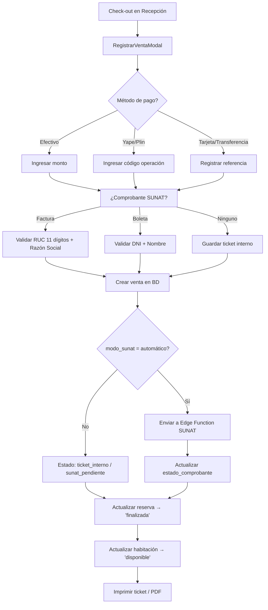
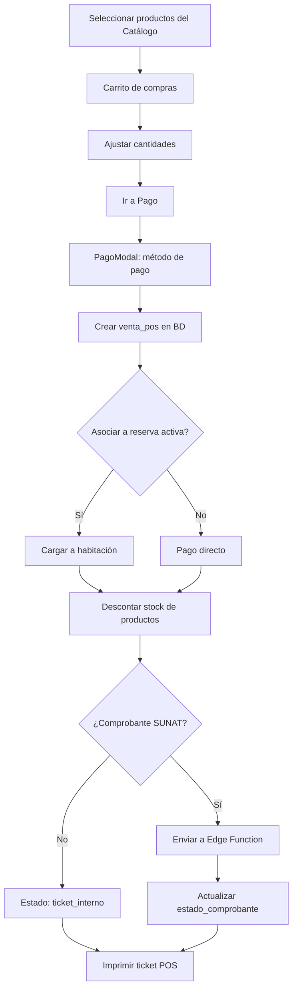
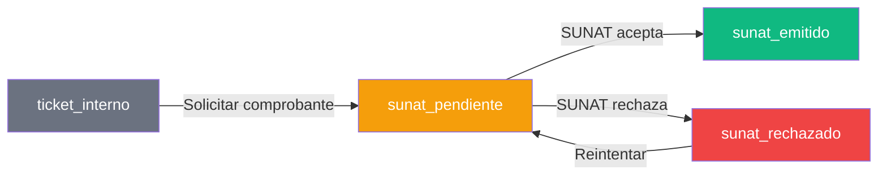

# Spec: Ventas — Ventas, Tickets y POS (Minimarket)

**Dominio:** Ventas y Punto de Venta  
**Prioridad:** P1  
**Versión:** 3.0 Enterprise  
**Última actualización:** Agosto 2026  
**Dependencias:** `specs/domain-checkout.md`, `specs/domain-caja.md`

---

## 1. Propósito

Gestiona el registro, visualización y administración de todas las transacciones del sistema, divididas en dos tipos:

- **Ventas Hotel (`ventas`)**: Ingresos generados por hospedaje (check-out de reservas), con datos del huésped, habitación y método de pago.
- **Ventas POS (`ventas_pos`)**: Ingresos generados por el Minimarket / Punto de Venta, con productos, cantidades, consumos de habitación y comprobantes SUNAT.

El módulo de Ventas es el repositorio central para la consulta de tickets, emisión de comprobantes electrónicos e impresión de tickets internos.

---

## 2. Flujo Canónico

### 2.1 Flujo de Venta Hotel (Check-out)



### 2.2 Flujo de Venta POS (Minimarket)



---

## 3. Reglas de Negocio

### RN-VEN-001: Métodos de Pago Soportados

El sistema soporta exactamente 5 métodos de pago:

```typescript
type MetodoPago = 'efectivo' | 'yape' | 'plin' | 'transferencia' | 'tarjeta';
```

- Yape y Plin requieren código de operación (referencia) obligatorio.
- El método de pago se normaliza a minúsculas.

### RN-VEN-002: Numeración de Tickets

- **Ventas Hotel**: Ticket autogenerado correlativo (`numero_ticket`) — secuencia numérica.
- **Ventas POS**: Ticket con prefijo `POS` + timestamp (`POS{6 dígitos}`).
- El número de ticket es único por hotel y se muestra en la UI con prefijo `#`.

### RN-VEN-003: Estados de Comprobante SUNAT

```typescript
type EstadoComprobante = 'ticket_interno' | 'sunat_pendiente' | 'sunat_emitido' | 'sunat_rechazado';
```

| Estado | Descripción |
|:---|---|
| `ticket_interno` | Sin comprobante SUNAT — solo ticket interno |
| `sunat_pendiente` | Pendiente de envío a SUNAT (modo manual o fallback) |
| `sunat_emitido` | Comprobante aceptado por SUNAT + CDR recibido |
| `sunat_rechazado` | Comprobante rechazado por SUNAT |

### RN-VEN-004: Validación de Factura Electrónica

```
SI tipo_comprobante = 'factura':
  - RUC obligatorio: exactamente 11 dígitos numéricos
  - Razón social obligatoria: mínimo 3 caracteres
  - Serie: F001
SI tipo_comprobante = 'boleta':
  - DNI obligatorio: mínimo 8 dígitos
  - Nombre obligatorio: mínimo 3 caracteres
  - Serie: B001
```

### RN-VEN-005: Integración SUNAT Automática

```
SI hotel.modo_sunat = 'automatico':
  1. Crear venta en BD
  2. Enviar comprobante a Edge Function /functions/v1/facturacion
  3. SI éxito → actualizar estado a 'sunat_emitido'
  4. SI fallo → mantener como 'sunat_pendiente' (no bloquear venta)
  5. Mostrar toast informativo al usuario
```

### RN-VEN-006: Visualización Consolidada

- Todas las ventas (Hotel + POS) se visualizan en una sola vista cronológica inversa.
- Filtros disponibles: texto (ticket/cliente/habitación), método de pago, tipo (hotel/pos).
- Vista Desktop: tabla con columnas (Origen, Ticket, Cliente, Total, Pago, Estado, Comprobante, Acciones).
- Vista Móvil: cards con resumen compacto.
- Resumen del día: totales separados por Hotel, POS e Histórico general.

### RN-VEN-007: Gestión de Productos del Minimarket

```
CRUD de productos:
  - Nombre, precio_venta, stock, categoría, activo/inactivo
  - Stock se descuenta automáticamente al crear venta POS
  - Alertas visuales:
    🔴 Stock = 0 → Producto agotado (bloqueado)
    🟠 Stock ≤ 5 → Bajo stock (advertencia)
    🟢 Stock > 5 → Normal
```

### RN-VEN-008: Carrito de Compras POS

- Estado manejado con Zustand (`useCartStore.js`) o estado local (`PuntoVenta.jsx`)
- Cada producto se agrega con cantidad = 1 por defecto
- No se puede superar el stock disponible del producto
- Se puede modificar cantidad o eliminar items del carrito
- El carrito se limpia al completar la venta exitosamente
- El resumen incluye: items, subtotal, y total general con IGV opcional

---

## 4. Schemas de Datos

### 4.1 Tabla `ventas` (Hotel)

| Campo | Tipo | Descripción |
|:---|:---|:---|
| `id` | UUID | PK |
| `hotel_id` | UUID | FK → hoteles |
| `habitacion_numero` | TEXT | Habitación asociada al cobro |
| `huesped_nombre` | TEXT | Nombre del cliente facturado |
| `numero_ticket` | TEXT | Número de ticket autogenerado |
| `metodo_pago` | TEXT | efectivo, yape, plin, transferencia, tarjeta |
| `fecha_pago` | TIMESTAMPTZ | Fecha y hora exacta del cobro |
| `total` | NUMERIC | Monto final liquidado |
| `created_date` | TIMESTAMPTZ | Auditoría |

### 4.2 Tabla `ventas_pos` (Minimarket)

| Campo | Tipo | Descripción |
|:---|:---|:---|
| `id` | UUID | PK |
| `hotel_id` | UUID | FK → hoteles |
| `numero_ticket` | TEXT | Código correlativo (ej. "POS234901") |
| `tipo` | TEXT | 'solo_extras', 'solo_estadia', 'estadia_extras' |
| `habitacion_numero` | TEXT | Habitación asociada |
| `huesped_nombre` | TEXT | Nombre del huésped |
| `huesped_dni` | TEXT | Documento del huésped |
| `reserva_id` | UUID | FK → reservas (opcional) |
| `items` | JSONB | Listado de productos vendidos |
| `subtotal_estadia` | NUMERIC | Subtotal del hospedaje |
| `subtotal_extras` | NUMERIC | Subtotal de productos |
| `descuento` | NUMERIC | Descuento aplicado |
| `total` | NUMERIC | Neto total cobrado |
| `metodo_pago` | TEXT | Método de pago |
| `tipo_comprobante` | TEXT | 'ninguno', 'boleta', 'factura' |
| `estado_comprobante` | TEXT | 'ticket_interno', 'sunat_pendiente', 'sunat_emitido', 'sunat_rechazado' |
| `ruc_cliente` | TEXT | RUC del cliente (factura) |
| `razon_social` | TEXT | Razón social (factura) |
| `notas` | TEXT | Observaciones de venta |
| `fecha_venta` | TIMESTAMPTZ | Fecha y hora de la transacción |
| `created_date` | TIMESTAMPTZ | Auditoría |

### 4.3 Tabla `categorias_productos`

| Campo | Tipo | Descripción |
|:---|:---|:---|
| `id` | UUID | PK |
| `hotel_id` | UUID | FK → hoteles |
| `nombre` | TEXT | Nombre de la categoría |
| `created_date` | TIMESTAMPTZ | Auditoría |

### 4.4 Tabla `productos`

| Campo | Tipo | Descripción |
|:---|:---|:---|
| `id` | UUID | PK |
| `hotel_id` | UUID | FK → hoteles |
| `categoria_id` | UUID | FK → categorias_productos |
| `nombre` | TEXT | Nombre del producto |
| `precio_venta` | NUMERIC | Precio al público |
| `stock` | INTEGER | Unidades en estante |
| `activo` | BOOLEAN | Habilitado en catálogo |
| `created_date` | TIMESTAMPTZ | Auditoría |

---

## 5. Estados del Flujo de Comprobante SUNAT



---

## 6. Integraciones

### 6.1 Caja (Módulo Financiero)
```
Todas las ventas alimentan las estadísticas del módulo de Caja:
  - Ventas Hotel → stats.hotel
  - Ventas POS → stats.pos
  - El método de pago se usa para desglose de métodos
  - El estado del comprobante SUNAT se usa para desglose SUNAT
```

### 6.2 Impresión Térmica
```
- Ventas Hotel → Template: checkOut.js (ESC/POS 32 cols)
- Ventas POS → Template: receipt.js (ESC/POS 32 cols)
- Comprobante SUNAT → ComprobanteModal.jsx (texto plano estructurado)
```

### 6.3 SUNAT (Edge Function)
```
- Las ventas con tipo_comprobante != 'ninguno' pueden enviarse a SUNAT
- Edge Function: /functions/v1/facturacion (Deno)
- Protocolo: SOAP XML con UBL 2.1 + Firma XAdES-BES
- Comunicación asíncrona: no bloquea la venta
```

### 6.4 Realtime
```
- La tabla 'ventas' tiene suscripción Realtime para actualizar la UI
  cuando otro usuario registra una venta
```

---

## 7. Tests de Contrato

- [ ] `VEN-001`: Ventas hotel y POS se consolidan en una sola vista
- [ ] `VEN-002`: Filtros de búsqueda funcionan correctamente
- [ ] `VEN-003`: Los 5 métodos de pago se muestran con su icono
- [ ] `VEN-004`: El resumen del día se calcula correctamente
- [ ] `VEN-005`: La numeración de tickets hotel es correlativa
- [ ] `VEN-006`: Los tickets POS tienen prefijo "POS"
- [ ] `VEN-007`: El carrito de compras se limpia al completar venta
- [ ] `VEN-008`: El stock se descuenta al crear venta POS
- [ ] `VEN-009`: El comprobante SUNAT muestra estado correcto
- [ ] `VEN-010`: La impresión de ticket hotel funciona con datos mock

---

## 8. Criterios de Aceptación

1. ✅ El usuario ve todas las ventas (Hotel + POS) en una sola lista cronológica
2. ✅ Los filtros de búsqueda, método de pago y tipo son funcionales
3. ✅ El resumen del día muestra totales de Hotel, POS e Histórico
4. ✅ Los tickets se pueden imprimir (PDF o térmico)
5. ✅ Los comprobantes SUNAT se emiten desde la vista de Ventas
6. ✅ El inventario del Minimarket tiene control de stock con alertas visuales
7. ✅ El carrito de compras tiene validación de stock máximo
8. ✅ Los estados de comprobante SUNAT son visibles para cada venta POS

---

## 9. Historial de Cambios

| Versión | Fecha | Cambio | Autor |
|:---|:---|:---|:---|
| 1.0 | Julio 2026 | Versión inicial del spec | Buffy (Freebuff) |
